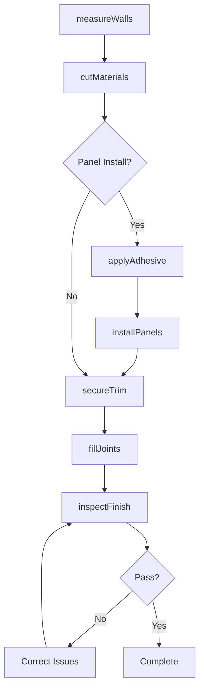
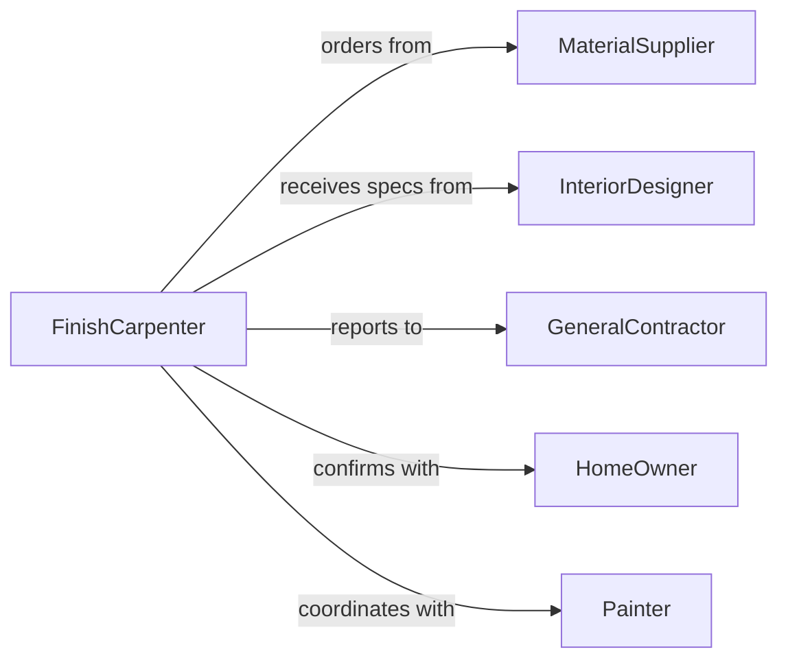

# Install Trim Paneling

> Business-as-Code definition for installing trim and paneling in construction and renovation projects. Models the complete installation workflow from measurement through finishing and quality inspection.

## Overview

Installing trim or paneling involves cutting, fitting, and securing decorative and protective wall coverings, baseboards, crown molding, and wainscoting. This definition exposes actions for material preparation, installation, and finishing work, with events for quality control and project tracking.

## Actors

| Actor | Description |
|-------|-------------|
| MaterialSupplier | Provides trim, paneling, and finishing materials |
| InteriorDesigner | Specifies trim styles and installation details |
| GeneralContractor | Coordinates installation scheduling |
| HomeOwner | Approves design selections and installation quality |
| Painter | Performs final finishing and touch-up work |
| InspectionAuthority | Verifies code compliance for commercial projects |

## Roles

| Role | Description |
|------|-------------|
| FinishCarpenter | Executes trim and panel installation |
| Apprentice | Assists with material handling and preparation |
| Foreman | Coordinates installation crew and schedule |
| QualityInspector | Verifies fit, finish, and alignment |

## Entities

| Entity | Description |
|--------|-------------|
| TrimProfile | Specific molding design and dimensions |
| PanelSheet | Wall covering material unit |
| CutList | Measured and labeled pieces for installation |
| Adhesive | Bonding agent for panel attachment |
| Fastener | Nails, screws, or clips for securing trim |
| JointCompound | Filler for seams and nail holes |

## Actions

| Action | Description |
|--------|-------------|
| measureWalls | Record dimensions for material calculation |
| cutMaterials | Prepare trim and panels to required sizes |
| applyAdhesive | Apply bonding agent to panel backs |
| installPanels | Mount panels to wall surface |
| secureTrim | Attach trim pieces with fasteners |
| fillJoints | Apply compound to seams and holes |
| inspectFinish | Verify alignment and quality of installation |

## Events

| Event | Description |
|-------|-------------|
| wallsMeasured | Room dimensions recorded and verified |
| materialsCut | Trim and panels prepared for installation |
| adhesiveApplied | Bonding agent ready for panel mounting |
| panelsInstalled | Wall panels mounted and secured |
| trimSecured | All trim pieces attached and aligned |
| jointsFilled | Seams and fastener holes filled |
| finishInspected | Quality inspection completed |

## Searches

| Search | Description |
|--------|-------------|
| findInstallations | List installations by room, type, or status |
| getMaterials | Retrieve material specifications and quantities |
| getInspections | Find inspection records and quality notes |
| getCutLists | Get prepared material lists for rooms |

## Workflow



## Actor Relationships



## Usage

### Calling Actions

```typescript
import { installTrimPaneling } from '@headlessly/install-trim-paneling'

const trim = installTrimPaneling()

// Measure dining room for wainscoting
const measurements = await trim.measureWalls({
  room: 'Dining Room',
  walls: [
    { id: 'north', length: 144, height: 96 },
    { id: 'south', length: 144, height: 96 },
    { id: 'east', length: 120, height: 96 },
    { id: 'west', length: 120, height: 96 }
  ],
  unit: 'inches'
})

// Cut materials and install panels
const cutList = await trim.cutMaterials({
  measurementId: measurements.id,
  panelHeight: 36,
  material: 'beadboard-panels',
  trimProfile: 'colonial-cap-rail'
})

await trim.applyAdhesive({
  cutListId: cutList.id,
  adhesiveType: 'construction-adhesive',
  pattern: 'serpentine'
})

await trim.installPanels({
  cutListId: cutList.id,
  startingWall: 'north',
  alignment: 'level'
})

// Secure trim and finish
await trim.secureTrim({
  cutListId: cutList.id,
  fastenerType: 'finish-nails',
  spacing: 16
})

await trim.fillJoints({
  cutListId: cutList.id,
  compound: 'wood-filler',
  method: 'putty-knife'
})
```

### Event-Driven Automation

```typescript
// Order additional materials if cut list shows shortage
trim.materialsCut(async ({ cutListId, materials }) => {
  const shortage = materials.filter(m => m.quantity < m.required)

  if (shortage.length > 0) {
    await notify({
      to: 'procurement',
      message: `Additional materials needed for ${cutListId}`,
      items: shortage
    })
  }
})

// Schedule painting after inspection passes
trim.finishInspected(async ({ cutListId, inspection }) => {
  if (inspection.status === 'approved') {
    await schedulePainting({
      room: inspection.room,
      priority: 'normal',
      notes: 'Wainscoting ready for primer'
    })
  }
})
```
