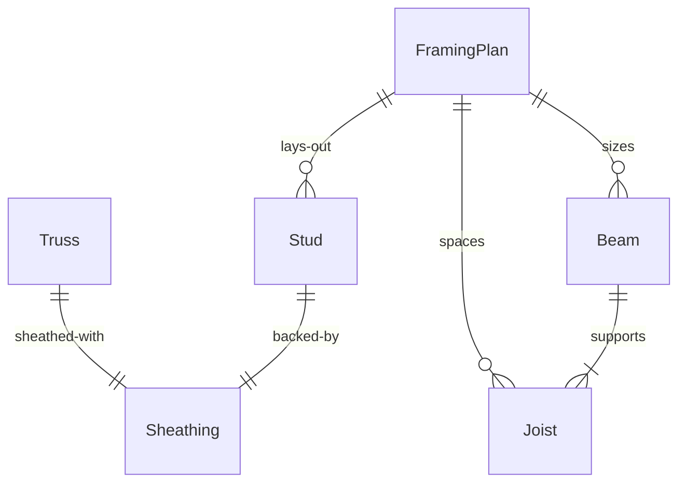
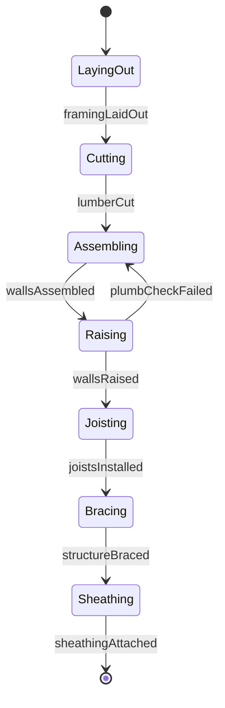
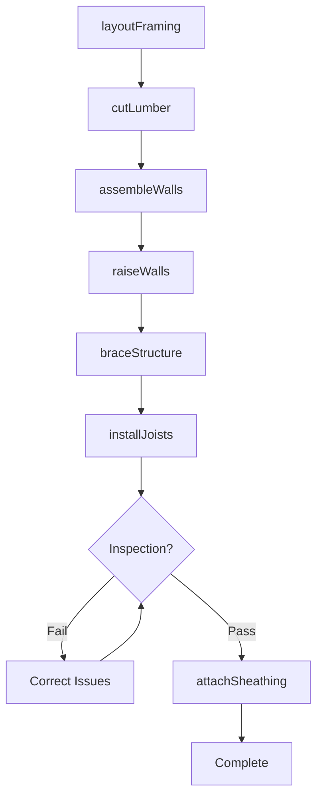
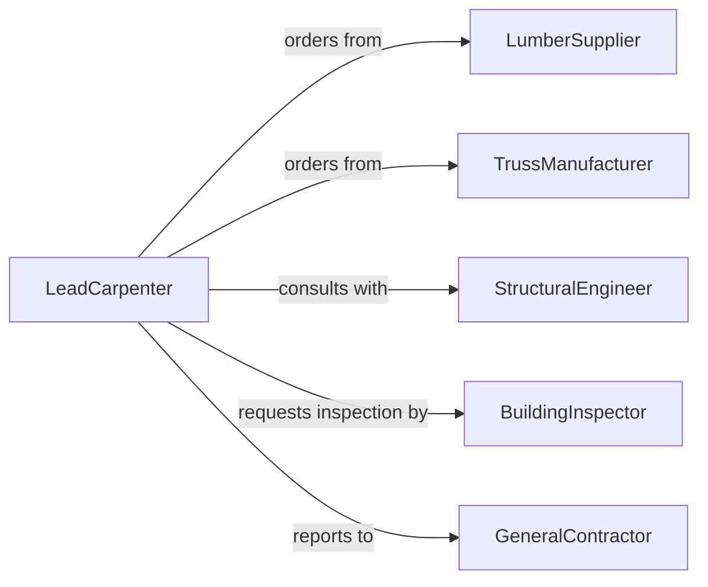

# Install Wooden Structural Components

> Business-as-Code definition for installing wooden structural components in building construction. Models the complete framing process from layout through bracing and inspection.

## Overview

Installing wooden structural components involves framing walls, floors, roofs, and other load-bearing assemblies using dimensional lumber and engineered wood products. This definition exposes actions for layout, assembly, and installation of beams, joists, studs, trusses, and sheathing, with events for quality tracking and building code compliance.

## Actors

| Actor | Description |
|-------|-------------|
| LumberSupplier | Provides dimensional lumber and engineered wood |
| StructuralEngineer | Designs framing specifications and load calculations |
| BuildingInspector | Verifies compliance with building codes |
| GeneralContractor | Coordinates framing schedule and crews |
| TrussManufacturer | Fabricates engineered roof and floor trusses |
| HardwareSupplier | Provides fasteners, hangers, and connectors |

## Roles

| Role | Description |
|------|-------------|
| FramingCrew | Executes structural framing installation |
| LeadCarpenter | Supervises crew and ensures quality |
| Apprentice | Assists with material handling and cutting |
| SafetyCoordinator | Monitors fall protection and site safety |

## Entities

| Entity | Description |
|--------|-------------|
| FramingPlan | Engineering drawings for structural layout |
| Stud | Vertical framing member in wall assemblies |
| Joist | Horizontal framing member for floors and ceilings |
| Beam | Load-bearing horizontal structural member |
| Truss | Engineered triangulated framework |
| Sheathing | Structural panel covering for walls or roof |

## Actions

| Action | Description |
|--------|-------------|
| layoutFraming | Mark component locations per engineering plans |
| cutLumber | Prepare dimensional lumber to required lengths |
| assembleWalls | Construct wall frames on ground or deck |
| raiseWalls | Lift and position wall assemblies |
| installJoists | Position and secure floor or ceiling joists |
| braceStructure | Add temporary and permanent bracing |
| attachSheathing | Install structural panels to framed assembly |

## Events

| Event | Description |
|-------|-------------|
| framingLaidOut | Component positions marked and verified |
| lumberCut | Materials prepared for assembly |
| wallsAssembled | Wall frames constructed and ready to raise |
| wallsRaised | Wall assemblies positioned and plumbed |
| joistsInstalled | Floor or ceiling joists secured |
| structureBraced | Bracing installed for stability |
| sheathingAttached | Structural panels installed |

## Searches

| Search | Description |
|--------|-------------|
| findFraming | List framing installations by building and status |
| getInspections | Retrieve inspection records and notes |
| getMaterials | Find lumber specifications and quantities |
| getProgress | Get installation completion by phase |

## Entity Relationships



## State Diagram



## Workflow



## Actor Relationships



## Usage

### Calling Actions

```typescript
import { installWoodenStructuralComponents } from '@headlessly/install-wooden-structural-components'

const framing = installWoodenStructuralComponents()

// Layout first floor wall framing
const layout = await framing.layoutFraming({
  buildingId: 'building-2026-001',
  floor: 1,
  planReference: 'A-101',
  walls: ['exterior-north', 'exterior-south', 'interior-main']
})

// Cut lumber and assemble wall frames
await framing.cutLumber({
  layoutId: layout.id,
  materials: [
    { type: '2x6', grade: '#2', length: 96, quantity: 120 },
    { type: '2x4', grade: '#2', length: 92.625, quantity: 80 }
  ]
})

await framing.assembleWalls({
  layoutId: layout.id,
  wallId: 'exterior-north',
  studSpacing: 16,
  headers: [
    { location: 'door-1', size: '2-2x8' },
    { location: 'window-1', size: '2-2x6' }
  ]
})

// Raise walls and install joists
await framing.raiseWalls({
  layoutId: layout.id,
  wallIds: ['exterior-north', 'exterior-south'],
  method: 'crane-lift'
})

await framing.braceStructure({
  layoutId: layout.id,
  bracingType: 'diagonal-let-in',
  spacing: 25
})

await framing.installJoists({
  layoutId: layout.id,
  joistSize: '2x10',
  spacing: 16,
  span: 14,
  hangers: 'Simpson LUS210'
})
```

### Event-Driven Automation

```typescript
// Request inspection after walls are raised and braced
framing.structureBraced(async ({ layoutId, buildingId }) => {
  await requestInspection({
    buildingId,
    inspectionType: 'framing-rough',
    phase: 'walls-raised',
    notes: `Ready for framing inspection - layout ${layoutId}`
  })
})

// Alert on material shortages during cutting
framing.lumberCut(async ({ layoutId, materials }) => {
  const shortage = materials.filter(m => m.actualQuantity < m.requiredQuantity)

  if (shortage.length > 0) {
    await notify({
      to: 'procurement',
      priority: 'high',
      message: `Material shortage for layout ${layoutId}`,
      items: shortage
    })
  }
})
```
