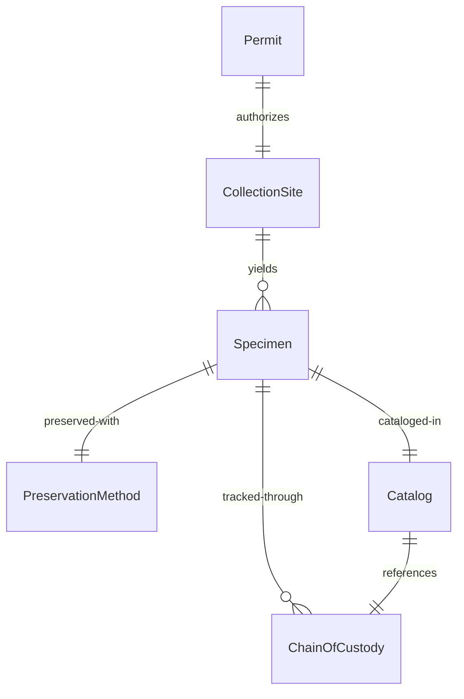
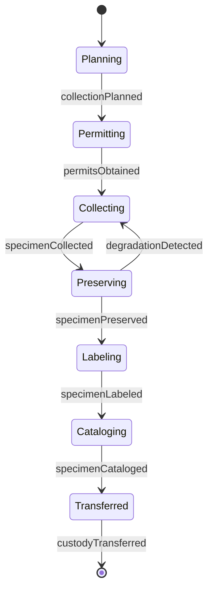
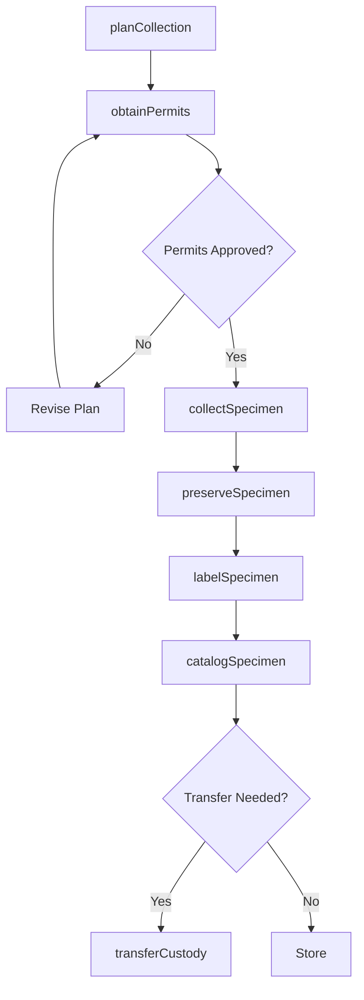
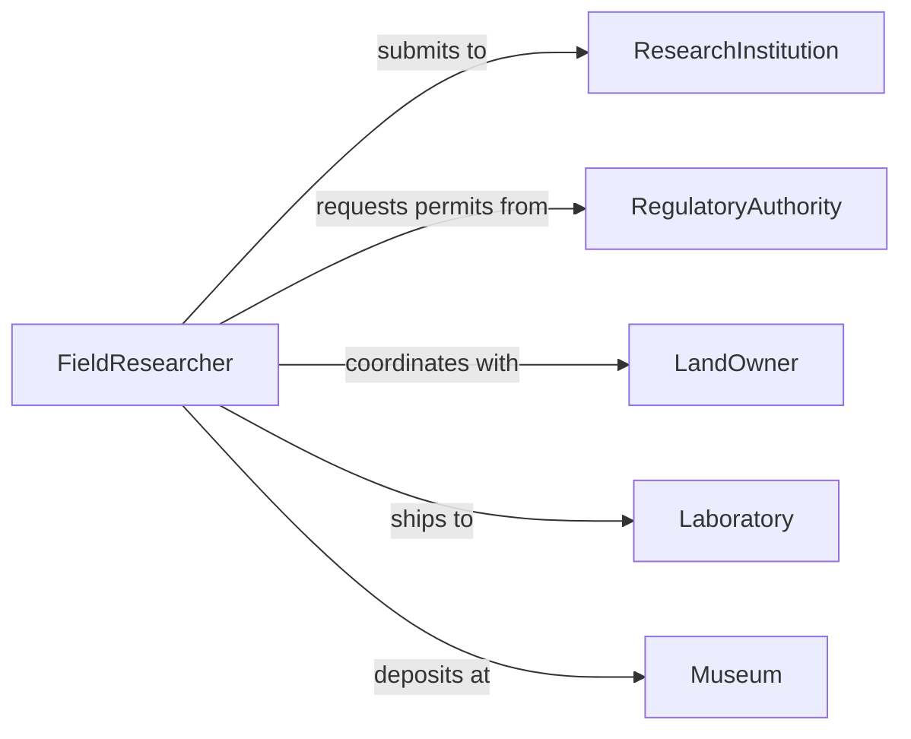

# Collect Biological Specimens

> Business-as-Code definition for collecting biological specimens in field research and environmental studies. Models the complete collection workflow from planning through preservation and cataloging.

## Overview

Collecting biological specimens involves gathering plant, animal, fungal, or microbial samples for scientific study, conservation monitoring, or biodiversity assessment. This definition exposes actions for collection planning, field sampling, preservation, and documentation, with events for chain of custody tracking and regulatory compliance.

## Actors

| Actor | Description |
|-------|-------------|
| ResearchInstitution | Sponsors field research and maintains collections |
| RegulatoryAuthority | Issues permits and enforces collection regulations |
| LandOwner | Grants access to collection sites |
| Laboratory | Performs analysis and testing on specimens |
| Museum | Curates and preserves specimen collections |
| EquipmentSupplier | Provides collection tools and preservation materials |

## Roles

| Role | Description |
|------|-------------|
| FieldResearcher | Executes specimen collection in field locations |
| Taxonomist | Identifies and classifies collected specimens |
| CollectionManager | Maintains specimen database and storage |
| PermitCoordinator | Ensures regulatory compliance for collection |

## Entities

| Entity | Description |
|--------|-------------|
| Specimen | Individual biological sample collected |
| CollectionSite | Geographic location where sampling occurs |
| Permit | Legal authorization for specimen collection |
| PreservationMethod | Technique for maintaining specimen integrity |
| Catalog | Database record of specimen metadata |
| ChainOfCustody | Documentation of specimen handling history |

## Actions

| Action | Description |
|--------|-------------|
| planCollection | Create field collection schedule and protocols |
| obtainPermits | Secure legal authorization for collection |
| collectSpecimen | Gather biological sample from field site |
| preserveSpecimen | Apply preservation method to maintain integrity |
| labelSpecimen | Apply unique identifier and metadata tags |
| catalogSpecimen | Record specimen details in database |
| transferCustody | Document specimen transfer between handlers |

## Events

| Event | Description |
|-------|-------------|
| collectionPlanned | Field schedule and protocols established |
| permitsObtained | Legal authorization secured |
| specimenCollected | Biological sample gathered from site |
| specimenPreserved | Preservation method applied successfully |
| specimenLabeled | Unique identifier and tags attached |
| specimenCataloged | Database record created with metadata |
| custodyTransferred | Specimen ownership or location changed |

## Searches

| Search | Description |
|--------|-------------|
| findSpecimens | List specimens by taxonomy, location, or date |
| getSites | Retrieve collection site details and coordinates |
| getPermits | Find permits by region, type, or expiration |
| getCustody | Trace specimen handling history |

## Entity Relationships



## State Diagram



## Workflow



## Actor Relationships



## Usage

### Calling Actions

```typescript
import { collectBiologicalSpecimens } from '@headlessly/collect-biological-specimens'

const specimens = collectBiologicalSpecimens()

// Plan collection expedition for tropical forest survey
const plan = await specimens.planCollection({
  project: 'Amazon Biodiversity Survey 2026',
  sites: ['site-001', 'site-002'],
  taxa: ['plants', 'insects', 'fungi'],
  duration: { start: '2026-06-01', end: '2026-06-15' }
})

// Obtain collection permits
const permit = await specimens.obtainPermits({
  planId: plan.id,
  jurisdiction: 'Brazil-Amazonas',
  permitType: 'research-collection',
  taxa: ['Orchidaceae', 'Lepidoptera', 'Basidiomycota']
})

// Collect and preserve specimens in the field
const specimen = await specimens.collectSpecimen({
  planId: plan.id,
  siteId: 'site-001',
  taxon: 'Orchidaceae',
  coordinates: { lat: -3.4653, lon: -62.2159 },
  habitat: 'epiphytic on Ceiba tree',
  collectorNotes: 'White flowers with purple labellum'
})

await specimens.preserveSpecimen({
  specimenId: specimen.id,
  method: 'pressed-herbarium',
  preservative: 'silica-gel',
  temperature: 'ambient'
})

await specimens.labelSpecimen({
  specimenId: specimen.id,
  catalogNumber: 'ABC-2026-001234',
  barcode: '978020137962'
})
```

### Event-Driven Automation

```typescript
// Alert when permits are close to expiration
specimens.permitsObtained(async ({ permitId, expirationDate }) => {
  const daysToExpire = Math.floor((new Date(expirationDate) - new Date()) / 86400000)

  if (daysToExpire < 30) {
    await notify({
      to: 'permit-coordinator',
      priority: 'high',
      message: `Permit ${permitId} expires in ${daysToExpire} days`
    })
  }
})

// Automatically catalog specimens after preservation
specimens.specimenPreserved(async ({ specimenId, method }) => {
  await specimens.catalogSpecimen({
    specimenId,
    catalogDate: new Date().toISOString(),
    preservationStatus: 'complete',
    storageLocation: `${method}-archive`
  })
})
```
