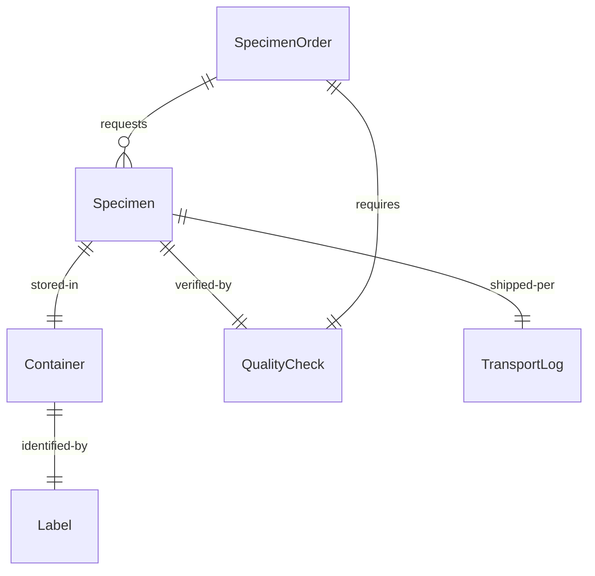
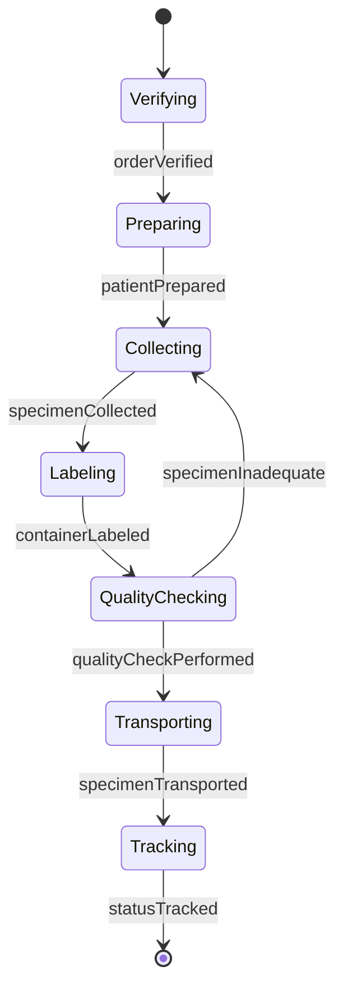
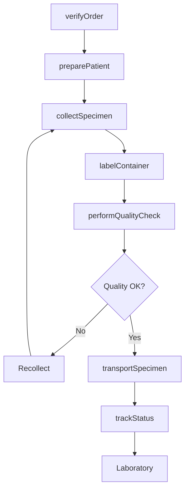
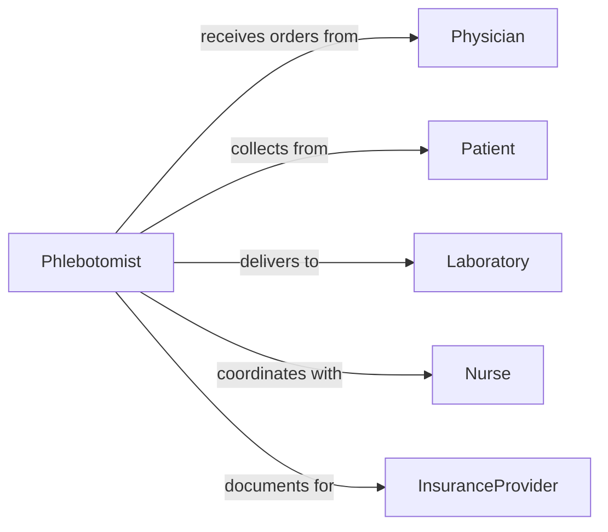

# Collect Biological Specimens Patients

> Business-as-Code definition for collecting biological specimens from patients in healthcare settings. Models the complete collection workflow from order processing through laboratory delivery and result tracking.

## Overview

Collecting biological specimens from patients involves obtaining blood, urine, tissue, and other samples for diagnostic testing, treatment monitoring, and disease screening. This definition exposes actions for specimen collection, labeling, handling, and transport, with events for chain of custody tracking and quality assurance.

## Actors

| Actor | Description |
|-------|-------------|
| Physician | Orders diagnostic tests requiring specimens |
| Patient | Provides biological samples for testing |
| Laboratory | Receives and processes specimens for analysis |
| PathologyService | Performs specialized tissue analysis |
| InsuranceProvider | Authorizes and reimburses specimen collection |
| RegulatoryAuthority | Enforces specimen handling standards |

## Roles

| Role | Description |
|------|-------------|
| Phlebotomist | Collects blood and other fluid specimens |
| LabTechnician | Processes and prepares specimens for testing |
| Nurse | Coordinates specimen collection for inpatients |
| SpecimenProcessor | Manages specimen receipt and routing |

## Entities

| Entity | Description |
|--------|-------------|
| SpecimenOrder | Physician request for specific tests |
| Specimen | Biological sample collected from patient |
| Container | Tube or vessel for specimen storage |
| Label | Identifier linking specimen to patient and order |
| TransportLog | Documentation of specimen movement |
| QualityCheck | Verification of specimen adequacy |

## Actions

| Action | Description |
|--------|-------------|
| verifyOrder | Confirm test orders and patient identity |
| preparePatient | Provide instructions and obtain consent |
| collectSpecimen | Obtain biological sample using proper technique |
| labelContainer | Apply patient and order identifiers |
| performQualityCheck | Verify specimen adequacy and integrity |
| transportSpecimen | Deliver specimen to laboratory |
| trackStatus | Monitor specimen processing progress |

## Events

| Event | Description |
|-------|-------------|
| orderVerified | Test order confirmed and patient identified |
| patientPrepared | Instructions given and consent obtained |
| specimenCollected | Biological sample successfully obtained |
| containerLabeled | Identifiers applied to specimen container |
| qualityCheckPerformed | Specimen adequacy verified |
| specimenTransported | Sample delivered to laboratory |
| statusTracked | Processing milestone recorded |

## Searches

| Search | Description |
|--------|-------------|
| findOrders | List specimen orders by patient, date, or status |
| getSpecimens | Retrieve specimen details and test assignments |
| getTransport | Find transport logs and delivery times |
| getQualityIssues | Identify rejected or inadequate specimens |

## Entity Relationships



## State Diagram



## Workflow



## Actor Relationships



## Usage

### Calling Actions

```typescript
import { collectBiologicalSpecimensPatients } from '@headlessly/collect-biological-specimens-patients'

const specimens = collectBiologicalSpecimensPatients()

// Verify lab orders for patient
const order = await specimens.verifyOrder({
  patientId: 'P-2026-12345',
  orderIds: ['ORD-98765', 'ORD-98766'],
  identityVerification: {
    method: 'two-factor',
    verified: true
  }
})

// Prepare patient and collect blood specimens
await specimens.preparePatient({
  orderId: order.id,
  instructions: 'Fasting required for glucose test',
  consentObtained: true
})

const specimen = await specimens.collectSpecimen({
  orderId: order.id,
  specimenType: 'blood-venous',
  collectionMethod: 'venipuncture',
  site: 'left-antecubital',
  volume: 10,
  volumeUnit: 'mL',
  tubes: [
    { type: 'serum-separator', color: 'gold', volume: 5 },
    { type: 'EDTA', color: 'lavender', volume: 5 }
  ]
})

// Label and perform quality check
await specimens.labelContainer({
  specimenId: specimen.id,
  barcode: '12345678901',
  patientName: 'Smith, John',
  collectionTime: new Date().toISOString()
})

const qualityCheck = await specimens.performQualityCheck({
  specimenId: specimen.id,
  checks: {
    volume: 'adequate',
    hemolysis: 'none',
    clotting: 'appropriate',
    labeling: 'correct'
  }
})
```

### Event-Driven Automation

```typescript
// Alert on quality check failures
specimens.qualityCheckPerformed(async ({ specimenId, checks, passed }) => {
  if (!passed) {
    await notify({
      to: 'phlebotomy-supervisor',
      priority: 'high',
      message: `Quality check failed for specimen ${specimenId}`,
      issues: Object.entries(checks).filter(([k, v]) => v === 'failed')
    })
  }
})

// Auto-route specimens to appropriate lab based on test type
specimens.specimenCollected(async ({ specimenId, orderId, tests }) => {
  const routingRules = {
    'microbiology': 'lab-micro',
    'chemistry': 'lab-chem',
    'hematology': 'lab-heme'
  }

  const destination = routingRules[tests[0].department] || 'lab-general'

  await specimens.transportSpecimen({
    specimenId,
    destination,
    priority: tests.some(t => t.stat) ? 'stat' : 'routine'
  })
})
```
