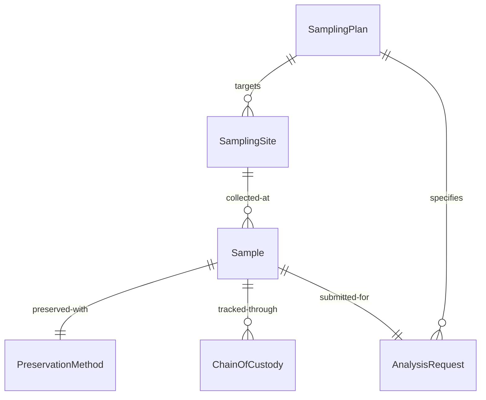
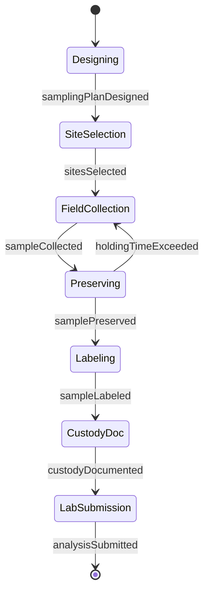
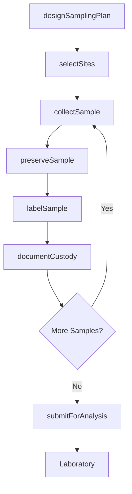
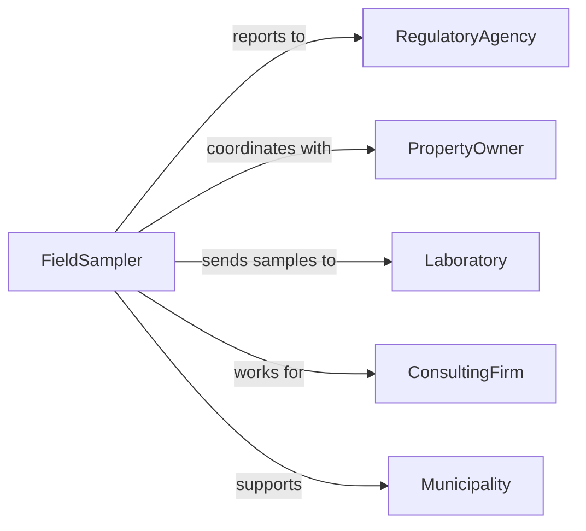

# Collect Environmental Data Samples

> Business-as-Code definition for collecting environmental data and samples for monitoring and assessment. Models the complete collection workflow from site selection through analysis and reporting.

## Overview

Collecting environmental data or samples involves gathering air, water, soil, and ecological measurements for pollution monitoring, compliance testing, and ecosystem assessment. This definition exposes actions for sampling design, field collection, preservation, and chain of custody, with events for regulatory reporting and quality assurance.

## Actors

| Actor | Description |
|-------|-------------|
| RegulatoryAgency | Enforces environmental standards and permits |
| Laboratory | Analyzes environmental samples for contaminants |
| PropertyOwner | Grants access to sampling locations |
| ConsultingFirm | Provides environmental assessment services |
| Municipality | Monitors water and air quality for public health |
| ResearchInstitution | Conducts environmental studies and monitoring |

## Roles

| Role | Description |
|------|-------------|
| FieldSampler | Executes sample collection in field locations |
| EnvironmentalScientist | Designs sampling protocols and interprets data |
| QualityAssuranceOfficer | Ensures sampling meets regulatory standards |
| DataManager | Maintains sample database and metadata |

## Entities

| Entity | Description |
|--------|-------------|
| SamplingPlan | Protocol for sample collection and analysis |
| SamplingSite | Geographic location where samples are collected |
| Sample | Physical specimen or measurement collected |
| PreservationMethod | Technique for maintaining sample integrity |
| ChainOfCustody | Documentation of sample handling |
| AnalysisRequest | Laboratory testing specifications |

## Actions

| Action | Description |
|--------|-------------|
| designSamplingPlan | Create protocol for sample collection |
| selectSites | Identify locations for sample collection |
| collectSample | Gather environmental specimen or measurement |
| preserveSample | Apply preservation method to maintain integrity |
| labelSample | Apply unique identifier and metadata |
| documentCustody | Record sample handling and transfers |
| submitForAnalysis | Send samples to laboratory for testing |

## Events

| Event | Description |
|-------|-------------|
| samplingPlanDesigned | Protocol established for collection |
| sitesSelected | Sampling locations identified |
| sampleCollected | Environmental specimen obtained |
| samplePreserved | Preservation method applied |
| sampleLabeled | Unique identifier and tags attached |
| custodyDocumented | Chain of custody record created |
| analysisSubmitted | Samples delivered to laboratory |

## Searches

| Search | Description |
|--------|-------------|
| findSamples | List samples by location, type, or date |
| getSites | Retrieve site details and coordinates |
| getCustody | Trace sample handling history |
| getAnalyses | Find analysis requests and results |

## Entity Relationships



## State Diagram



## Workflow



## Actor Relationships



## Usage

### Calling Actions

```typescript
import { collectEnvironmentalDataSamples } from '@headlessly/collect-environmental-data-samples'

const environmental = collectEnvironmentalDataSamples()

// Design sampling plan for groundwater monitoring
const plan = await environmental.designSamplingPlan({
  project: 'Industrial Site Remediation',
  matrix: 'groundwater',
  parameters: ['benzene', 'toluene', 'lead', 'pH'],
  frequency: 'quarterly',
  standards: ['EPA-8260', 'EPA-200.8']
})

// Select monitoring well locations
await environmental.selectSites({
  planId: plan.id,
  sites: [
    { id: 'MW-01', coordinates: { lat: 40.7589, lon: -73.9851 }, depth: 25 },
    { id: 'MW-02', coordinates: { lat: 40.7590, lon: -73.9852 }, depth: 30 },
    { id: 'MW-03', coordinates: { lat: 40.7591, lon: -73.9853 }, depth: 20 }
  ]
})

// Collect groundwater samples
const sample = await environmental.collectSample({
  planId: plan.id,
  siteId: 'MW-01',
  sampleType: 'groundwater',
  collectionMethod: 'low-flow-purging',
  volume: 1000,
  volumeUnit: 'mL',
  fieldMeasurements: {
    pH: 6.8,
    temperature: 12.5,
    conductivity: 450,
    turbidity: 2.3
  }
})

// Preserve and label sample
await environmental.preserveSample({
  sampleId: sample.id,
  preservative: 'HCl-pH2',
  temperature: 4,
  holdingTime: 14,
  holdingTimeUnit: 'days'
})

await environmental.labelSample({
  sampleId: sample.id,
  sampleNumber: 'MW01-Q1-2026',
  barcode: '123456789012'
})
```

### Event-Driven Automation

```typescript
// Alert when samples approach holding time limits
environmental.samplePreserved(async ({ sampleId, holdingTime, preservationDate }) => {
  const expiryDate = new Date(preservationDate)
  expiryDate.setDate(expiryDate.getDate() + holdingTime)

  const daysRemaining = Math.floor((expiryDate - new Date()) / 86400000)

  if (daysRemaining <= 3) {
    await notify({
      to: 'lab-coordinator',
      priority: 'urgent',
      message: `Sample ${sampleId} holding time expires in ${daysRemaining} days`
    })
  }
})

// Auto-submit samples for analysis after collection batch is complete
environmental.sampleLabeled(async ({ planId, sampleId }) => {
  const allSamples = await environmental.findSamples({ planId, status: 'labeled' })

  const expectedCount = await getExpectedSampleCount(planId)

  if (allSamples.length === expectedCount) {
    await environmental.submitForAnalysis({
      planId,
      sampleIds: allSamples.map(s => s.id),
      laboratory: 'certified-lab-001',
      turnaround: 'standard'
    })
  }
})
```
