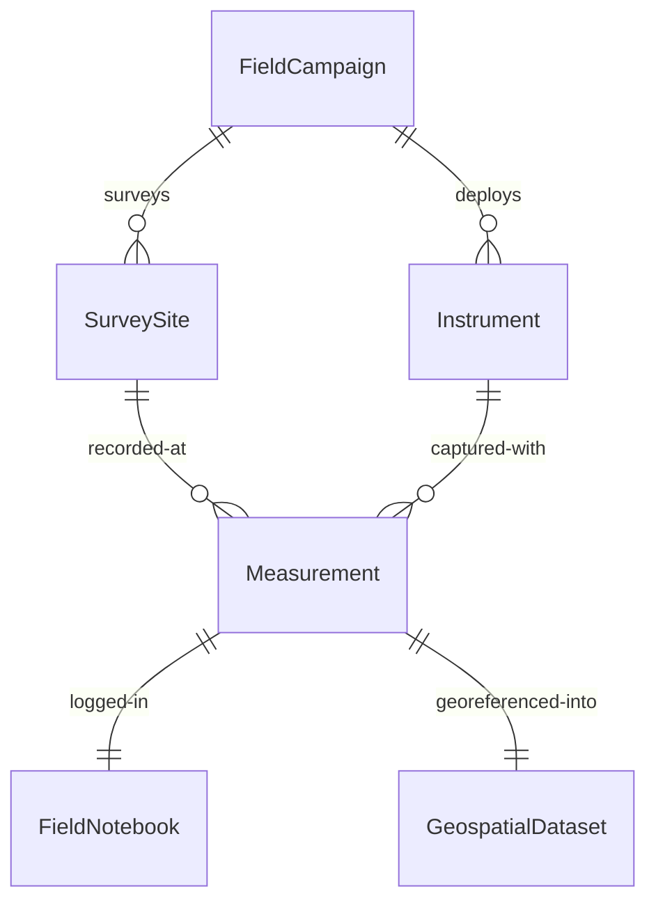
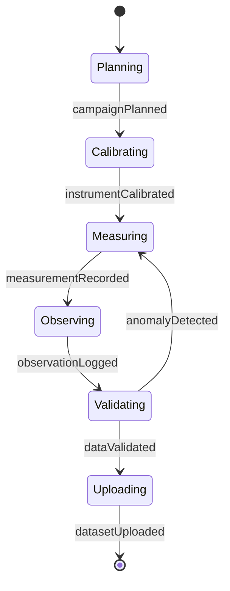
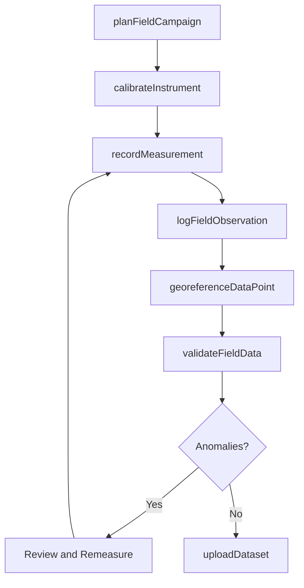
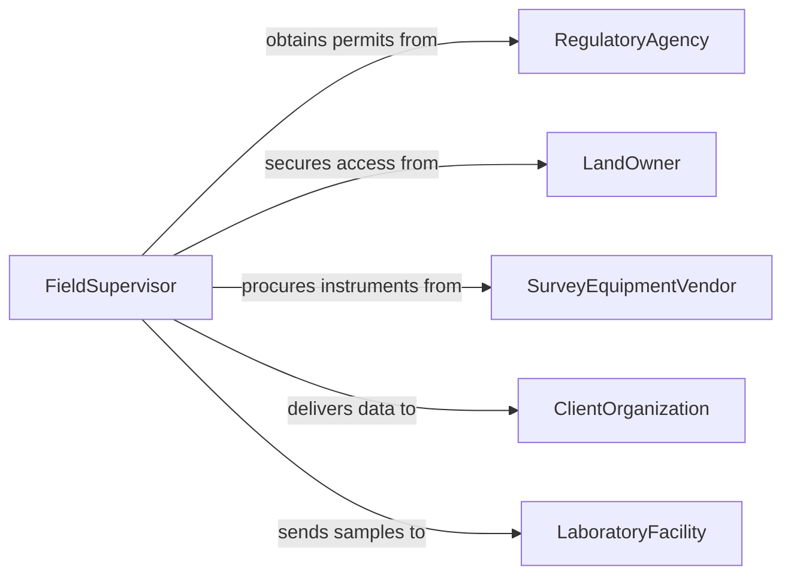

# Collect Geographical and Geological Field Data

> Business-as-Code definition for geographical and geological field data collection. Models the end-to-end process of planning field campaigns, gathering geospatial measurements and geological observations, and cataloging data for analysis.

## Overview

Collecting geographical and geological field data encompasses the physical activities of surveying terrain, recording geospatial coordinates, measuring stratigraphic sections, mapping rock outcrops, and gathering in-situ measurements such as strike-and-dip readings, soil permeability, and magnetic susceptibility. Field crews use instruments like GPS receivers, total stations, inclinometers, and magnetometers to capture data that feeds into geographic information systems and geological models. This definition provides actions for each stage of the collection workflow, events for automated data pipelines, and searches for querying field datasets.

## Actors

| Actor | Description |
|-------|-------------|
| LandOwner | Grants access to property for field surveys |
| RegulatoryAgency | Issues permits and enforces environmental compliance |
| SurveyEquipmentVendor | Supplies and calibrates field instruments |
| ClientOrganization | Commissions the field data collection campaign |
| LaboratoryFacility | Receives samples and data for further analysis |
| MappingAuthority | Provides base maps, geodetic datums, and reference networks |

## Roles

| Role | Description |
|------|-------------|
| FieldGeologist | Conducts geological observations and records stratigraphic data |
| Surveyor | Captures geospatial measurements using precision instruments |
| GISTechnician | Processes and integrates field data into geospatial databases |
| FieldSupervisor | Coordinates crew assignments and ensures data quality standards |

## Entities

| Entity | Description |
|--------|-------------|
| FieldCampaign | A planned period of data collection at one or more sites |
| SurveySite | A specific geographic location where measurements are taken |
| Measurement | A single recorded observation such as elevation, bearing, or conductivity |
| FieldNotebook | A structured log of observations, sketches, and contextual notes |
| GeospatialDataset | A collection of georeferenced measurements in a standard format |
| Instrument | A calibrated device used to capture field measurements |

## Actions

| Action | Description |
|--------|-------------|
| planFieldCampaign | Define objectives, sites, schedules, and equipment for the campaign |
| calibrateInstrument | Verify and adjust instrument accuracy before field deployment |
| recordMeasurement | Capture a geospatial or geological reading at a survey point |
| logFieldObservation | Document qualitative observations such as lithology and structure |
| georeferenceDataPoint | Assign precise geographic coordinates to a measurement |
| validateFieldData | Check collected data against quality thresholds and consistency rules |
| uploadDataset | Transfer field data to a centralized geospatial database |

## Events

| Event | Description |
|-------|-------------|
| campaignPlanned | A field campaign has been defined and approved |
| instrumentCalibrated | An instrument has passed calibration checks |
| measurementRecorded | A new geospatial or geological measurement has been captured |
| observationLogged | A qualitative field observation has been documented |
| dataValidated | A batch of field data has passed quality validation |
| datasetUploaded | Field data has been successfully transferred to the central repository |
| anomalyDetected | A measurement falls outside expected ranges for the survey area |

## Searches

| Search | Description |
|--------|-------------|
| findCampaigns | List field campaigns by date range, region, or project |
| getMeasurements | Retrieve measurements by site, instrument type, or date |
| getObservations | Query field notebook entries by geologist, site, or keyword |
| findAnomalies | Locate measurements flagged as outside expected thresholds |

## Entity Relationships



## State Diagram



## Workflow



## Actor Relationships



## Usage

### Calling Actions

```typescript
import { collectGeographicalGeologicalFieldData } from '@headlessly/collect-geographical-geological-field-data'

const fieldData = collectGeographicalGeologicalFieldData()

// Plan a new field campaign
const campaign = await fieldData.planFieldCampaign({
  name: 'Basin Reconnaissance Survey Q2',
  region: 'Permian Basin, West Texas',
  startDate: '2026-04-15',
  endDate: '2026-05-10',
  objectives: ['stratigraphic mapping', 'structural measurements', 'geochemical sampling']
})

// Record a measurement at a survey point
await fieldData.recordMeasurement({
  campaignId: campaign.id,
  siteId: 'PB-2026-014',
  instrument: 'Brunton Compass',
  type: 'strike-and-dip',
  values: { strike: 245, dip: 32, dipDirection: 'NW' },
  coordinates: { latitude: 31.9421, longitude: -102.0847, elevation: 823 }
})

// Validate and upload collected data
await fieldData.validateFieldData({ campaignId: campaign.id })
```

### Event-Driven Automation

```typescript
// Flag anomalous measurements for review
fieldData.anomalyDetected(async ({ campaignId, measurement, threshold }) => {
  await notify({
    to: 'field-supervisor',
    message: `Measurement ${measurement.id} at site ${measurement.siteId} exceeds threshold by ${threshold.deviation}%`
  })
})

// Trigger GIS processing when dataset is uploaded
fieldData.datasetUploaded(async ({ campaignId, datasetId }) => {
  await startGISProcessing({
    datasetId,
    pipeline: 'geological-model-ingestion'
  })
})
```
