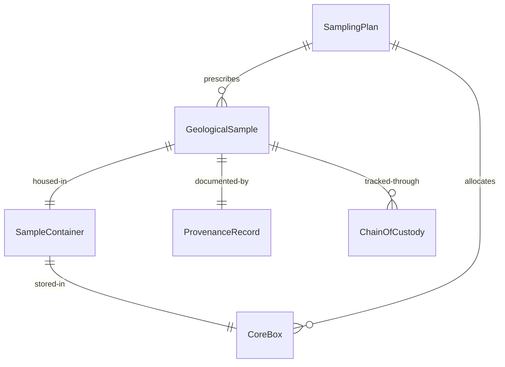
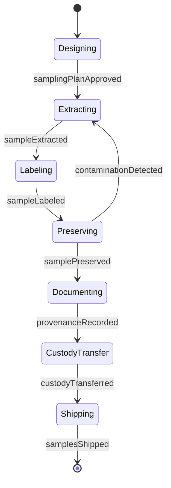
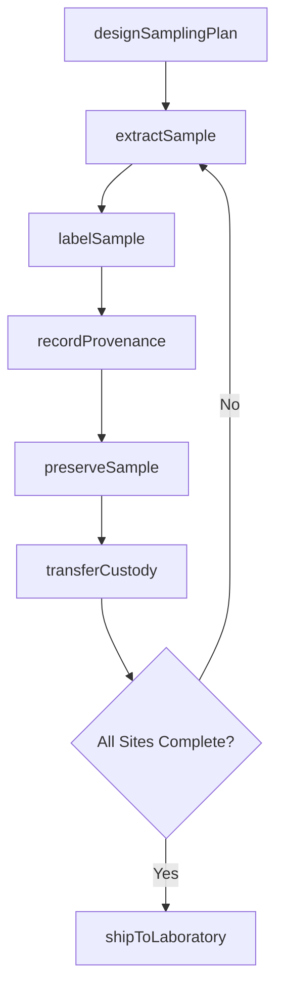
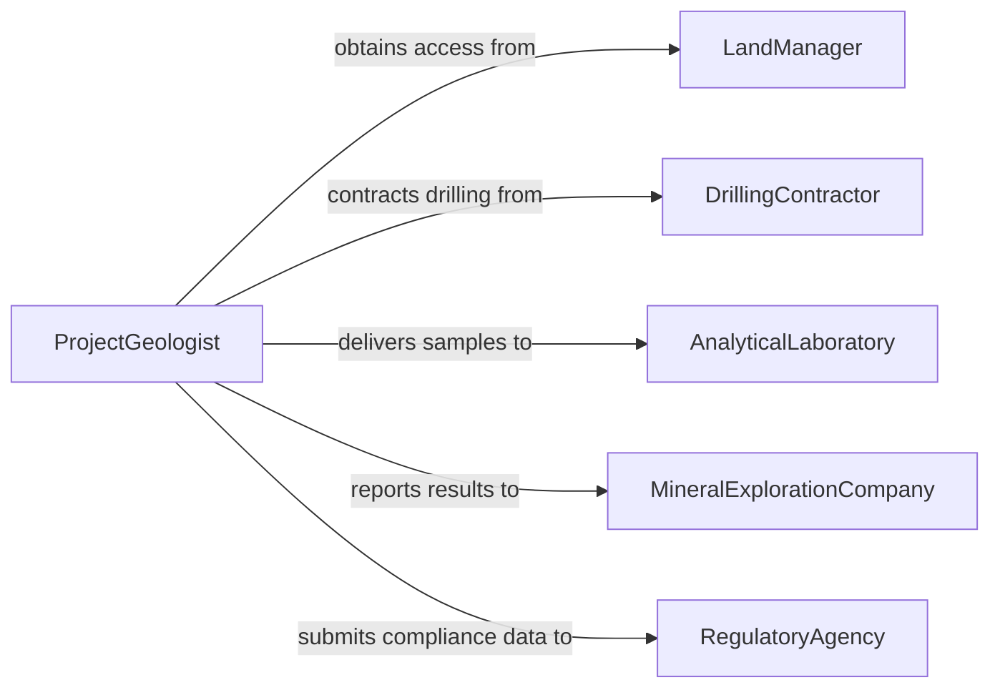

# Collect Geological Samples

> Business-as-Code definition for geological sample collection. Models the complete lifecycle from field planning through specimen retrieval, labeling, preservation, and chain-of-custody handoff to analytical laboratories.

## Overview

Collecting geological samples involves the physical extraction of rock cores, soil specimens, sediment grabs, water samples, and mineral fragments from field sites for laboratory analysis. Activities include selecting representative sampling locations, using hand tools or drilling equipment to extract specimens, recording provenance metadata, preserving samples to prevent contamination or degradation, and packaging them for transport. This work supports mineral exploration, environmental assessment, geotechnical engineering, and academic research.

## Actors

| Actor | Description |
|-------|-------------|
| MineralExplorationCompany | Commissions sample collection for prospecting and resource estimation |
| EnvironmentalConsultant | Requests samples for contamination assessment or remediation planning |
| AnalyticalLaboratory | Performs geochemical, petrographic, or mineralogical analyses on samples |
| RegulatoryAgency | Mandates sampling protocols and receives compliance reports |
| DrillingContractor | Provides core drilling services for subsurface sample extraction |
| LandManager | Authorizes access to public or private lands for sampling |

## Roles

| Role | Description |
|------|-------------|
| FieldGeologist | Selects sampling sites and extracts specimens following protocols |
| SampleTechnician | Labels, preserves, and packages samples for transport |
| ProjectGeologist | Designs the sampling plan and interprets preliminary field results |
| ChainOfCustodyOfficer | Maintains documentation tracking sample possession and handling |

## Entities

| Entity | Description |
|--------|-------------|
| SamplingPlan | A document specifying locations, methods, quantities, and protocols |
| GeologicalSample | A physical specimen of rock, soil, sediment, or water |
| SampleContainer | A labeled vessel used to store and transport a specimen |
| ProvenanceRecord | Metadata describing where, when, and how a sample was collected |
| ChainOfCustody | A sequential log documenting sample possession transfers |
| CoreBox | A segmented container for storing and organizing drill core sections |

## Actions

| Action | Description |
|--------|-------------|
| designSamplingPlan | Define locations, depths, methods, and quantities for collection |
| extractSample | Physically remove a specimen from a rock face, soil horizon, or core |
| labelSample | Apply a unique identifier and metadata tag to the sample container |
| preserveSample | Apply appropriate storage conditions to prevent degradation |
| recordProvenance | Document the exact location, depth, orientation, and context |
| transferCustody | Hand off sample possession to the next party in the chain |
| shipToLaboratory | Package and dispatch samples for analytical processing |

## Events

| Event | Description |
|-------|-------------|
| samplingPlanApproved | The sampling plan has been reviewed and authorized |
| sampleExtracted | A geological specimen has been physically collected |
| sampleLabeled | A sample has been assigned its unique identifier |
| samplePreserved | Appropriate preservation measures have been applied |
| provenanceRecorded | Location and context metadata has been documented |
| custodyTransferred | Sample possession has been formally handed to another party |
| samplesShipped | A batch of samples has been dispatched to the laboratory |

## Searches

| Search | Description |
|--------|-------------|
| findSamples | List samples by project, location, rock type, or collection date |
| getProvenance | Retrieve provenance metadata for a specific sample |
| getCustodyChain | View the full chain-of-custody history for a sample |
| findPendingShipments | List sample batches awaiting transport to the laboratory |

## Entity Relationships



## State Diagram



## Workflow



## Actor Relationships



## Usage

### Calling Actions

```typescript
import { collectGeologicalSamples } from '@headlessly/collect-geological-samples'

const samples = collectGeologicalSamples()

// Design a sampling plan
const plan = await samples.designSamplingPlan({
  project: 'Copper Ridge Exploration',
  sites: [
    { id: 'CR-001', coordinates: { lat: 34.521, lng: -111.843 }, depth: '0-30m', method: 'diamond-core' },
    { id: 'CR-002', coordinates: { lat: 34.519, lng: -111.840 }, depth: '0-15m', method: 'hand-auger' }
  ],
  targetCount: 48,
  protocols: ['ASTM D420', 'USGS Field Methods']
})

// Extract and label a sample
const specimen = await samples.extractSample({
  planId: plan.id,
  siteId: 'CR-001',
  depth: 12.5,
  method: 'diamond-core',
  lithology: 'quartz-monzonite porphyry'
})

await samples.labelSample({
  sampleId: specimen.id,
  containerId: 'CB-2026-0147',
  label: 'CR-001-12.5m-QMP'
})
```

### Event-Driven Automation

```typescript
// Notify lab when shipment is dispatched
samples.samplesShipped(async ({ shipmentId, sampleCount, destination }) => {
  await notify({
    to: destination.contactEmail,
    message: `Shipment ${shipmentId} with ${sampleCount} samples en route. ETA: ${destination.eta}`
  })
})

// Alert on chain-of-custody gap
samples.custodyTransferred(async ({ sampleId, fromParty, toParty, timestamp }) => {
  const gap = await checkCustodyGap({ sampleId, timestamp })
  if (gap.hoursUnaccounted > 2) {
    await escalate({
      to: 'quality-manager',
      message: `Chain-of-custody gap of ${gap.hoursUnaccounted}h detected for sample ${sampleId}`
    })
  }
})
```
