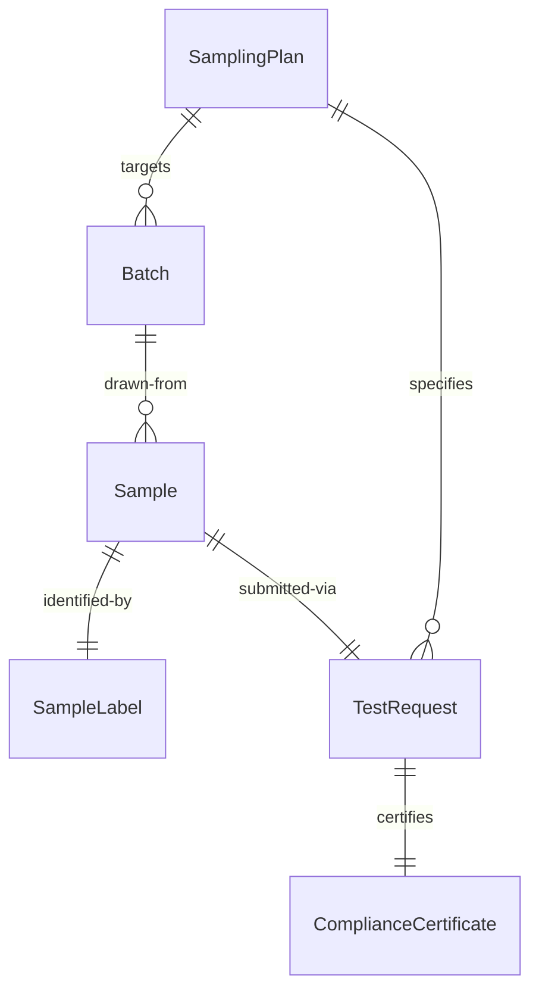
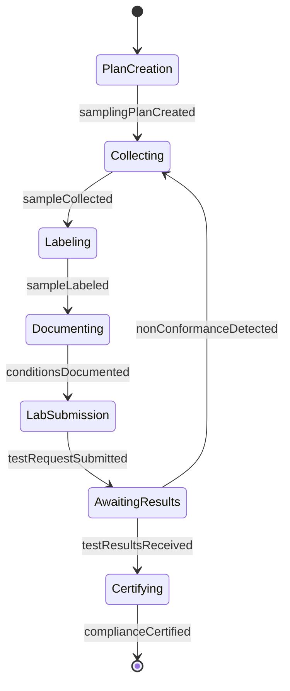
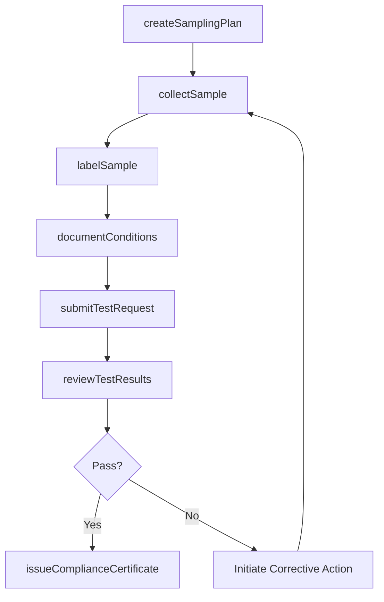
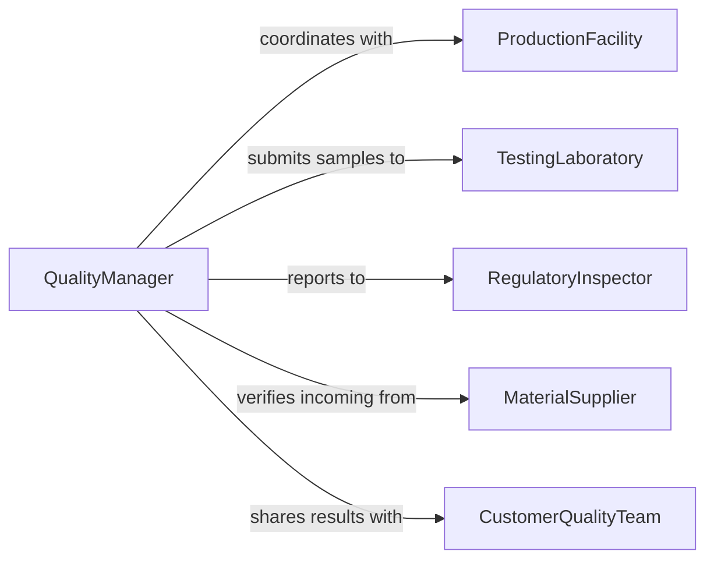

# Collect Samples for Analysis or Testing

> Business-as-Code definition for collecting product and material samples destined for laboratory analysis or quality testing. Models the workflow from sampling plan creation through specimen retrieval, documentation, and submission to testing facilities.

## Overview

Collecting samples for analysis or testing involves systematically extracting representative portions of raw materials, in-process goods, finished products, or environmental media and preparing them for laboratory evaluation. This activity spans industries including manufacturing quality control, food safety inspection, pharmaceutical batch release, environmental monitoring, and construction materials testing. Proper technique ensures that samples are representative, uncontaminated, and traceable throughout the analytical chain.

## Actors

| Actor | Description |
|-------|-------------|
| ProductionFacility | Provides access to production lines and material batches for sampling |
| TestingLaboratory | Receives samples and performs analytical or physical testing |
| RegulatoryInspector | Mandates sampling frequency, methods, and documentation standards |
| MaterialSupplier | Furnishes incoming materials subject to receiving inspection sampling |
| CustomerQualityTeam | Requests specific sampling to verify product conformance |
| CalibrationService | Certifies sampling instruments and measurement tools |

## Roles

| Role | Description |
|------|-------------|
| QualityInspector | Executes sampling procedures and documents collection details |
| LabTechnician | Prepares and routes samples within the testing facility |
| QualityManager | Designs sampling plans and reviews testing outcomes |
| SamplingCoordinator | Schedules sample collection across production shifts and lines |

## Entities

| Entity | Description |
|--------|-------------|
| SamplingPlan | A protocol specifying what, where, when, and how to sample |
| Sample | A physical portion of material collected for testing |
| Batch | A production lot or material consignment from which samples are drawn |
| TestRequest | A formal submission linking a sample to the required analyses |
| SampleLabel | A unique identifier affixed to the sample container |
| ComplianceCertificate | Documentation confirming that sampled material meets specifications |

## Actions

| Action | Description |
|--------|-------------|
| createSamplingPlan | Define sampling frequency, locations, methods, and acceptance criteria |
| collectSample | Extract a representative portion from a batch or process stream |
| labelSample | Assign a unique tracking identifier to the sample container |
| documentConditions | Record environmental and process conditions at the time of collection |
| submitTestRequest | Send the sample to a laboratory with specified test requirements |
| reviewTestResults | Evaluate analytical outcomes against acceptance criteria |
| issueComplianceCertificate | Generate documentation certifying material conformance |

## Events

| Event | Description |
|-------|-------------|
| samplingPlanCreated | A new sampling protocol has been established |
| sampleCollected | A sample has been physically extracted from the source |
| sampleLabeled | A sample has been assigned its tracking identifier |
| conditionsDocumented | Collection environment and process data have been recorded |
| testRequestSubmitted | A sample has been formally submitted for laboratory analysis |
| testResultsReceived | Analytical results have been returned from the laboratory |
| complianceCertified | Material has been certified as meeting quality specifications |
| nonConformanceDetected | Test results indicate the sample does not meet criteria |

## Searches

| Search | Description |
|--------|-------------|
| findSamples | List samples by batch, product, date range, or test status |
| getTestResults | Retrieve analytical results for a specific sample or batch |
| findNonConformances | Locate samples that failed acceptance criteria |
| getSamplingSchedule | View upcoming sample collection events by line or shift |

## Entity Relationships



## State Diagram



## Workflow



## Actor Relationships



## Usage

### Calling Actions

```typescript
import { collectSamplesForAnalysisOrTesting } from '@headlessly/collect-samples-for-analysis-or-testing'

const sampling = collectSamplesForAnalysisOrTesting()

// Create a sampling plan for incoming steel coils
const plan = await sampling.createSamplingPlan({
  product: 'Cold-Rolled Steel Coil',
  batchSize: 500,
  sampleSize: 12,
  method: 'systematic-random',
  tests: ['tensile-strength', 'chemical-composition', 'surface-roughness'],
  acceptanceCriteria: { tensileStrength: { min: 270, max: 370, unit: 'MPa' } }
})

// Collect a sample from the batch
const sample = await sampling.collectSample({
  planId: plan.id,
  batchId: 'SC-2026-04821',
  location: 'Coil center, 3m from leading edge',
  method: 'coupon-cut'
})

// Submit for laboratory testing
await sampling.submitTestRequest({
  sampleId: sample.id,
  laboratory: 'Materials Testing Lab A',
  priority: 'standard',
  tests: plan.tests
})
```

### Event-Driven Automation

```typescript
// Alert quality team on non-conformance
sampling.nonConformanceDetected(async ({ sampleId, batchId, failedTests }) => {
  await notify({
    to: 'quality-team',
    message: `Sample ${sampleId} from batch ${batchId} failed: ${failedTests.join(', ')}`
  })
  await quarantineBatch({ batchId })
})

// Auto-issue compliance certificate on passing results
sampling.testResultsReceived(async ({ sampleId, results, allPassed }) => {
  if (allPassed) {
    await sampling.issueComplianceCertificate({ sampleId, results })
  }
})
```
