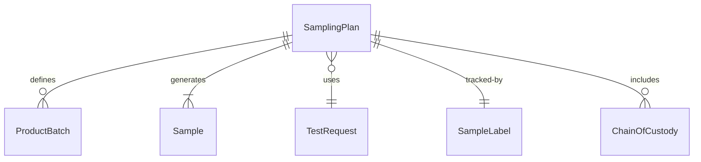
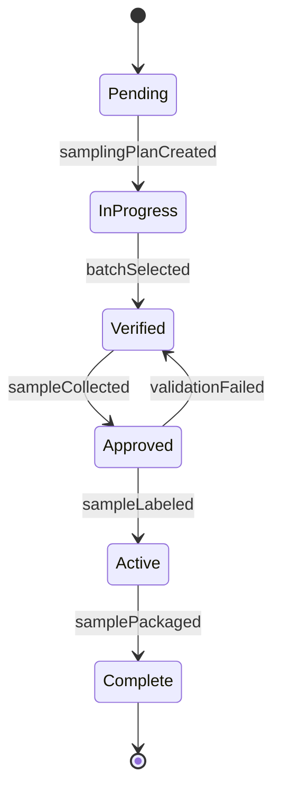
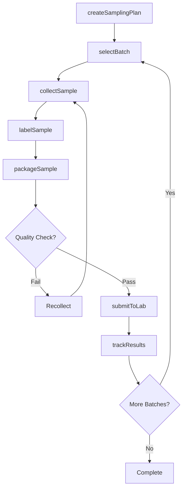
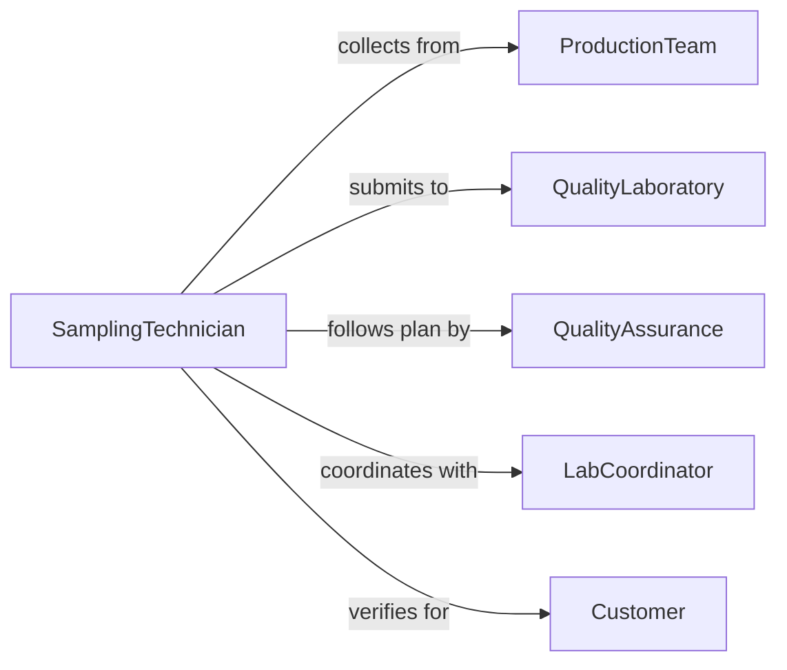

# Collect Samples Materials Products Testing

> Business-as-Code definition for collecting samples of materials or products for quality testing. Models the complete sampling workflow from planning through laboratory submission and result tracking.

## Overview

Collecting samples of materials or products for testing involves obtaining representative specimens from production batches, shipments, or inventory for quality control, compliance verification, and performance analysis. This definition exposes actions for sampling plan design, collection, labeling, and laboratory coordination, with events for traceability and quality assurance.

## Actors

| Actor | Description |
|-------|-------------|
| QualityLaboratory | Performs testing and analysis on samples |
| ProductionTeam | Manufactures materials or products being sampled |
| QualityAssurance | Defines testing requirements and acceptance criteria |
| Customer | Requests testing for incoming materials |
| RegulatoryAuthority | Enforces testing standards and compliance |
| Supplier | Provides materials subject to sampling |

## Roles

| Role | Description |
|------|-------------|
| SamplingTechnician | Executes sample collection procedures |
| QualityInspector | Verifies sampling meets protocols |
| LabCoordinator | Manages sample submission and tracking |
| DataAnalyst | Interprets test results and trends |

## Entities

| Entity | Description |
|--------|-------------|
| SamplingPlan | Protocol for sample collection and testing |
| ProductBatch | Production lot from which samples are drawn |
| Sample | Representative specimen collected for testing |
| TestRequest | Specification of analyses to perform |
| SampleLabel | Identifier linking sample to batch and tests |
| ChainOfCustody | Documentation of sample handling |

## Actions

| Action | Description |
|--------|-------------|
| createSamplingPlan | Define sampling frequency and methodology |
| selectBatch | Identify production lot for sampling |
| collectSample | Obtain representative specimen from batch |
| labelSample | Apply identifier and metadata to sample |
| packageSample | Prepare sample for transport to laboratory |
| submitToLab | Deliver sample with test specifications |
| trackResults | Monitor testing progress and retrieve data |

## Events

| Event | Description |
|-------|-------------|
| samplingPlanCreated | Sampling protocol established |
| batchSelected | Production lot identified for sampling |
| sampleCollected | Representative specimen obtained |
| sampleLabeled | Identifier and metadata applied |
| samplePackaged | Sample prepared for laboratory transport |
| labSubmitted | Sample delivered with test request |
| resultsTracked | Testing milestone or result recorded |

## Searches

| Search | Description |
|--------|-------------|
| findSamples | List samples by batch, product, or date |
| getBatches | Retrieve production lots and sampling status |
| getTests | Find test requests and results |
| getCustody | Trace sample handling history |

## Entity Relationships



## State Diagram



## Workflow



## Actor Relationships



## Usage

### Calling Actions

```typescript
import { collectSamplesMaterialsProductsTesting } from '@headlessly/collect-samples-materials-products-testing'

const sampling = collectSamplesMaterialsProductsTesting()

// Create sampling plan for incoming raw materials
const plan = await sampling.createSamplingPlan({
  product: 'Steel Rod - Grade A36',
  frequency: 'per-shipment',
  sampleSize: 3,
  tests: ['tensile-strength', 'chemical-composition', 'hardness']
})

// Select batch and collect samples
const batch = await sampling.selectBatch({
  planId: plan.id,
  batchNumber: 'LOT-2026-001234',
  receivedDate: '2026-02-05',
  quantity: 10000,
  quantityUnit: 'lbs'
})

const sample = await sampling.collectSample({
  batchId: batch.id,
  sampleNumber: 1,
  collectionMethod: 'random-systematic',
  location: 'top-middle-bottom',
  quantity: 500,
  quantityUnit: 'grams'
})

// Label and package for laboratory
await sampling.labelSample({
  sampleId: sample.id,
  sampleNumber: 'SAMPLE-2026-001234-01',
  barcode: '987654321098',
  metadata: {
    product: 'Steel Rod - Grade A36',
    batch: 'LOT-2026-001234',
    collectionDate: new Date().toISOString()
  }
})

await sampling.packageSample({
  sampleId: sample.id,
  containerType: 'sealed-bag',
  storageConditions: 'room-temperature'
})

// Submit to laboratory with test specifications
await sampling.submitToLab({
  sampleId: sample.id,
  laboratory: 'materials-lab-001',
  testMethods: ['ASTM-E8', 'ASTM-E415', 'ASTM-E18'],
  priority: 'standard',
  turnaroundDays: 5
})
```

### Event-Driven Automation

```typescript
// Alert quality team when test results are out of specification
sampling.resultsTracked(async ({ sampleId, testResults }) => {
  const failures = testResults.filter(r => r.result < r.minSpec || r.result > r.maxSpec)

  if (failures.length > 0) {
    await notify({
      to: 'quality-assurance',
      priority: 'high',
      message: `Sample ${sampleId} failed ${failures.length} test(s)`,
      details: failures
    })

    // Place batch on hold
    const sample = await sampling.findSamples({ id: sampleId })
    await holdBatch({ batchId: sample[0].batchId, reason: 'failed-testing' })
  }
})

// Auto-release batches when all tests pass
sampling.resultsTracked(async ({ sampleId, testResults, allTestsComplete }) => {
  if (allTestsComplete && testResults.every(r => r.status === 'pass')) {
    const sample = await sampling.findSamples({ id: sampleId })
    await releaseBatch({
      batchId: sample[0].batchId,
      approvedBy: 'automated-qa-system',
      approvalDate: new Date().toISOString()
    })
  }
})
```
