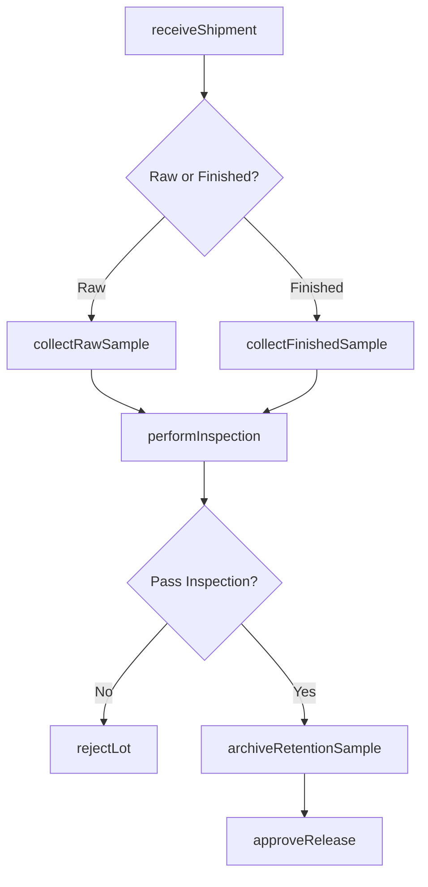
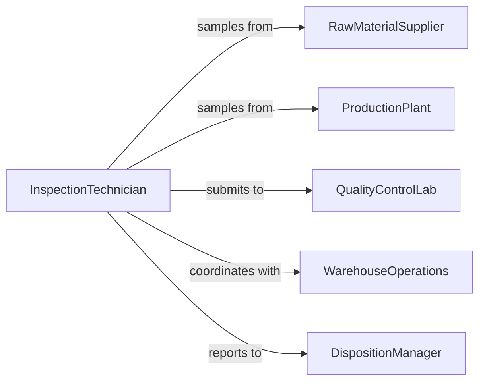

# Collect Samples Raw Materials Finished

> Business-as-Code definition for collecting samples of raw materials or finished products in manufacturing operations. Models the complete sampling lifecycle from receipt inspection through final product release.

## Overview

Collecting samples of raw materials or finished products involves obtaining representative specimens at various production stages for incoming inspection, in-process monitoring, and final quality verification. This definition exposes actions for strategic sampling, documentation, and disposition decisions, with events for supply chain coordination and regulatory compliance.

## Actors

| Actor | Description |
|-------|-------------|
| RawMaterialSupplier | Provides materials for production processes |
| ProductionPlant | Manufactures finished products from raw materials |
| QualityControlLab | Performs testing on samples |
| WarehouseOperations | Stores and manages inventory pending release |
| Customer | Receives finished products after approval |
| CertificationBody | Verifies compliance with industry standards |

## Roles

| Role | Description |
|------|-------------|
| InspectionTechnician | Collects samples at receiving and production |
| QualityEngineer | Defines sampling criteria and acceptance limits |
| WarehouseClerk | Manages sample storage and retention |
| DispositionManager | Approves release or rejection of batches |

## Entities

| Entity | Description |
|--------|-------------|
| RawMaterialLot | Incoming material shipment from supplier |
| ProductionBatch | Finished goods from manufacturing run |
| Sample | Representative specimen from lot or batch |
| InspectionPlan | Criteria for sample collection and testing |
| Certificate | Documentation of test results and approval |
| RetentionSample | Archived specimen for future reference |

## Actions

| Action | Description |
|--------|-------------|
| receiveShipment | Document incoming raw material delivery |
| collectRawSample | Obtain specimen from incoming material |
| collectFinishedSample | Obtain specimen from production output |
| performInspection | Conduct visual and physical checks |
| archiveRetentionSample | Store sample for future reference |
| approveRelease | Authorize use of raw material or sale of product |
| rejectLot | Quarantine and return non-conforming material |

## Events

| Event | Description |
|-------|-------------|
| shipmentReceived | Incoming material documented |
| rawSampleCollected | Specimen obtained from raw material |
| finishedSampleCollected | Specimen obtained from finished product |
| inspectionPerformed | Visual and physical checks completed |
| retentionSampleArchived | Sample stored for retention period |
| releaseApproved | Material or product authorized for use |
| lotRejected | Non-conforming batch quarantined |

## Searches

| Search | Description |
|--------|-------------|
| findSamples | List samples by material, batch, or status |
| getLots | Retrieve raw material or finished product lots |
| getInspections | Find inspection records and results |
| getRetentionSamples | Locate archived samples by date range |

## Workflow



## Actor Relationships



## Usage

### Calling Actions

```typescript
import { collectSamplesRawMaterialsFinished } from '@headlessly/collect-samples-raw-materials-finished'

const samples = collectSamplesRawMaterialsFinished()

// Receive raw material shipment and collect sample
const shipment = await samples.receiveShipment({
  supplier: 'Chemical Supply Inc',
  material: 'Titanium Dioxide Powder',
  lotNumber: 'TI-2026-0205',
  quantity: 5000,
  quantityUnit: 'kg',
  receivedDate: '2026-02-05'
})

const rawSample = await samples.collectRawSample({
  shipmentId: shipment.id,
  sampleSize: 500,
  sampleUnit: 'grams',
  collectionMethod: 'random-stratified',
  locations: ['top', 'middle', 'bottom']
})

// Perform inspection on raw material
const inspection = await samples.performInspection({
  sampleId: rawSample.id,
  inspectionType: 'raw-material',
  criteria: {
    appearance: 'white-powder',
    moisture: { max: 0.5, unit: 'percent' },
    particleSize: { max: 10, unit: 'microns' }
  }
})

// Collect finished product sample
const finishedSample = await samples.collectFinishedSample({
  batchNumber: 'PAINT-2026-0123',
  product: 'Interior Paint - White',
  sampleSize: 1,
  sampleUnit: 'liter',
  collectionPoint: 'filling-line-end'
})

// Archive retention sample and approve release
await samples.archiveRetentionSample({
  sampleId: finishedSample.id,
  storageLocation: 'retention-room-A',
  retentionPeriod: 24,
  retentionUnit: 'months'
})

await samples.approveRelease({
  batchNumber: 'PAINT-2026-0123',
  approvedBy: 'quality-engineer-001',
  approvalDate: new Date().toISOString(),
  certificateNumber: 'COA-2026-0123'
})
```

### Event-Driven Automation

```typescript
// Auto-reject lots when inspection fails
samples.inspectionPerformed(async ({ sampleId, inspection, passed }) => {
  if (!passed) {
    const sample = await samples.findSamples({ id: sampleId })

    await samples.rejectLot({
      lotNumber: sample[0].lotNumber,
      reason: inspection.failures.join(', '),
      disposition: 'return-to-supplier'
    })

    await notify({
      to: 'procurement',
      priority: 'high',
      message: `Lot ${sample[0].lotNumber} rejected - ${inspection.failures.join(', ')}`
    })
  }
})

// Notify production when raw materials are approved
samples.releaseApproved(async ({ lotNumber, material }) => {
  if (material.type === 'raw-material') {
    await notify({
      to: 'production-planning',
      message: `Raw material ${lotNumber} approved and available`,
      quantity: material.quantity
    })

    await updateInventory({
      material: material.name,
      lot: lotNumber,
      status: 'available'
    })
  }
})
```
