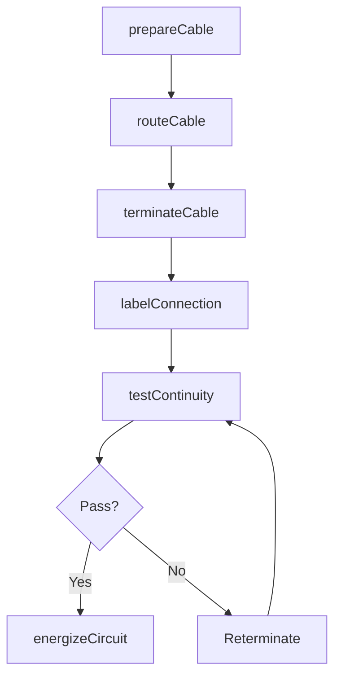
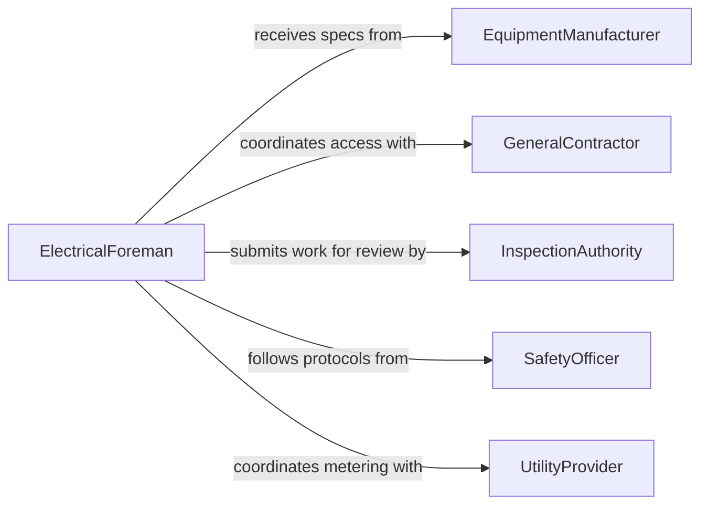

# Connect Cables Electrical Lines

> Business-as-Code definition for connecting cables and electrical lines. Models the end-to-end process of routing, terminating, and verifying power and signal cable connections across electrical infrastructure.

## Overview

Connecting cables and electrical lines encompasses the physical attachment of power conductors, control wiring, and communication cables to panels, junction boxes, transformers, and end-use equipment. This work requires adherence to electrical codes, proper torque specifications, and verified continuity before energization. The definition exposes actions for each phase from cable preparation through final testing and commissioning.

## Actors

| Actor | Description |
|-------|-------------|
| UtilityProvider | Supplies incoming power and sets metering requirements |
| EquipmentManufacturer | Specifies terminal ratings, wire gauges, and connection methods |
| InspectionAuthority | Conducts code compliance inspections on completed connections |
| GeneralContractor | Coordinates scheduling and site access for electrical work |
| SafetyOfficer | Enforces lockout/tagout and arc flash safety protocols |

## Roles

| Role | Description |
|------|-------------|
| Electrician | Performs cable termination, splicing, and connection work |
| CablePuller | Routes and pulls cables through raceways and conduits |
| ElectricalForeman | Supervises crew assignments and ensures code compliance |
| TestTechnician | Performs continuity, insulation resistance, and megger testing |

## Entities

| Entity | Description |
|--------|-------------|
| Cable | A conductor assembly with insulation rated for specific voltage and amperage |
| Terminal | A connection point on equipment where cables are fastened |
| JunctionBox | An enclosure where cable splices and branch connections are made |
| CircuitBreaker | A protective device that the cable feeds through for overcurrent protection |
| CableSchedule | A document listing cable types, lengths, origins, and destinations |
| ConnectionLog | A record of each completed cable termination with torque values |

## Actions

| Action | Description |
|--------|-------------|
| prepareCable | Strip insulation, apply lugs, and dress conductors for termination |
| routeCable | Pull cable through conduit, tray, or raceway to the destination point |
| terminateCable | Secure conductors to terminals using specified torque and methods |
| spliceCable | Join two cable ends in a junction box with approved connectors |
| labelConnection | Apply identification tags to cables and terminals per the cable schedule |
| testContinuity | Verify end-to-end electrical continuity and insulation resistance |
| energizeCircuit | Apply power to the completed cable connection after testing passes |

## Events

| Event | Description |
|-------|-------------|
| cablePrepared | Cable ends have been stripped, lugged, and readied for connection |
| cableRouted | Cable has been pulled to the destination and secured in place |
| cableTerminated | Conductors have been fastened to terminals at rated torque |
| cableSpliced | Cable splice has been completed and enclosed in a junction box |
| connectionLabeled | Identification tags have been applied to the cable and terminal |
| continuityVerified | Continuity and insulation resistance tests have passed |
| circuitEnergized | Power has been applied and the connection is live |

## Searches

| Search | Description |
|--------|-------------|
| findCables | List cables by type, gauge, voltage rating, or route assignment |
| getConnections | Retrieve completed connections by panel, circuit, or equipment |
| getTestResults | Look up continuity and insulation test results for specific cables |
| findOpenTerminals | Locate available terminal positions on panels or junction boxes |

## Workflow



## Actor Relationships



## Usage

### Calling Actions

```typescript
import { connectCablesElectricalLines } from '@headlessly/connect-cables-electrical-lines'

const cables = connectCablesElectricalLines()

// Prepare a cable for termination
const cable = await cables.prepareCable({
  cableId: 'PWR-001',
  gauge: '4/0 AWG',
  voltage: 480,
  lugType: 'compression',
  conductorCount: 3
})

// Route the cable to the destination panel
await cables.routeCable({
  cableId: cable.id,
  origin: 'MDP-1',
  destination: 'PANEL-3A',
  raceway: 'EMT-2inch',
  lengthFt: 125
})

// Terminate and test
await cables.terminateCable({
  cableId: cable.id,
  terminalId: 'PANEL-3A-MAIN',
  torqueSpec: { value: 35, unit: 'ft-lb' }
})
```

### Event-Driven Automation

```typescript
// Trigger inspection request after continuity passes
cables.continuityVerified(async ({ cableId, testResults }) => {
  await requestInspection({
    type: 'electrical-connection',
    cableId,
    meggerReading: testResults.insulationResistance
  })
})

// Log energization events for commissioning records
cables.circuitEnergized(async ({ cableId, circuitId, timestamp }) => {
  await updateCommissioningLog({
    circuitId,
    cableId,
    energizedAt: timestamp,
    status: 'live'
  })
})
```
