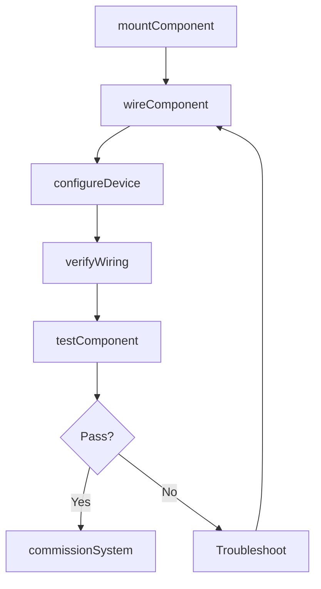
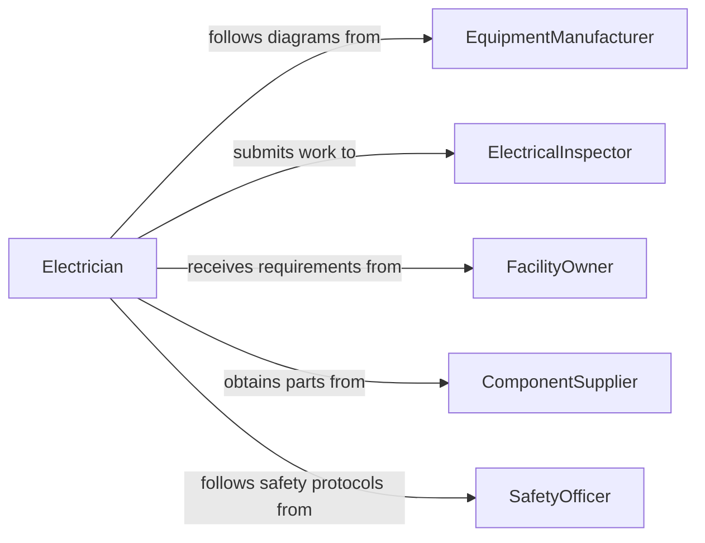

# Connect Electrical Components Equipment

> Business-as-Code definition for connecting electrical components and equipment. Models the process of wiring, mounting, and integrating electrical devices such as motors, switches, relays, and control panels into functional systems.

## Overview

Connecting electrical components and equipment involves mounting devices, wiring them into circuits, and verifying proper operation within an electrical system. This includes tasks such as installing circuit breakers, wiring motor starters, connecting sensors to controllers, and integrating control panel assemblies. Each connection must conform to manufacturer specifications, NEC requirements, and facility standards before the system is placed in service.

## Actors

| Actor | Description |
|-------|-------------|
| EquipmentManufacturer | Provides wiring diagrams, terminal specifications, and installation guides |
| ElectricalInspector | Verifies code compliance and approves installations for service |
| FacilityOwner | Defines system requirements and approves scope of electrical work |
| ComponentSupplier | Delivers electrical devices, connectors, and mounting hardware |
| SafetyOfficer | Enforces electrical safety procedures and PPE requirements |

## Roles

| Role | Description |
|------|-------------|
| Electrician | Mounts components and completes wiring connections |
| ControlsTechnician | Programs and configures connected control devices |
| ElectricalEngineer | Designs circuit layouts and specifies component ratings |
| QualityInspector | Verifies connections against wiring diagrams and torque specs |

## Entities

| Entity | Description |
|--------|-------------|
| Component | An electrical device such as a relay, contactor, switch, or sensor |
| WiringDiagram | A schematic showing how components connect within a circuit |
| Terminal | A connection point on a component for attaching conductors |
| ControlPanel | An enclosure housing multiple interconnected electrical components |
| CircuitBranch | A section of the electrical system fed by a single protective device |
| ConnectionRecord | Documentation of a completed component connection with verification data |

## Actions

| Action | Description |
|--------|-------------|
| mountComponent | Secure an electrical component to a panel, rack, or mounting surface |
| wireComponent | Attach conductors from the component terminals to the circuit |
| configureDevice | Set DIP switches, address settings, or parameters on the component |
| verifyWiring | Check connections against the wiring diagram for correctness |
| testComponent | Power on the component and validate proper operation |
| commissionSystem | Place the fully connected and tested system into active service |

## Events

| Event | Description |
|-------|-------------|
| componentMounted | An electrical component has been physically secured in position |
| componentWired | All conductors have been attached to the component terminals |
| deviceConfigured | Component settings have been applied per specification |
| wiringVerified | Point-to-point wiring check has confirmed diagram compliance |
| componentTested | Functional test has confirmed the component operates correctly |
| systemCommissioned | The connected system has been placed into active service |

## Searches

| Search | Description |
|--------|-------------|
| findComponents | List components by type, rating, panel location, or installation status |
| getWiringDiagrams | Retrieve wiring diagrams by system, panel, or circuit branch |
| getConnectionRecords | Look up completed connection documentation by component or circuit |

## Workflow



## Actor Relationships



## Usage

### Calling Actions

```typescript
import { connectElectricalComponentsEquipment } from '@headlessly/connect-electrical-components-equipment'

const components = connectElectricalComponentsEquipment()

// Mount a motor starter in the control panel
const starter = await components.mountComponent({
  componentType: 'motor-starter',
  model: 'AB-509',
  panelId: 'MCC-2',
  position: 'Bucket-5A',
  rating: { voltage: 480, hp: 25 }
})

// Wire the component per diagram
await components.wireComponent({
  componentId: starter.id,
  diagramRef: 'DWG-E-401',
  connections: [
    { terminal: 'L1', conductor: 'BLK-12AWG', source: 'BKR-5A' },
    { terminal: 'L2', conductor: 'RED-12AWG', source: 'BKR-5A' },
    { terminal: 'L3', conductor: 'BLU-12AWG', source: 'BKR-5A' }
  ]
})

// Verify and test
await components.verifyWiring({ componentId: starter.id, diagramRef: 'DWG-E-401' })
await components.testComponent({ componentId: starter.id, testType: 'functional' })
```

### Event-Driven Automation

```typescript
// Auto-schedule inspection when wiring is verified
components.wiringVerified(async ({ componentId, panelId }) => {
  await scheduleInspection({
    type: 'electrical-component',
    panelId,
    componentId,
    priority: 'standard'
  })
})

// Notify operations when system is commissioned
components.systemCommissioned(async ({ systemId, components }) => {
  await notify({
    to: 'operations-team',
    message: `System ${systemId} commissioned with ${components.length} components`
  })
})
```
