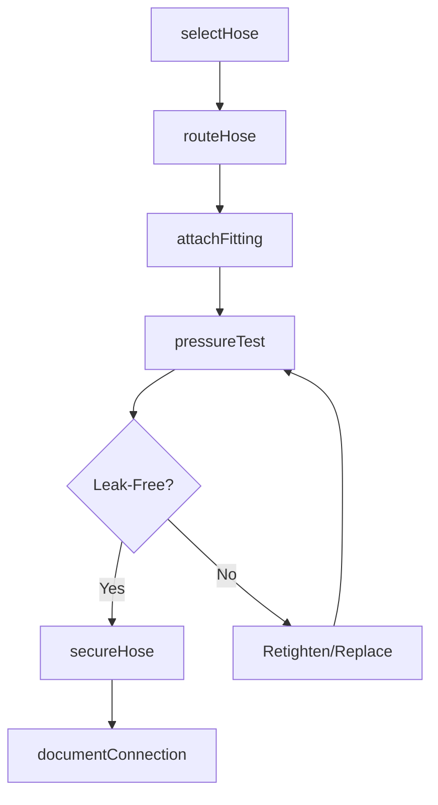
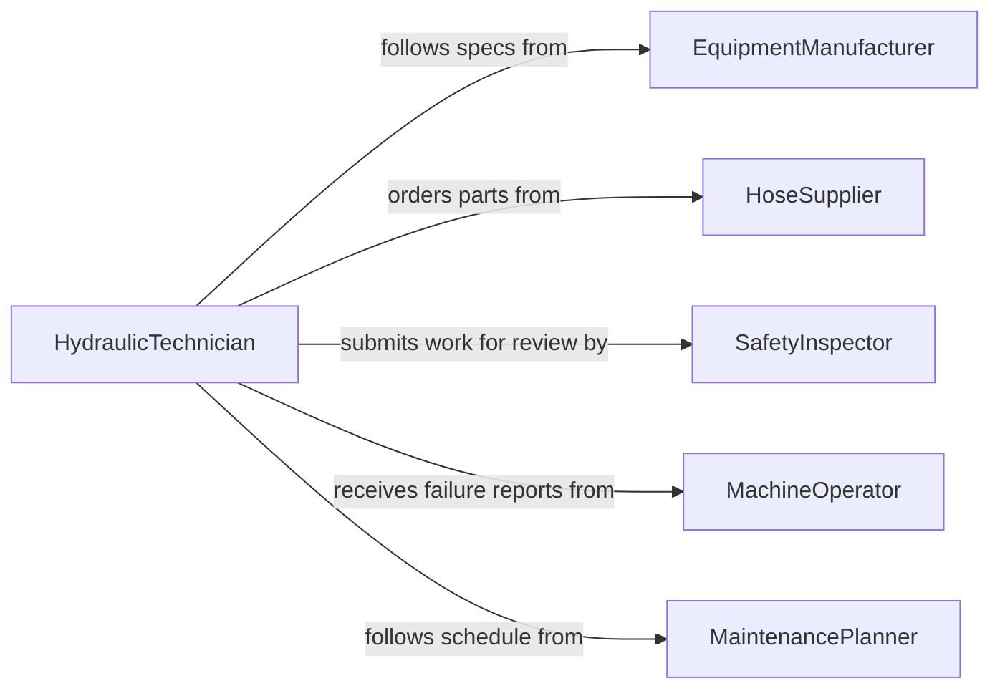

# Connect Hoses Equipment Machinery

> Business-as-Code definition for connecting hoses to equipment and machinery. Models the process of selecting, routing, attaching, and pressure-testing flexible hose assemblies on industrial and mobile equipment.

## Overview

Connecting hoses to equipment or machinery involves selecting the correct hose type and fittings, routing them between components, securing connections at ports, and verifying leak-free operation under working pressure. This activity is common across hydraulic systems, pneumatic tools, coolant circuits, and fuel delivery on construction, manufacturing, and agricultural equipment. Proper hose connections are critical for safe, reliable machinery operation.

## Actors

| Actor | Description |
|-------|-------------|
| EquipmentManufacturer | Specifies hose types, port sizes, and pressure ratings for machinery |
| HoseSupplier | Provides hose assemblies, fittings, and adapters |
| SafetyInspector | Verifies hose installations meet OSHA and manufacturer safety standards |
| MachineOperator | Reports hose failures and requests replacement connections |
| MaintenancePlanner | Schedules hose replacement and preventive maintenance intervals |

## Roles

| Role | Description |
|------|-------------|
| HydraulicTechnician | Installs and connects hydraulic and pneumatic hose assemblies |
| MaintenanceMechanic | Performs general hose connections across various equipment systems |
| FieldServiceTechnician | Connects hoses on mobile equipment at remote job sites |

## Entities

| Entity | Description |
|--------|-------------|
| HoseAssembly | A flexible conduit with end fittings rated for specific pressure and media |
| Fitting | A connector that joins a hose to an equipment port or another hose |
| Port | A machined connection point on equipment designed to accept a hose fitting |
| PressureTest | A verification procedure confirming leak-free operation at rated pressure |
| HoseRoute | The physical path a hose follows between two connection points |
| WorkOrder | A maintenance directive specifying hose connection tasks and requirements |

## Actions

| Action | Description |
|--------|-------------|
| selectHose | Choose the correct hose assembly based on pressure, media, and temperature ratings |
| routeHose | Position the hose along its path avoiding sharp bends, heat sources, and pinch points |
| attachFitting | Connect the hose fitting to the equipment port and tighten to specification |
| pressureTest | Apply working pressure and inspect for leaks at all connection points |
| secureHose | Install clamps, guards, and strain relief to protect the hose route |
| replaceHose | Remove a worn or damaged hose and install a replacement assembly |
| documentConnection | Record hose type, fitting torque, test results, and installation date |

## Events

| Event | Description |
|-------|-------------|
| hoseSelected | A hose assembly has been matched to the equipment requirements |
| hoseRouted | The hose has been positioned along its designated path |
| fittingAttached | The hose fitting has been secured to the equipment port |
| pressureTestPassed | The connection has been verified leak-free at rated pressure |
| hoseSecured | Clamps and guards have been installed to protect the hose |
| hoseReplaced | A worn hose has been swapped with a new assembly |
| connectionDocumented | Installation details and test results have been recorded |

## Searches

| Search | Description |
|--------|-------------|
| findHoseAssemblies | List hose assemblies by type, pressure rating, or equipment assignment |
| getConnectionHistory | Retrieve past hose connections and replacements for specific equipment |
| getPressureTestResults | Look up leak test results by hose, equipment, or date range |
| findDueReplacements | Locate hoses approaching their scheduled replacement interval |

## Workflow



## Actor Relationships



## Usage

### Calling Actions

```typescript
import { connectHosesEquipmentMachinery } from '@headlessly/connect-hoses-equipment-machinery'

const hoses = connectHosesEquipmentMachinery()

// Select and route a hydraulic hose
const hose = await hoses.selectHose({
  mediaType: 'hydraulic-oil',
  pressureRating: 3000,
  innerDiameter: 0.5,
  temperatureRange: { min: -40, max: 250 },
  lengthFt: 8
})

// Attach to the excavator boom cylinder
await hoses.attachFitting({
  hoseId: hose.id,
  equipmentId: 'EXC-320',
  portId: 'boom-cylinder-extend',
  fittingType: 'JIC-08',
  torqueSpec: { value: 28, unit: 'ft-lb' }
})

// Pressure test the connection
const result = await hoses.pressureTest({
  hoseId: hose.id,
  testPressure: 3000,
  holdTimeSec: 120
})
```

### Event-Driven Automation

```typescript
// Alert maintenance when pressure test fails
hoses.pressureTestPassed(async ({ hoseId, equipmentId, testPressure }) => {
  await updateEquipmentLog({
    equipmentId,
    event: 'hose-connection-verified',
    hoseId,
    pressure: testPressure
  })
})

// Schedule next replacement based on installation date
hoses.connectionDocumented(async ({ hoseId, installDate, hoseType }) => {
  const intervalMonths = hoseType === 'hydraulic' ? 24 : 12
  await scheduleReplacement({
    hoseId,
    dueDate: addMonths(installDate, intervalMonths)
  })
})
```
