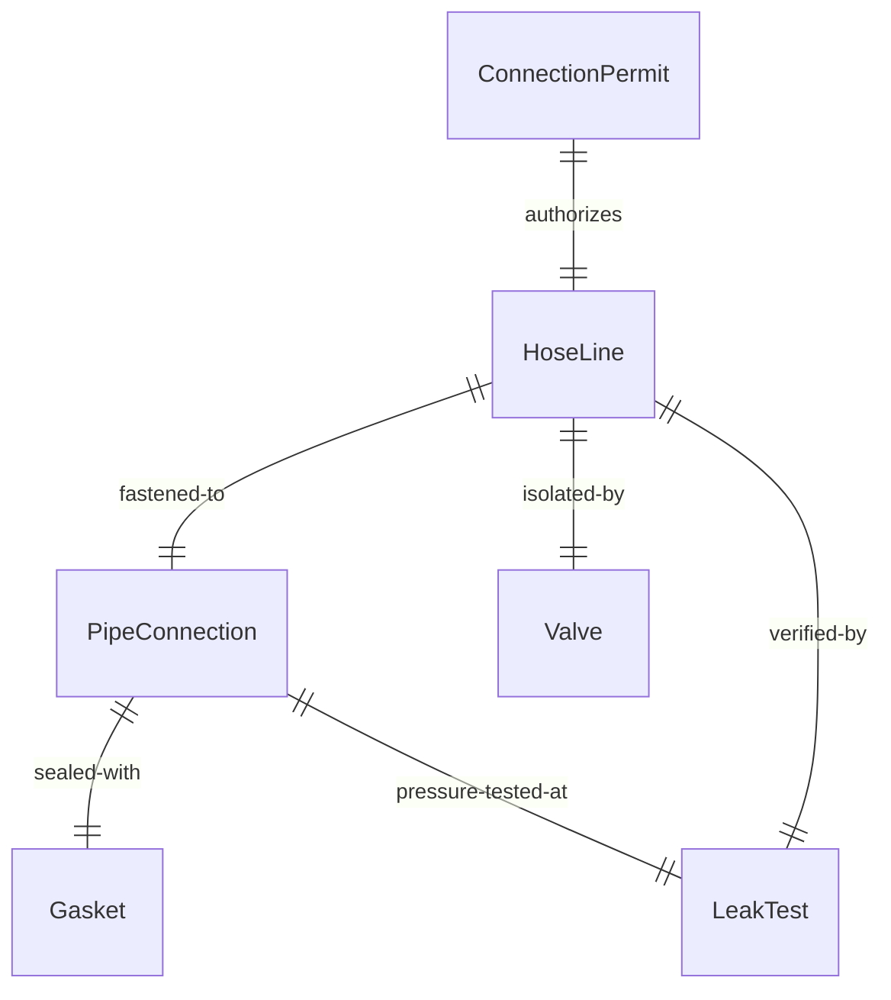
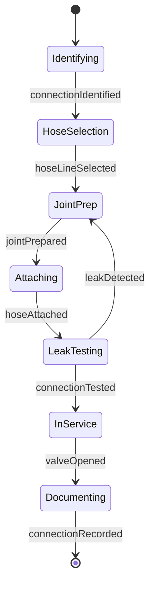
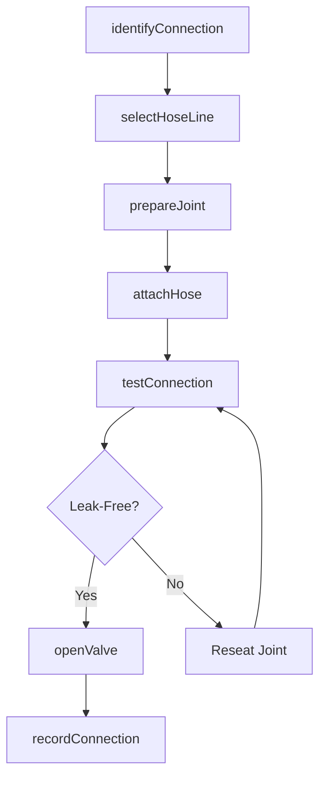
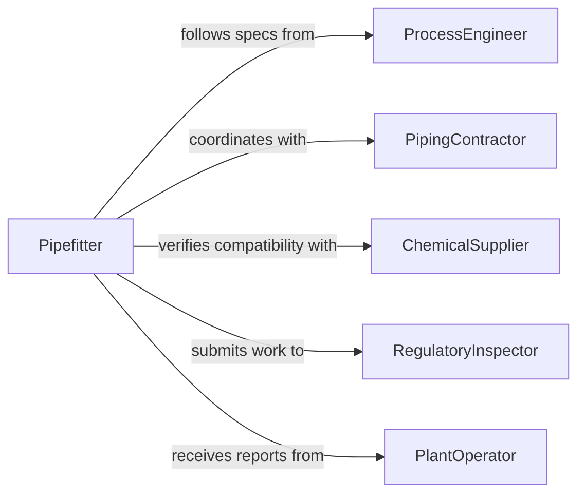

# Connect Hoses Equipment Piping

> Business-as-Code definition for connecting hoses to equipment and piping systems. Models the process of attaching flexible hose lines to rigid piping networks, tanks, pumps, and process equipment for fluid and gas transfer.

## Overview

Connecting hoses to equipment or piping involves attaching flexible hose assemblies to rigid pipe connections, flanges, valves, and process vessels. This activity spans chemical processing, water treatment, HVAC, fire suppression, and industrial fluid transfer systems. Each connection must match the system's pressure, temperature, and chemical compatibility requirements, followed by leak testing before the line is placed in service.

## Actors

| Actor | Description |
|-------|-------------|
| ProcessEngineer | Specifies piping and hose connection requirements for fluid systems |
| PipingContractor | Installs rigid piping and prepares connection points for hoses |
| ChemicalSupplier | Provides material compatibility data for hose and fitting selection |
| RegulatoryInspector | Verifies connections comply with ASME, ANSI, or EPA standards |
| PlantOperator | Monitors connected systems and reports leaks or connection issues |

## Roles

| Role | Description |
|------|-------------|
| Pipefitter | Connects hoses to piping systems and ensures proper alignment |
| MaintenanceTechnician | Performs routine hose replacements and connection repairs |
| SafetyCoordinator | Reviews connection procedures for hazardous material lines |
| SystemEngineer | Validates hose connection designs within the overall piping layout |

## Entities

| Entity | Description |
|--------|-------------|
| HoseLine | A flexible conduit connecting equipment to rigid piping systems |
| PipeConnection | A fitting or flange on rigid piping where a hose attaches |
| Gasket | A sealing element placed between flanged hose and pipe connections |
| Valve | A flow control device at the junction of hose and piping |
| LeakTest | A procedure verifying the integrity of the hose-to-pipe connection |
| ConnectionPermit | Authorization to connect hoses to process piping carrying hazardous media |

## Actions

| Action | Description |
|--------|-------------|
| identifyConnection | Locate the piping connection point and confirm specifications |
| selectHoseLine | Choose a hose rated for the system pressure, temperature, and media |
| prepareJoint | Clean flanges, install gaskets, and align the hose to the pipe connection |
| attachHose | Fasten the hose to the piping connection using clamps, couplings, or bolted flanges |
| testConnection | Perform hydrostatic or pneumatic leak testing on the completed joint |
| openValve | Place the connection in service by opening the adjacent isolation valve |
| recordConnection | Document the hose type, connection point, test results, and service date |

## Events

| Event | Description |
|-------|-------------|
| connectionIdentified | The piping connection point has been located and specifications confirmed |
| hoseLineSelected | A compatible hose has been matched to the piping system requirements |
| jointPrepared | Flanges have been cleaned, gaskets installed, and alignment confirmed |
| hoseAttached | The hose has been fastened to the piping connection point |
| connectionTested | Leak testing has been completed on the hose-to-pipe joint |
| valveOpened | The isolation valve has been opened and the line is in service |
| connectionRecorded | All connection details and test data have been documented |

## Searches

| Search | Description |
|--------|-------------|
| findPipeConnections | List available piping connection points by system, size, or media type |
| getHoseLines | Retrieve hose assemblies by rating, assignment, or installation status |
| getLeakTestHistory | Look up leak test results by connection point or date range |

## Entity Relationships



## State Diagram



## Workflow



## Actor Relationships



## Usage

### Calling Actions

```typescript
import { connectHosesEquipmentPiping } from '@headlessly/connect-hoses-equipment-piping'

const connections = connectHosesEquipmentPiping()

// Identify a piping connection point
const point = await connections.identifyConnection({
  systemId: 'COOLING-LOOP-3',
  connectionType: 'flanged',
  pipeSize: '2-inch',
  media: 'chilled-water'
})

// Select and attach a hose
const hose = await connections.selectHoseLine({
  pressureRating: 150,
  temperatureRange: { min: 35, max: 85 },
  innerDiameter: 2.0,
  media: 'water-glycol'
})

await connections.attachHose({
  hoseId: hose.id,
  connectionPointId: point.id,
  gasketType: 'EPDM',
  boltTorque: { value: 45, unit: 'ft-lb' }
})

// Test and commission
const test = await connections.testConnection({
  connectionPointId: point.id,
  testType: 'hydrostatic',
  testPressure: 225,
  holdTimeSec: 300
})
```

### Event-Driven Automation

```typescript
// Notify operations when connection is ready for service
connections.connectionTested(async ({ connectionPointId, passed }) => {
  if (passed) {
    await notify({
      to: 'plant-operations',
      message: `Connection ${connectionPointId} tested and ready for service`
    })
  }
})

// Track connection age for preventive maintenance
connections.connectionRecorded(async ({ hoseId, connectionPointId, serviceDate }) => {
  await scheduleInspection({
    hoseId,
    connectionPointId,
    nextInspection: addMonths(serviceDate, 6),
    type: 'visual-and-pressure'
  })
})
```
