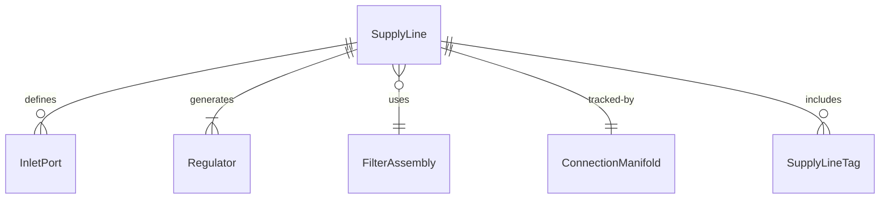
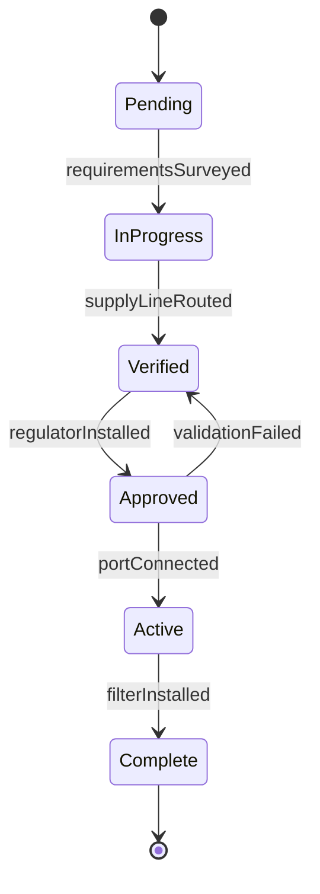
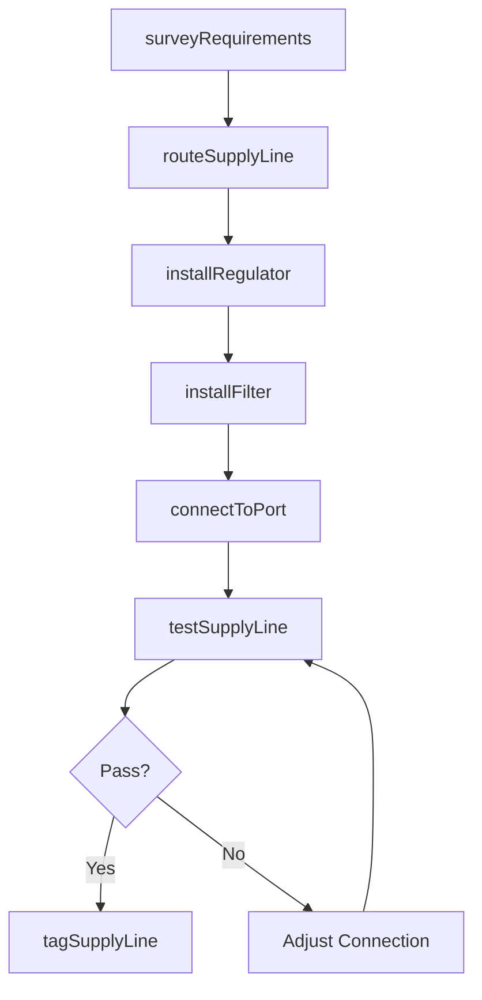
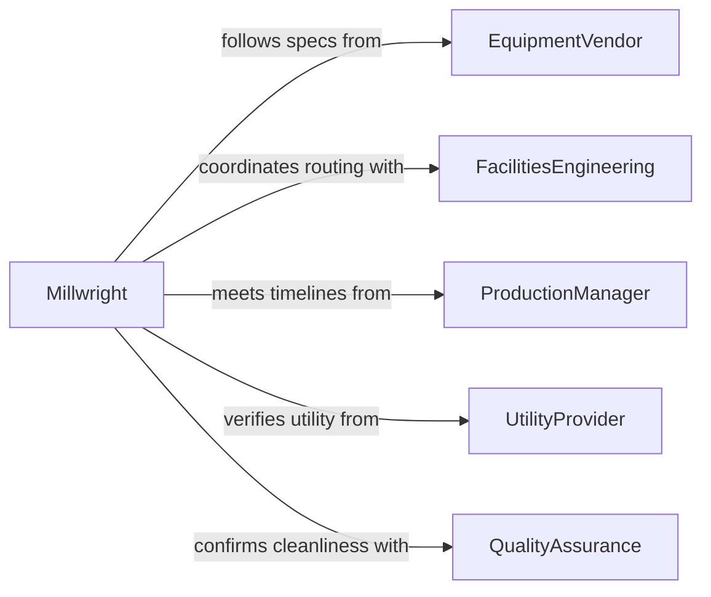

# Connect Supply Lines Production Equipment

> Business-as-Code definition for connecting supply lines to production equipment and tools. Models the full lifecycle of routing utility feeds such as compressed air, gas, water, and material supply lines to manufacturing machinery.

## Overview

Connecting supply lines to production equipment involves routing and attaching utility feeds -- compressed air, inert gas, cooling water, lubricant, and raw material lines -- to machines, tools, and workstations on a production floor. This ensures each piece of equipment receives the resources needed to operate within process specifications. Connections must be leak-tested, labeled, and documented before production begins.

## Actors

| Actor | Description |
|-------|-------------|
| EquipmentVendor | Specifies inlet port sizes, flow rates, and pressure requirements for machinery |
| FacilitiesEngineering | Designs and maintains the plant utility distribution systems |
| ProductionManager | Defines equipment layout and production readiness timelines |
| UtilityProvider | Supplies compressed air, gas, or water to the facility header systems |
| QualityAssurance | Verifies supply line connections meet cleanliness and contamination standards |

## Roles

| Role | Description |
|------|-------------|
| Millwright | Installs and connects supply lines to production machinery |
| MaintenanceTechnician | Maintains and repairs supply line connections during operations |
| ProcessEngineer | Specifies flow rates, pressures, and filtration for each supply connection |
| InstallationSupervisor | Coordinates supply line hookup sequencing across multiple machines |

## Entities

| Entity | Description |
|--------|-------------|
| SupplyLine | A pipe, tube, or hose delivering a utility resource to equipment |
| InletPort | A connection point on production equipment that receives a supply line |
| Regulator | A device controlling pressure or flow rate at the supply connection |
| FilterAssembly | An inline filter ensuring supply media meets cleanliness requirements |
| ConnectionManifold | A distribution block splitting a single supply into multiple equipment feeds |
| SupplyLineTag | An identification label recording line contents, pressure, and destination |

## Actions

| Action | Description |
|--------|-------------|
| surveyRequirements | Review equipment specifications to determine supply line needs |
| routeSupplyLine | Run pipe or tubing from the utility header to the equipment inlet |
| installRegulator | Mount and set a pressure or flow regulator at the connection point |
| connectToPort | Attach the supply line to the equipment inlet port with proper fittings |
| installFilter | Place an inline filter assembly upstream of the equipment connection |
| testSupplyLine | Verify flow rate, pressure, and leak-free operation of the connection |
| tagSupplyLine | Label the line with contents, pressure rating, and destination equipment |

## Events

| Event | Description |
|-------|-------------|
| requirementsSurveyed | Equipment supply line needs have been documented |
| supplyLineRouted | Pipe or tubing has been run from header to equipment |
| regulatorInstalled | A pressure or flow regulator has been mounted and set |
| portConnected | The supply line has been attached to the equipment inlet |
| filterInstalled | An inline filter has been placed upstream of the connection |
| supplyLineTested | Flow, pressure, and leak tests have passed |
| supplyLineTagged | Identification labels have been applied to the completed line |

## Searches

| Search | Description |
|--------|-------------|
| findSupplyLines | List supply lines by utility type, equipment, or installation status |
| getEquipmentInlets | Retrieve inlet port specifications for a piece of production equipment |
| getTestResults | Look up flow and pressure test data by supply line or equipment |
| findRegulators | Locate regulators by supply line, setting, or calibration due date |


## Entity Relationships



## State Diagram


## Workflow



## Actor Relationships



## Usage

### Calling Actions

```typescript
import { connectSupplyLinesProductionEquipment } from '@headlessly/connect-supply-lines-production-equipment'

const supplyLines = connectSupplyLinesProductionEquipment()

// Survey requirements for a CNC machine
const requirements = await supplyLines.surveyRequirements({
  equipmentId: 'CNC-LATHE-07',
  utilityTypes: ['compressed-air', 'coolant', 'lubricant']
})

// Route compressed air supply
const airLine = await supplyLines.routeSupplyLine({
  utilityType: 'compressed-air',
  sourceHeader: 'AIR-HEADER-B',
  destination: 'CNC-LATHE-07',
  material: 'aluminum-tubing',
  sizeMm: 12
})

// Install regulator and connect
await supplyLines.installRegulator({
  supplyLineId: airLine.id,
  setPressure: 90,
  unit: 'psi'
})

await supplyLines.connectToPort({
  supplyLineId: airLine.id,
  inletPortId: 'CNC-LATHE-07-AIR-IN',
  fittingType: 'quick-disconnect'
})
```

### Event-Driven Automation

```typescript
// Notify production when all supply lines are tested
supplyLines.supplyLineTested(async ({ equipmentId, utilityType, testResults }) => {
  const allLines = await supplyLines.findSupplyLines({ equipmentId })
  const allTested = allLines.every(line => line.status === 'tested')
  if (allTested) {
    await notify({
      to: 'production-manager',
      message: `All supply lines for ${equipmentId} connected and verified`
    })
  }
})

// Schedule filter replacement based on installation
supplyLines.filterInstalled(async ({ filterId, supplyLineId, installDate }) => {
  await scheduleReplacement({
    filterId,
    supplyLineId,
    dueDate: addMonths(installDate, 3),
    type: 'inline-filter'
  })
})
```
