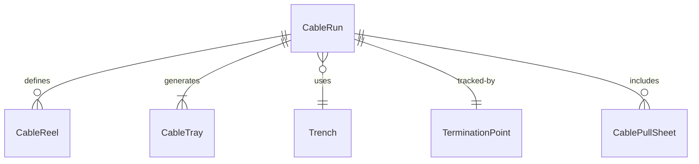
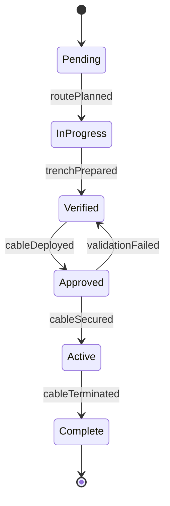
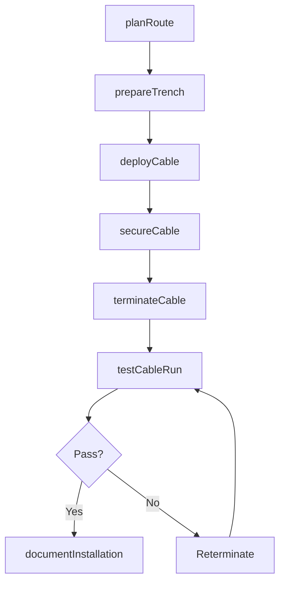
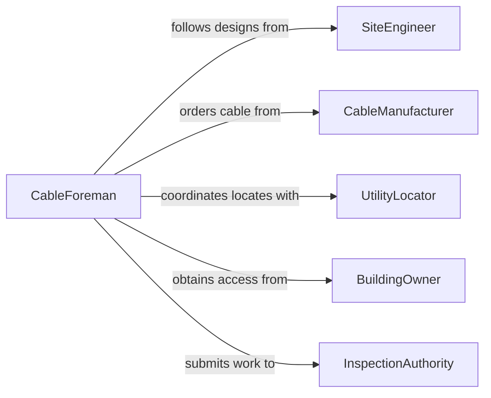

# Lay Cables Connect Equipment

> Business-as-Code definition for laying cables to connect equipment. Models the process of planning cable routes, deploying cables across distances, and terminating them at equipment endpoints for power, data, and signal transmission.

## Overview

Laying cables to connect equipment involves planning cable routes, physically deploying power, data, or signal cables across a facility or job site, and terminating them at the designated equipment. This includes underground cable burial, overhead cable tray installation, and direct cable runs across floors or between buildings. Proper cable laying ensures reliable connectivity while protecting cables from environmental damage and mechanical stress.

## Actors

| Actor | Description |
|-------|-------------|
| SiteEngineer | Designs cable routes and specifies cable types for the installation |
| CableManufacturer | Supplies cables rated for the required voltage, bandwidth, or signal type |
| UtilityLocator | Identifies underground utilities to avoid during cable trenching |
| BuildingOwner | Grants access and approves cable routes through the facility |
| InspectionAuthority | Inspects completed cable installations for code compliance |

## Roles

| Role | Description |
|------|-------------|
| CableInstaller | Physically lays, pulls, and secures cables along designated routes |
| CableForeman | Plans crew assignments and coordinates the cable laying sequence |
| Termination Technician | Connects cable ends to equipment terminals and patch panels |
| SurveyTechnician | Marks cable routes and verifies distances and clearances on site |

## Entities

| Entity | Description |
|--------|-------------|
| CableRun | A planned path from source to destination for a specific cable |
| CableReel | A spool of cable measured and prepared for deployment |
| CableTray | A support structure mounted overhead or along walls to carry cables |
| Trench | An excavated channel for burying underground cables |
| TerminationPoint | The equipment connection where a laid cable is terminated |
| CablePullSheet | A document specifying cable type, route, length, and tension limits |

## Actions

| Action | Description |
|--------|-------------|
| planRoute | Design the cable path considering distance, obstacles, and code clearances |
| prepareTrench | Excavate or open cable trays and raceways along the planned route |
| deployCable | Unroll cable from the reel and lay it along the route to the endpoint |
| secureCable | Fasten cable to trays, hangers, or backfill trenches with proper bedding |
| terminateCable | Strip, lug, and connect cable ends at the source and destination equipment |
| testCableRun | Perform continuity, signal quality, or insulation testing on the laid cable |
| documentInstallation | Record cable type, route, length, test results, and as-built details |

## Events

| Event | Description |
|-------|-------------|
| routePlanned | The cable path has been designed and approved |
| trenchPrepared | The excavation or cable tray has been readied for cable deployment |
| cableDeployed | Cable has been laid along the full route from source to destination |
| cableSecured | Cable has been fastened, supported, or buried along its route |
| cableTerminated | Cable ends have been connected at both the source and destination |
| cableRunTested | Continuity or signal testing has confirmed the cable run is functional |
| installationDocumented | As-built drawings and test data have been filed |

## Searches

| Search | Description |
|--------|-------------|
| findCableRuns | List cable runs by route, cable type, or equipment destination |
| getCablePullSheets | Retrieve pull sheet specifications by route or project phase |
| getTestResults | Look up cable test data by run, route, or date |
| findAvailableTrays | Locate cable trays with remaining capacity along a route |


## Entity Relationships



## State Diagram


## Workflow



## Actor Relationships



## Usage

### Calling Actions

```typescript
import { layCablesConnectEquipment } from '@headlessly/lay-cables-connect-equipment'

const cabling = layCablesConnectEquipment()

// Plan a cable route between buildings
const route = await cabling.planRoute({
  source: 'MAIN-SWITCHGEAR',
  destination: 'BLDG-C-PANEL',
  cableType: '3/C-2AWG-CU-XLPE',
  method: 'underground-direct-burial',
  distanceFt: 450
})

// Deploy the cable
await cabling.deployCable({
  routeId: route.id,
  reelId: 'REEL-PWR-2024-031',
  tensionLimit: 600,
  bendRadius: 12
})

// Secure and terminate
await cabling.secureCable({
  routeId: route.id,
  method: 'backfill-with-sand-bedding',
  warningTape: true
})

await cabling.terminateCable({
  routeId: route.id,
  sourceTerminal: 'MAIN-SW-BKR-12',
  destinationTerminal: 'BLDG-C-MAIN-LUG'
})
```

### Event-Driven Automation

```typescript
// Request inspection after cable run passes testing
cabling.cableRunTested(async ({ routeId, testType, results }) => {
  if (results.passed) {
    await requestInspection({
      type: 'underground-cable',
      routeId,
      testData: results
    })
  }
})

// Update as-built drawings when installation is documented
cabling.installationDocumented(async ({ routeId, asBuiltData }) => {
  await updateDrawings({
    drawingSet: 'electrical-site-plan',
    routeId,
    coordinates: asBuiltData.coordinates,
    depth: asBuiltData.burialDepth
  })
})
```
