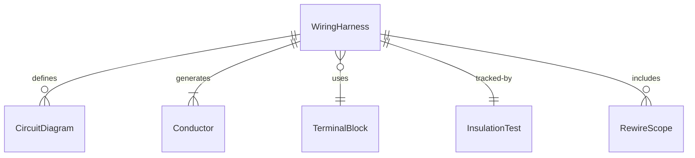
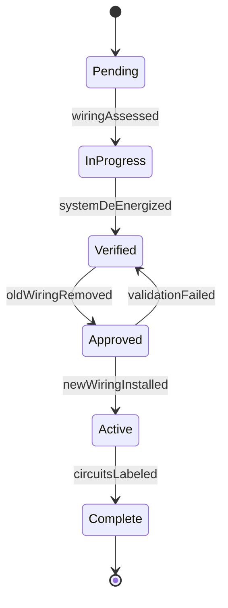
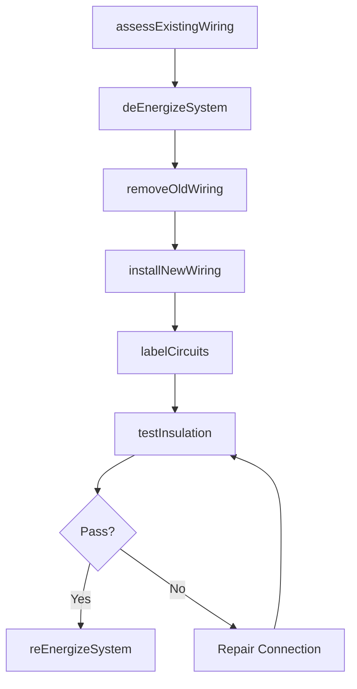
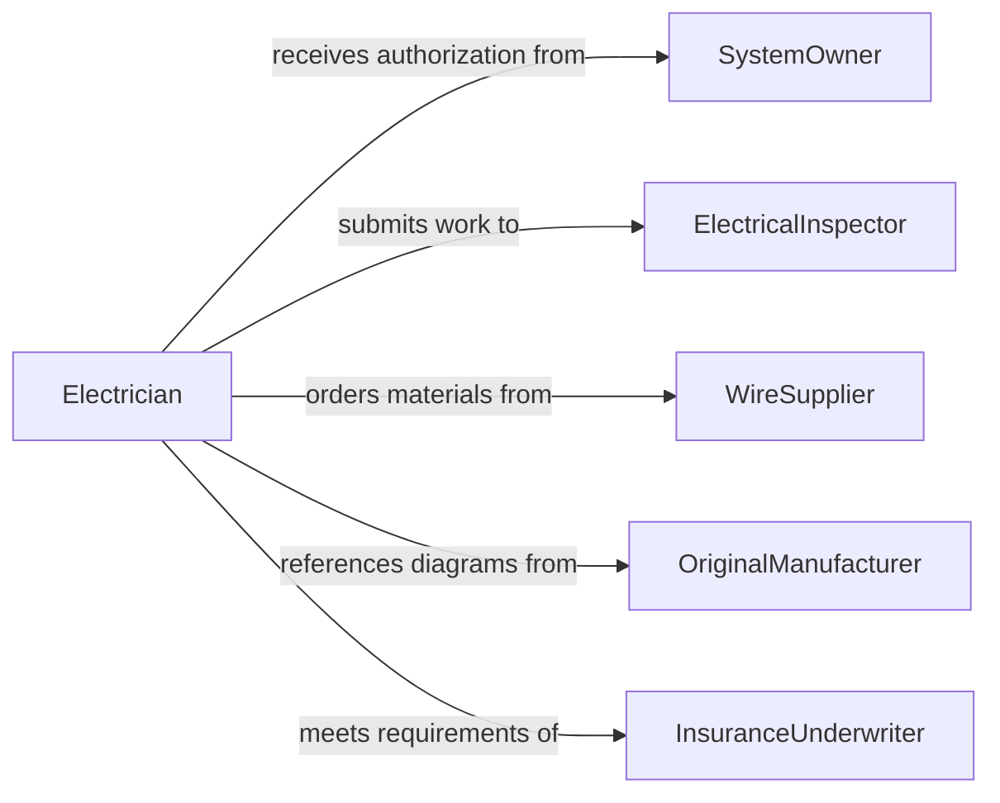

# Rewire Electrical Electronic Systems

> Business-as-Code definition for rewiring electrical or electronic systems. Models the complete process of removing existing wiring, redesigning circuits, and installing new conductors in electrical and electronic systems.

## Overview

Rewiring electrical or electronic systems involves systematically removing outdated, damaged, or non-compliant wiring and replacing it with new conductors that meet current codes and performance requirements. This activity spans residential panel upgrades, industrial control system retrofits, vehicle harness replacements, and electronic equipment refurbishment. The process requires careful documentation of existing circuits, de-energization procedures, and thorough testing before returning the system to service.

## Actors

| Actor | Description |
|-------|-------------|
| SystemOwner | Authorizes rewiring work and defines performance requirements |
| ElectricalInspector | Approves rewired systems for compliance with NEC and local codes |
| WireSupplier | Provides conductors, connectors, and termination hardware |
| InsuranceUnderwriter | May require rewiring to maintain coverage on older systems |
| OriginalManufacturer | Supplies wiring diagrams and specifications for the existing system |

## Roles

| Role | Description |
|------|-------------|
| Electrician | Removes old wiring and installs new conductors and connections |
| ElectricalEngineer | Redesigns circuit layouts and specifies wire gauges for the new system |
| TestTechnician | Performs insulation resistance, continuity, and functional testing |
| ProjectManager | Coordinates rewiring phases to minimize system downtime |

## Entities

| Entity | Description |
|--------|-------------|
| WiringHarness | A bundled assembly of conductors routed through a system |
| CircuitDiagram | A schematic showing conductor routing, connections, and component wiring |
| Conductor | An individual wire or cable being removed or installed |
| TerminalBlock | A connection point where conductors are fastened within a panel or enclosure |
| InsulationTest | A measurement verifying the dielectric integrity of installed conductors |
| RewireScope | A document defining which circuits and systems require rewiring |

## Actions

| Action | Description |
|--------|-------------|
| assessExistingWiring | Inspect current wiring to identify deficiencies and document circuit paths |
| deEnergizeSystem | Safely shut down and lock out the electrical system before work begins |
| removeOldWiring | Disconnect and extract existing conductors from raceways and terminals |
| installNewWiring | Route and terminate new conductors per the updated circuit diagram |
| labelCircuits | Apply wire markers and panel labels to all new and existing circuits |
| testInsulation | Perform megger and continuity tests on newly installed conductors |
| reEnergizeSystem | Restore power and verify proper operation of the rewired system |

## Events

| Event | Description |
|-------|-------------|
| wiringAssessed | Existing wiring conditions have been documented and deficiencies identified |
| systemDeEnergized | The electrical system has been safely shut down and locked out |
| oldWiringRemoved | Previous conductors have been disconnected and extracted |
| newWiringInstalled | Replacement conductors have been routed and terminated |
| circuitsLabeled | All circuits have been identified with proper wire markers and labels |
| insulationTested | Megger and continuity tests have verified conductor integrity |
| systemReEnergized | Power has been restored and the rewired system is operational |

## Searches

| Search | Description |
|--------|-------------|
| findCircuits | List circuits by panel, system, or rewire status |
| getWiringDiagrams | Retrieve original and updated circuit diagrams for a system |
| getTestResults | Look up insulation and continuity test data by circuit or conductor |
| findRewireScopes | Locate active rewiring projects by system, building, or status |


## Entity Relationships



## State Diagram


## Workflow



## Actor Relationships



## Usage

### Calling Actions

```typescript
import { rewireElectricalElectronicSystems } from '@headlessly/rewire-electrical-electronic-systems'

const rewire = rewireElectricalElectronicSystems()

// Assess existing wiring in a control panel
const assessment = await rewire.assessExistingWiring({
  systemId: 'CTRL-PANEL-12',
  inspectionType: 'full',
  checkFor: ['degraded-insulation', 'undersized-conductors', 'code-violations']
})

// De-energize and remove old wiring
await rewire.deEnergizeSystem({
  systemId: 'CTRL-PANEL-12',
  lockoutTag: 'LOTO-2026-0045',
  verifiedBy: 'tech-jones'
})

await rewire.removeOldWiring({
  systemId: 'CTRL-PANEL-12',
  circuits: assessment.deficientCircuits
})

// Install new wiring per updated diagram
await rewire.installNewWiring({
  systemId: 'CTRL-PANEL-12',
  diagramRef: 'DWG-E-412-REV-C',
  conductorSpec: '12AWG-THHN',
  circuits: assessment.deficientCircuits
})
```

### Event-Driven Automation

```typescript
// Schedule inspection after insulation testing passes
rewire.insulationTested(async ({ systemId, circuits, results }) => {
  if (results.allPassed) {
    await scheduleInspection({
      type: 'rewire-completion',
      systemId,
      circuitCount: circuits.length,
      testData: results
    })
  }
})

// Update asset records when system is re-energized
rewire.systemReEnergized(async ({ systemId, completedDate }) => {
  await updateAssetRecord({
    systemId,
    lastRewired: completedDate,
    nextInspectionDue: addYears(completedDate, 5)
  })
})
```
