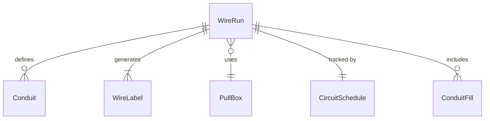
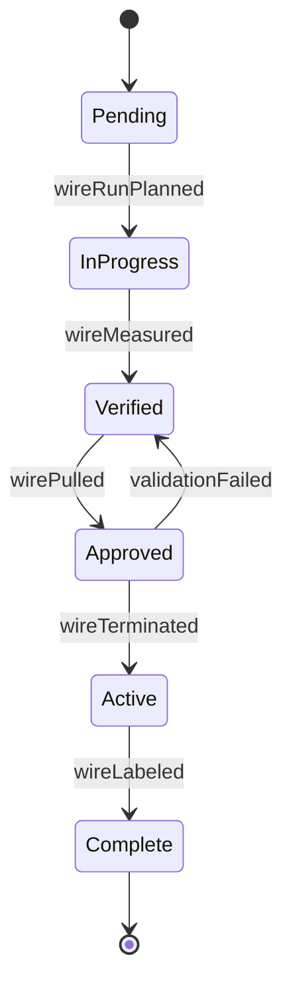
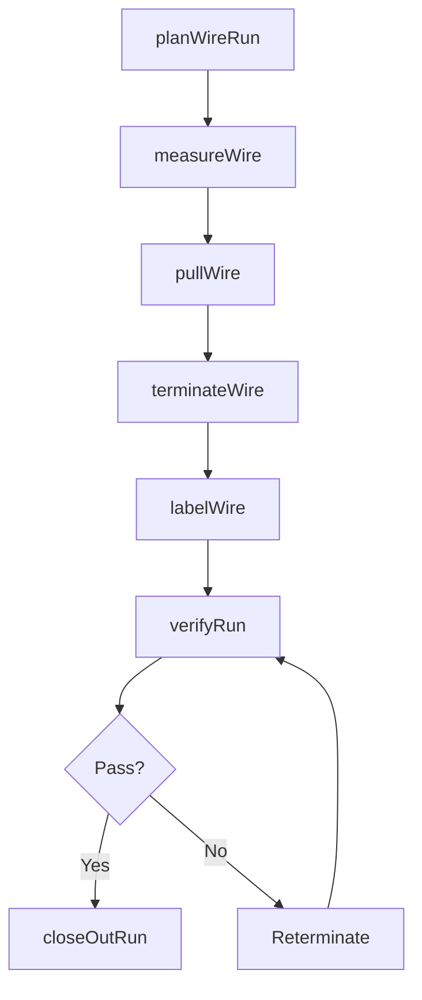
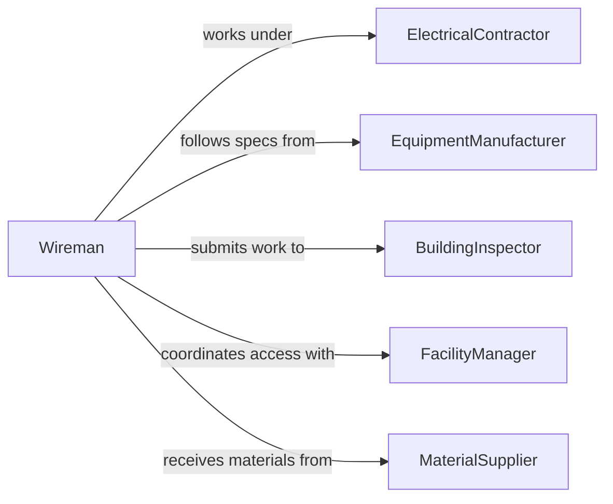

# Run Wiring Connect Equipment

> Business-as-Code definition for running wiring to connect equipment. Models the process of measuring, routing, and securing electrical wiring from power sources and control systems to individual pieces of equipment.

## Overview

Running wiring to connect equipment involves measuring wire lengths, routing conductors through conduit, wireways, or open runs, and securing them at both source and destination points. This activity is fundamental to industrial installations, building construction, and equipment commissioning where individual machines, fixtures, or devices must be connected to power distribution, control circuits, or communication networks. Each wire run must meet code requirements for ampacity, bend radius, and fill capacity.

## Actors

| Actor | Description |
|-------|-------------|
| ElectricalContractor | Provides skilled labor and manages the wiring installation project |
| EquipmentManufacturer | Specifies wiring requirements including gauge, type, and terminal connections |
| BuildingInspector | Reviews completed wiring runs for code compliance |
| FacilityManager | Coordinates access and scheduling for wiring work in occupied spaces |
| MaterialSupplier | Delivers wire, conduit, connectors, and support hardware |

## Roles

| Role | Description |
|------|-------------|
| Wireman | Measures, cuts, and routes wiring from source to equipment |
| ElectricalForeman | Assigns wire runs to crew members and manages installation sequence |
| Estimator | Calculates wire quantities and conduit fill for project planning |
| CommissioningTechnician | Tests completed wire runs and verifies equipment connections |

## Entities

| Entity | Description |
|--------|-------------|
| WireRun | A routed path of one or more conductors from source to equipment |
| Conduit | A protective tube or channel that houses and protects wiring |
| WireLabel | An identification marker applied to each conductor at both ends |
| PullBox | An access point in a conduit run that facilitates wire pulling |
| CircuitSchedule | A table listing each wire run with source, destination, wire type, and circuit number |
| ConduitFill | A calculation of the percentage of conduit cross-section occupied by wiring |

## Actions

| Action | Description |
|--------|-------------|
| planWireRun | Determine the route, wire type, and conduit path for the connection |
| measureWire | Calculate the required wire length including service loops and slack |
| pullWire | Route wire through conduit, wireways, or along open cable paths |
| terminateWire | Strip ends and connect conductors to terminals at source and equipment |
| labelWire | Apply identification markers to both ends of each conductor |
| verifyRun | Test continuity and confirm correct termination at both endpoints |
| closeOutRun | Secure covers, firestop penetrations, and file as-built documentation |

## Events

| Event | Description |
|-------|-------------|
| wireRunPlanned | The route and specifications for the wire run have been established |
| wireMeasured | Wire lengths have been calculated and cut for the run |
| wirePulled | Conductors have been routed through their designated path |
| wireTerminated | Conductors have been connected at source and destination terminals |
| wireLabeled | Identification markers have been applied to all conductors |
| runVerified | Continuity testing has confirmed the wire run is correct |
| runClosedOut | Covers and firestops are in place and as-built records filed |

## Searches

| Search | Description |
|--------|-------------|
| findWireRuns | List wire runs by circuit, equipment destination, or status |
| getCircuitSchedule | Retrieve the circuit schedule for a panel or distribution board |
| getConduitFill | Check conduit fill percentage for a specific raceway |
| findOpenRuns | Locate wire runs that have not yet been terminated or tested |


## Entity Relationships



## State Diagram


## Workflow



## Actor Relationships



## Usage

### Calling Actions

```typescript
import { runWiringConnectEquipment } from '@headlessly/run-wiring-connect-equipment'

const wiring = runWiringConnectEquipment()

// Plan a wire run to an air handling unit
const run = await wiring.planWireRun({
  source: 'PANEL-2B',
  destination: 'AHU-4',
  wireType: '10AWG-THWN',
  conductors: 4,
  conduitPath: 'EMT-3/4-RUN-47'
})

// Measure and pull wire
await wiring.measureWire({
  runId: run.id,
  routeLengthFt: 85,
  serviceLoopFt: 3,
  slackPercent: 5
})

await wiring.pullWire({
  runId: run.id,
  maxPullTension: 200,
  lubricant: 'wire-pulling-compound'
})

// Terminate and verify
await wiring.terminateWire({
  runId: run.id,
  sourceTerminal: 'PANEL-2B-CKT-14',
  destinationTerminal: 'AHU-4-DISCONNECT'
})

const result = await wiring.verifyRun({ runId: run.id })
```

### Event-Driven Automation

```typescript
// Flag conduit fill violations when wire is pulled
wiring.wirePulled(async ({ runId, conduitPath }) => {
  const fill = await wiring.getConduitFill({ conduitPath })
  if (fill.percentage > 40) {
    await flagViolation({
      type: 'conduit-fill-exceeded',
      conduitPath,
      fillPercent: fill.percentage,
      runId
    })
  }
})

// Update circuit schedule when run is closed out
wiring.runClosedOut(async ({ runId, source, destination, wireType }) => {
  await updateCircuitSchedule({
    runId,
    source,
    destination,
    wireType,
    status: 'as-built'
  })
})
```
