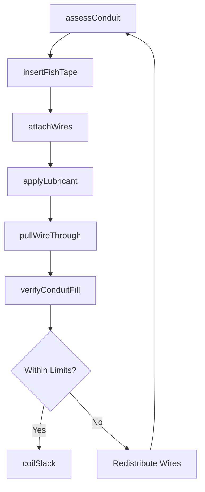
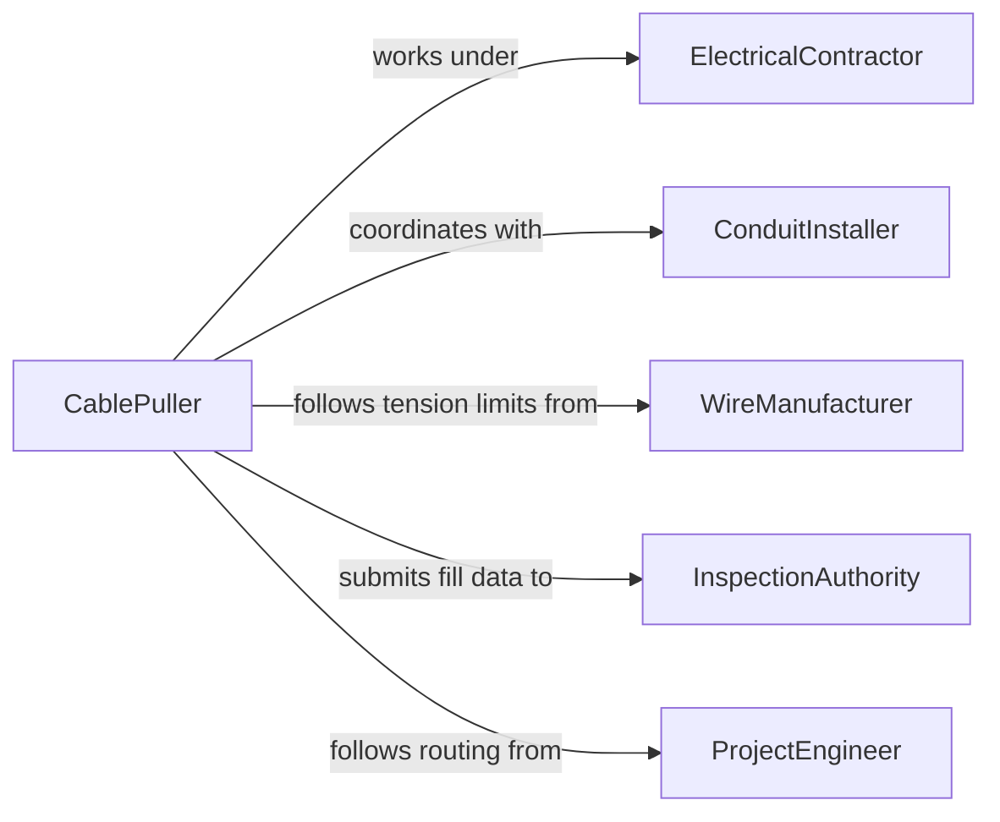

# Thread Wire Cable Through Ducts

> Business-as-Code definition for threading wire or cable through ducts and conduits. Models the process of feeding conductors through enclosed raceways, including fish tape operations, cable pulling, and conduit fill management.

## Overview

Threading wire or cable through ducts and conduits involves feeding conductors through enclosed raceways such as EMT, rigid conduit, flexible conduit, and underground duct banks. This requires fish tapes or pull ropes to guide wires through bends and long runs, proper lubrication to reduce friction, and careful management of conduit fill limits. The activity is essential in commercial, industrial, and residential electrical installations where wiring must be protected within enclosed pathways.

## Actors

| Actor | Description |
|-------|-------------|
| ElectricalContractor | Manages the wire-pulling crew and oversees installation quality |
| ConduitInstaller | Has previously installed the raceway system that wires will pass through |
| InspectionAuthority | Verifies conduit fill, wire type, and installation quality meet code |
| WireManufacturer | Specifies maximum pulling tension, bend radius, and jacket ratings |
| ProjectEngineer | Designs the conduit routing and specifies wire assignments per raceway |

## Roles

| Role | Description |
|------|-------------|
| CablePuller | Feeds wire through conduits using fish tapes, pull ropes, and lubricant |
| ElectricalForeman | Plans the pulling sequence and assigns crew to each conduit run |
| Helper | Feeds wire from the reel and applies lubricant at the conduit entry point |
| QualityChecker | Inspects pulled wire for jacket damage and verifies conduit fill compliance |

## Entities

| Entity | Description |
|--------|-------------|
| Conduit | An enclosed raceway through which wire or cable is threaded |
| FishTape | A flexible steel or fiberglass tool used to guide wire through conduit |
| PullRope | A high-strength line attached to wire bundles for mechanical pulling |
| WireLubricant | A compound applied to reduce friction during wire pulling |
| ConduitRun | A continuous path of conduit between two access points |
| PullSheet | A document specifying wires to be pulled, conduit run, and tension limits |

## Actions

| Action | Description |
|--------|-------------|
| assessConduit | Inspect the conduit run for obstructions, damage, and existing wire fill |
| insertFishTape | Feed a fish tape through the conduit from one end to the other |
| attachWires | Secure wire ends to the fish tape or pull rope with a pulling grip |
| applyLubricant | Coat wires with pulling lubricant at the conduit entry point |
| pullWireThrough | Draw the wire bundle through the conduit to the destination end |
| verifyConduitFill | Calculate and confirm the conduit fill percentage is within code limits |
| coilSlack | Neatly coil excess wire at pull boxes and termination points |

## Events

| Event | Description |
|-------|-------------|
| conduitAssessed | The conduit run has been inspected and cleared for wire pulling |
| fishTapeInserted | A fish tape has been threaded through the full conduit run |
| wiresAttached | Wire ends have been secured to the pull tape or rope |
| lubricantApplied | Wire-pulling lubricant has been applied to the conductors |
| wirePulledThrough | All conductors have been drawn through the conduit to the destination |
| conduitFillVerified | Conduit fill percentage has been confirmed within code limits |
| slackCoiled | Excess wire has been neatly coiled at pull boxes and endpoints |

## Searches

| Search | Description |
|--------|-------------|
| findConduitRuns | List conduit runs by location, size, or current fill percentage |
| getPullSheets | Retrieve pull sheet documents by conduit run or project phase |
| getConduitFill | Check the current fill percentage for a specific conduit run |
| findAvailableCapacity | Locate conduit runs with enough remaining capacity for additional wires |

## Workflow



## Actor Relationships



## Usage

### Calling Actions

```typescript
import { threadWireCableThroughDucts } from '@headlessly/thread-wire-cable-through-ducts'

const threading = threadWireCableThroughDucts()

// Assess a conduit run before pulling
const assessment = await threading.assessConduit({
  conduitRunId: 'EMT-RUN-23',
  conduitSize: '1-inch',
  lengthFt: 120,
  bends: 3,
  existingWires: ['12AWG-THWN x 3']
})

// Insert fish tape and attach wires
await threading.insertFishTape({
  conduitRunId: 'EMT-RUN-23',
  fishTapeType: 'steel-flat',
  entryPoint: 'PANEL-B',
  exitPoint: 'JB-47'
})

await threading.attachWires({
  conduitRunId: 'EMT-RUN-23',
  wires: [
    { type: '10AWG-THWN', color: 'black', circuit: 'CKT-22' },
    { type: '10AWG-THWN', color: 'red', circuit: 'CKT-22' },
    { type: '10AWG-THWN', color: 'green', circuit: 'CKT-22-GND' }
  ],
  gripType: 'basket-weave'
})

// Lubricate and pull
await threading.applyLubricant({ conduitRunId: 'EMT-RUN-23', lubricantType: 'water-based' })
await threading.pullWireThrough({ conduitRunId: 'EMT-RUN-23', maxTension: 150 })
```

### Event-Driven Automation

```typescript
// Alert if conduit fill exceeds threshold
threading.conduitFillVerified(async ({ conduitRunId, fillPercent }) => {
  if (fillPercent > 35) {
    await alert({
      to: 'electrical-foreman',
      message: `Conduit ${conduitRunId} at ${fillPercent}% fill - approaching NEC limit`
    })
  }
})

// Update conduit database when wire pull is complete
threading.wirePulledThrough(async ({ conduitRunId, wires }) => {
  await updateConduitRegistry({
    conduitRunId,
    addedWires: wires,
    pulledDate: new Date().toISOString()
  })
})
```
