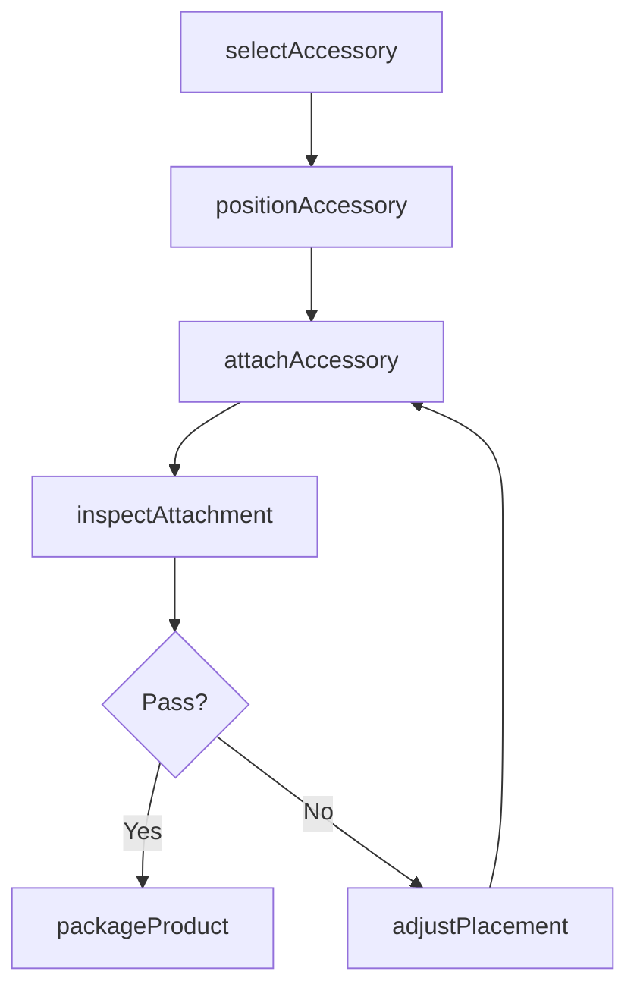
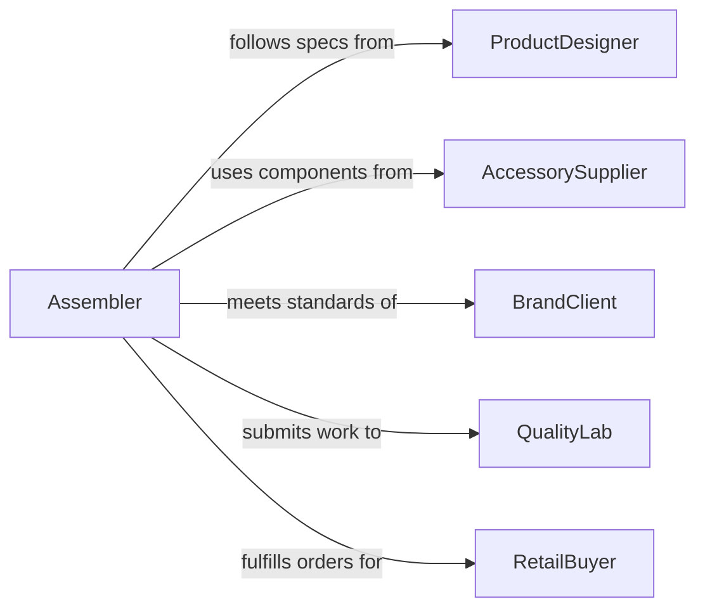

# Attach Decorative Functional Accessories Products

> Business-as-Code definition for attaching decorative or functional accessories to products. Models the process of selecting, positioning, and securing embellishments, hardware, trim, and functional add-ons during product assembly and finishing.

## Overview

Attaching decorative or functional accessories to products encompasses the selection, placement, and fastening of items such as buttons, zippers, hardware, trim, labels, handles, hinges, and ornamental elements onto finished or semi-finished goods. This work spans apparel manufacturing, furniture production, jewelry assembly, leather goods, and consumer product finishing. Each attachment must meet quality standards for appearance, alignment, durability, and functional performance.

## Actors

| Actor | Description |
|-------|-------------|
| ProductDesigner | Specifies accessory types, placement, and attachment methods |
| AccessorySupplier | Provides decorative and functional components such as hardware, trim, and fasteners |
| BrandClient | Approves final product appearance and accessory specifications |
| QualityLab | Tests attachment durability, pull strength, and finish integrity |
| RetailBuyer | Sets expectations for product presentation and accessory quality |

## Roles

| Role | Description |
|------|-------------|
| Assembler | Positions and attaches accessories to products by hand or machine |
| FinishingSpecialist | Applies and secures decorative elements requiring precision placement |
| QualityInspector | Verifies accessory alignment, attachment strength, and visual appearance |
| ProductionSupervisor | Manages workflow and ensures accessory attachment meets production targets |

## Entities

| Entity | Description |
|--------|-------------|
| Accessory | A decorative or functional component added to a product |
| AttachmentPoint | A designated location on the product where an accessory is secured |
| Fastener | A rivet, screw, snap, stitch, or adhesive used to secure the accessory |
| Product | The base item receiving the accessory attachment |
| SpecificationSheet | A document defining accessory type, position, and attachment method |
| QualityRecord | Documentation of inspection results for attachment strength and appearance |

## Actions

| Action | Description |
|--------|-------------|
| selectAccessory | Choose the correct accessory component based on the product specification |
| positionAccessory | Align the accessory at the designated attachment point on the product |
| attachAccessory | Secure the accessory using the specified fastening method |
| inspectAttachment | Verify alignment, strength, and visual quality of the attached accessory |
| adjustPlacement | Reposition or realign an accessory that does not meet quality standards |
| packageProduct | Prepare the finished product with all accessories for shipping or display |

## Events

| Event | Description |
|-------|-------------|
| accessorySelected | The correct accessory component has been matched to the product |
| accessoryPositioned | The accessory has been aligned at the designated attachment point |
| accessoryAttached | The accessory has been secured to the product |
| attachmentInspected | Quality inspection of the attachment has been completed |
| placementAdjusted | An accessory has been repositioned to meet quality standards |
| productPackaged | The finished product with all accessories has been prepared for shipment |

## Searches

| Search | Description |
|--------|-------------|
| findAccessories | List accessories by type, product line, or supplier |
| getAttachmentSpecs | Retrieve attachment specifications for a product model |
| getQualityRecords | Look up inspection results by product batch or accessory type |
| findDefects | Locate products with flagged accessory attachment issues |

## Workflow



## Actor Relationships



## Usage

### Calling Actions

```typescript
import { attachDecorativeFunctionalAccessoriesProducts } from '@headlessly/attach-decorative-functional-accessories-products'

const accessories = attachDecorativeFunctionalAccessoriesProducts()

// Select accessories for a leather handbag
const accessory = await accessories.selectAccessory({
  productId: 'BAG-TOTE-2026-BLK',
  accessoryType: 'metal-clasp',
  finish: 'brushed-gold',
  specSheet: 'SPEC-BAG-TOTE-V3'
})

// Position and attach
await accessories.positionAccessory({
  accessoryId: accessory.id,
  productId: 'BAG-TOTE-2026-BLK',
  attachmentPoint: 'front-flap-center',
  alignmentGuide: 'template-FFC-01'
})

await accessories.attachAccessory({
  accessoryId: accessory.id,
  productId: 'BAG-TOTE-2026-BLK',
  method: 'rivet',
  fastener: 'brass-rivet-4mm'
})

// Inspect the result
const inspection = await accessories.inspectAttachment({
  productId: 'BAG-TOTE-2026-BLK',
  checks: ['alignment', 'pull-strength', 'finish-quality']
})
```

### Event-Driven Automation

```typescript
// Flag products needing rework when inspection fails
accessories.attachmentInspected(async ({ productId, passed, defects }) => {
  if (!passed) {
    await createReworkOrder({
      productId,
      defects,
      priority: 'high'
    })
  }
})

// Track accessory usage for inventory management
accessories.accessoryAttached(async ({ accessoryId, productId, quantity }) => {
  await decrementInventory({
    itemId: accessoryId,
    quantity,
    consumedBy: productId
  })
})
```
