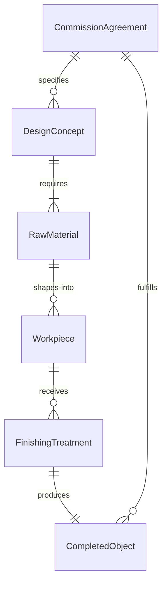
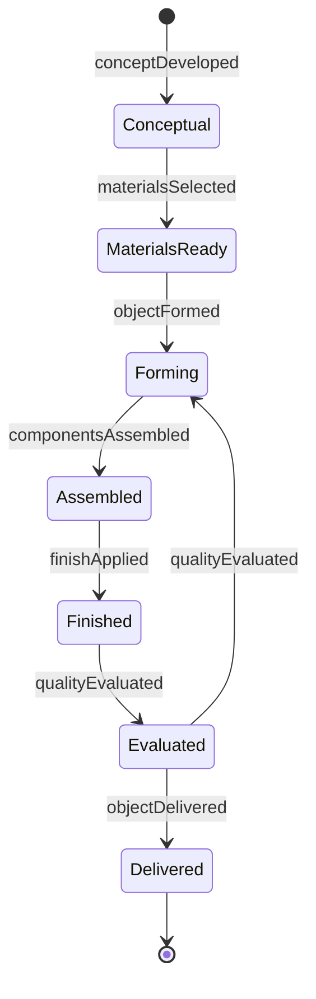
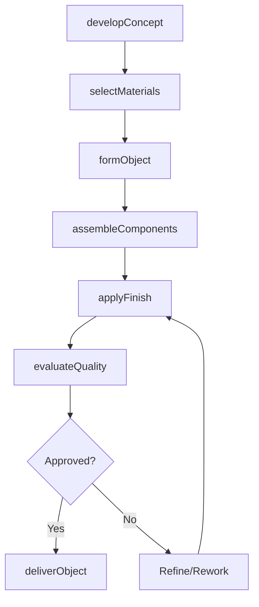
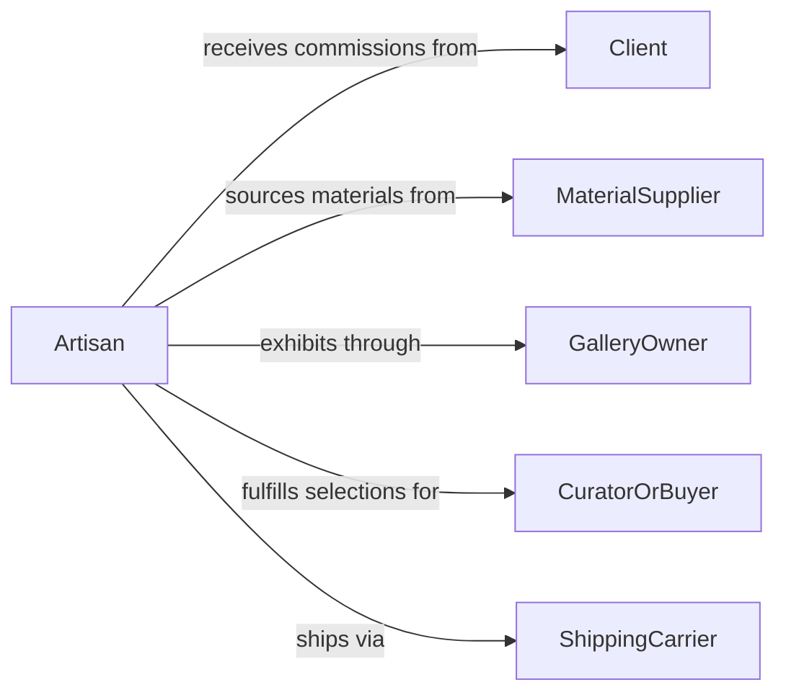

# Construct Distinctive Physical Objects Artistic

> Business-as-Code definition for constructing distinctive physical objects for artistic, functional, or commercial purposes. Models the creative fabrication process from concept through material selection, handcrafting, finishing, and delivery.

## Overview

Constructing distinctive physical objects involves designing and fabricating unique items such as sculptures, custom furniture, jewelry, pottery, glasswork, metalwork, and bespoke commercial products. This activity combines artistic vision with skilled craftsmanship, requiring material selection, forming techniques, surface finishing, and quality evaluation. The resulting objects may serve decorative, functional, or commercial purposes and are typically produced in limited quantities or as one-of-a-kind pieces.

## Actors

| Actor | Description |
|-------|-------------|
| Client | Commissions custom objects and approves designs and finished work |
| MaterialSupplier | Provides raw materials such as wood, metal, glass, clay, and stone |
| GalleryOwner | Exhibits and sells finished artistic objects to collectors |
| CuratorOrBuyer | Selects objects for exhibitions, collections, or retail environments |
| ShippingCarrier | Handles transport of fragile or oversized finished objects |

## Roles

| Role | Description |
|------|-------------|
| Artisan | Designs and handcrafts the physical object using specialized techniques |
| StudioAssistant | Supports the artisan with material preparation and finishing tasks |
| DesignConsultant | Collaborates with clients to refine concepts and specifications |
| QualityEvaluator | Assesses structural integrity, finish quality, and design fidelity |

## Entities

| Entity | Description |
|--------|-------------|
| DesignConcept | A sketch, model, or description defining the intended object |
| RawMaterial | The base substance from which the object is constructed |
| Workpiece | The object in its intermediate state during construction |
| FinishingTreatment | A surface application such as glaze, polish, stain, or patina |
| CompletedObject | The final crafted item ready for delivery or display |
| CommissionAgreement | A contract defining scope, materials, timeline, and compensation |

## Actions

| Action | Description |
|--------|-------------|
| developConcept | Create sketches, maquettes, or digital models of the intended object |
| selectMaterials | Choose raw materials based on design requirements and structural needs |
| formObject | Shape the workpiece using cutting, carving, welding, casting, or molding |
| assembleComponents | Join multiple fabricated parts into the complete object |
| applyFinish | Apply surface treatments such as glazing, polishing, painting, or sealing |
| evaluateQuality | Inspect the completed object for structural integrity and design fidelity |
| deliverObject | Package and transport the finished object to the client or gallery |

## Events

| Event | Description |
|-------|-------------|
| conceptDeveloped | Design sketches or models have been created and approved |
| materialsSelected | Raw materials have been chosen and procured for the project |
| objectFormed | The workpiece has been shaped into its primary form |
| componentsAssembled | All fabricated parts have been joined into the complete object |
| finishApplied | Surface treatments have been completed on the object |
| qualityEvaluated | The completed object has passed structural and aesthetic inspection |
| objectDelivered | The finished object has been packaged and delivered |

## Searches

| Search | Description |
|--------|-------------|
| findProjects | List construction projects by client, material, technique, or status |
| getMaterials | Retrieve available materials by type, grade, or supplier |
| getCompletedObjects | Look up finished objects by style, medium, or delivery status |
| findCommissions | Locate active commission agreements by client or deadline |


## Entity Relationships



## State Diagram


## Workflow



## Actor Relationships



## Usage

### Calling Actions

```typescript
import { constructDistinctivePhysicalObjectsArtistic } from '@headlessly/construct-distinctive-physical-objects-artistic'

const crafting = constructDistinctivePhysicalObjectsArtistic()

// Develop a concept for a commissioned bronze sculpture
const concept = await crafting.developConcept({
  commissionId: 'COMM-2026-018',
  medium: 'bronze',
  dimensions: { heightIn: 36, widthIn: 18, depthIn: 14 },
  style: 'abstract-organic',
  description: 'Freestanding sculpture for corporate lobby installation'
})

// Select materials and begin fabrication
await crafting.selectMaterials({
  projectId: concept.projectId,
  materials: [
    { type: 'silicon-bronze', weightLbs: 45, supplier: 'Atlas Metals' },
    { type: 'steel-armature', specification: '1/2-inch-rod' },
    { type: 'patina-chemicals', finish: 'verde-green' }
  ]
})

// Form and finish the sculpture
await crafting.formObject({
  projectId: concept.projectId,
  technique: 'lost-wax-casting',
  steps: ['wax-model', 'ceramic-shell', 'burnout', 'pour', 'break-out']
})

await crafting.applyFinish({
  projectId: concept.projectId,
  treatment: 'chemical-patina',
  color: 'verde-green',
  sealant: 'wax-topcoat'
})
```

### Event-Driven Automation

```typescript
// Notify client when quality evaluation passes
crafting.qualityEvaluated(async ({ projectId, commissionId, approved }) => {
  if (approved) {
    await notify({
      to: commissionId,
      message: `Your commissioned piece (${projectId}) has passed final evaluation and is ready for delivery`
    })
  }
})

// Update gallery inventory when object is delivered
crafting.objectDelivered(async ({ projectId, destination, deliveredDate }) => {
  if (destination.type === 'gallery') {
    await addToGalleryInventory({
      objectId: projectId,
      galleryId: destination.id,
      receivedDate: deliveredDate
    })
  }
})
```
