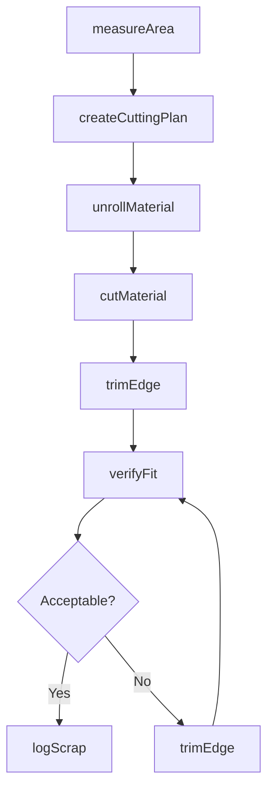
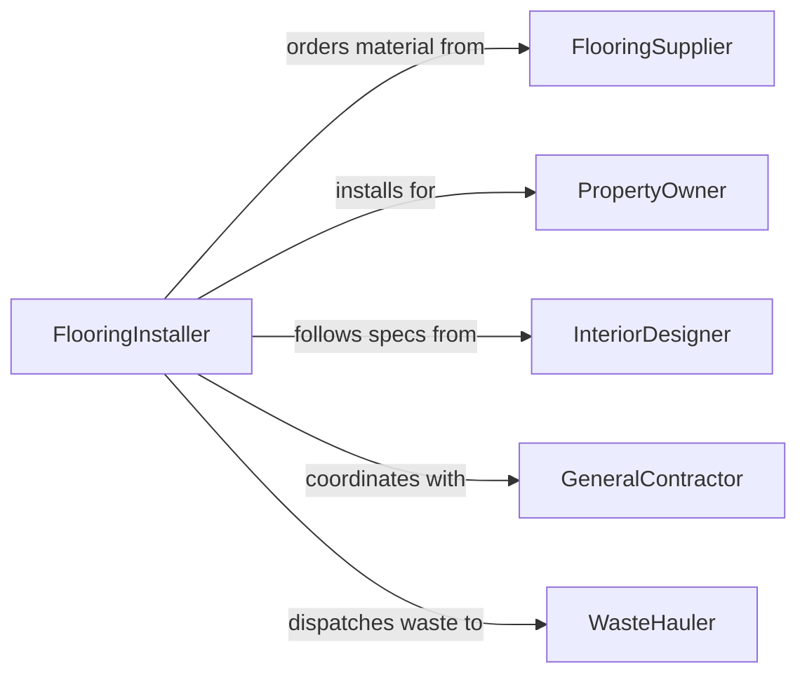

# Cut Carpet, Vinyl, or Flexible Materials

> Business-as-Code definition for cutting carpet, vinyl, and other flexible materials. Models the measurement, layout, and precision cutting of floor coverings, membranes, and sheet goods for installation and fabrication.

## Overview

Cutting carpet, vinyl, and flexible materials involves measuring spaces, planning seam placement, and using specialized tools to cut sheet goods and rolls to required dimensions. This definition covers flooring installation prep, industrial membrane fabrication, and custom upholstery or awning cutting where flexible substrates must be sized accurately to minimize waste and ensure fit.

## Actors

| Actor | Description |
|-------|-------------|
| FlooringSupplier | Provides rolls and sheets of carpet, vinyl, and flexible materials |
| PropertyOwner | Commissions flooring installation or material cutting |
| InteriorDesigner | Specifies materials, patterns, and layout requirements |
| GeneralContractor | Coordinates flooring work within broader construction projects |
| WasteHauler | Removes scrap material and packaging from job sites |

## Roles

| Role | Description |
|------|-------------|
| FlooringInstaller | Measures, cuts, and fits flexible materials on site |
| CuttingOperator | Operates manual or powered cutting tools in a fabrication shop |
| ProjectEstimator | Calculates material quantities and cutting plans |
| SiteSupervisor | Oversees cutting and installation quality on location |

## Entities

| Entity | Description |
|--------|-------------|
| MaterialRoll | A roll of carpet, vinyl, or flexible sheet material |
| CuttingPlan | A layout diagram showing cut lines and seam placements |
| CutPiece | A section of material cut to specified dimensions |
| SeamLocation | The planned joint between two adjacent material pieces |
| SubfloorProfile | Measurements and condition details of the surface to be covered |
| WasteScrap | Offcut material remaining after cutting operations |
| WorkOrder | A job ticket specifying material type, area, and pattern |

## Actions

| Action | Description |
|--------|-------------|
| measureArea | Survey and record dimensions of the area to be covered |
| createCuttingPlan | Generate an optimized layout to minimize seams and waste |
| unrollMaterial | Stage and flatten material for cutting |
| cutMaterial | Execute cuts along planned lines using appropriate tools |
| trimEdge | Fine-cut material edges for precise fit against walls or fixtures |
| verifyFit | Check cut pieces against the target area for dimensional accuracy |
| logScrap | Record waste material quantities for tracking |

## Events

| Event | Description |
|-------|-------------|
| areaMeasured | Target area dimensions have been recorded |
| cuttingPlanCreated | Optimized cutting layout has been generated |
| materialUnrolled | Material has been staged and flattened for cutting |
| materialCut | A section has been cut to planned dimensions |
| edgeTrimmed | Material edge has been fine-cut for fit |
| fitVerified | Cut piece has been confirmed to match the target area |
| scrapLogged | Waste material has been recorded |

## Searches

| Search | Description |
|--------|-------------|
| findWorkOrders | List cutting jobs by status, material type, or due date |
| getMaterialInventory | Retrieve available rolls by type, color, and remaining length |
| getScrapRate | Calculate waste percentage for completed jobs |
| findCuttingPlans | Locate optimized layouts for a given work order |

## Workflow



## Actor Relationships



## Usage

### Calling Actions

```typescript
import { cutCarpetVinylFlexibleMaterials } from '@headlessly/cut-carpet-vinyl-flexible-materials'

const cutter = cutCarpetVinylFlexibleMaterials()

// Measure the target area
const area = await cutter.measureArea({
  room: 'Living Room',
  dimensions: { length: 18, width: 14, unit: 'feet' },
  obstacles: [{ type: 'fireplace', width: 4, depth: 1.5 }]
})

// Generate an optimized cutting plan
const plan = await cutter.createCuttingPlan({
  areaId: area.id,
  materialType: 'carpet',
  rollWidth: 12,
  patternRepeat: 24
})

// Execute the cuts
await cutter.cutMaterial({
  planId: plan.id,
  rollId: 'ROLL-2024-0133',
  tool: 'straight-edge-knife'
})
```

### Event-Driven Automation

```typescript
// Reorder material when inventory runs low
cutter.materialCut(async ({ rollId, remainingLength }) => {
  if (remainingLength < 10) {
    await purchasing.createRequisition({
      materialType: 'carpet',
      rollId,
      urgency: 'standard'
    })
  }
})

// Notify supervisor on fit failure
cutter.fitVerified(async ({ pieceId, passed, deviation }) => {
  if (!passed) {
    await notify({
      to: 'site-supervisor',
      message: `Piece ${pieceId} failed fit check: ${deviation}mm deviation`
    })
  }
})
```
