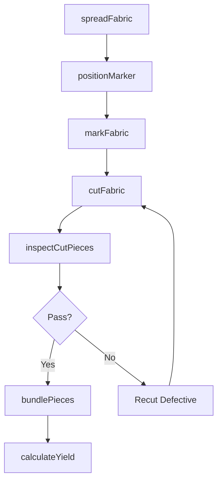
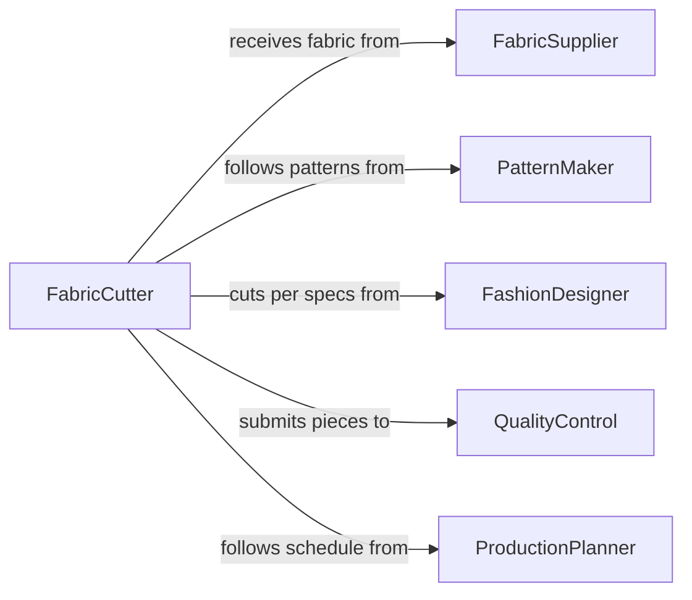

# Cut Fabrics

> Business-as-Code definition for cutting fabrics. Models the process of laying out, marking, and cutting textile materials according to patterns for garment manufacturing, upholstery, and industrial textile applications.

## Overview

Cutting fabrics involves spreading fabric on cutting tables, positioning patterns or templates, marking cut lines, and executing cuts using hand shears, rotary cutters, or automated cutting machines. This activity is central to apparel production, upholstery manufacturing, sailmaking, and industrial textile fabrication. Precision cutting directly impacts material yield, garment fit, and production quality, making pattern alignment, grain direction, and defect avoidance critical considerations.

## Actors

| Actor | Description |
|-------|-------------|
| FabricSupplier | Provides textile rolls with specifications for width, weight, and composition |
| PatternMaker | Creates cutting patterns and marker layouts that optimize material usage |
| FashionDesigner | Specifies fabric types, colorways, and cut requirements for each style |
| QualityControl | Inspects cut pieces for dimensional accuracy and fabric defects |
| ProductionPlanner | Schedules cutting orders based on sewing line capacity and delivery dates |

## Roles

| Role | Description |
|------|-------------|
| FabricCutter | Operates cutting tools and machines to cut fabric per patterns |
| Spreader | Lays out fabric layers on the cutting table in proper alignment |
| MarkerPlanner | Arranges pattern pieces on the marker to maximize material yield |
| CuttingRoomSupervisor | Manages cutting operations and coordinates with sewing production |

## Entities

| Entity | Description |
|--------|-------------|
| FabricRoll | A bolt of textile material ready for spreading and cutting |
| CuttingPattern | A template defining the shape and dimensions of each piece to be cut |
| Marker | A layout arrangement of all pattern pieces optimized for minimal waste |
| CutPiece | An individual fabric piece cut from the lay and ready for sewing |
| CuttingOrder | A production directive specifying styles, sizes, and quantities to cut |
| FabricLay | A stack of fabric layers spread on the cutting table for simultaneous cutting |

## Actions

| Action | Description |
|--------|-------------|
| spreadFabric | Lay fabric from the roll onto the cutting table in aligned layers |
| positionMarker | Place the marker layout on top of the fabric lay for pattern transfer |
| markFabric | Transfer pattern outlines, notches, and drill holes onto the fabric |
| cutFabric | Execute cuts along marked lines using shears, rotary cutters, or CNC machines |
| bundlePieces | Group cut pieces by size, color, and style for transfer to sewing |
| inspectCutPieces | Check cut pieces for dimensional accuracy, fraying, and fabric defects |
| calculateYield | Determine actual material usage versus planned consumption for the cutting order |

## Events

| Event | Description |
|-------|-------------|
| fabricSpread | Fabric layers have been laid out on the cutting table |
| markerPositioned | The marker layout has been placed on the fabric lay |
| fabricMarked | Pattern outlines and notch marks have been transferred to the fabric |
| fabricCut | All pieces have been cut from the fabric lay |
| piecesBundled | Cut pieces have been grouped and labeled for sewing production |
| cutPiecesInspected | Quality inspection of cut pieces has been completed |
| yieldCalculated | Material usage and waste percentages have been determined |

## Searches

| Search | Description |
|--------|-------------|
| findCuttingOrders | List cutting orders by style, date, or production status |
| getFabricInventory | Retrieve available fabric rolls by type, color, or width |
| getCutPieces | Look up cut pieces by style, size, or bundle assignment |
| getYieldReports | Retrieve material yield data by order, fabric type, or date range |

## Workflow



## Actor Relationships



## Usage

### Calling Actions

```typescript
import { cutFabrics } from '@headlessly/cut-fabrics'

const cutting = cutFabrics()

// Spread fabric for a cutting order
const lay = await cutting.spreadFabric({
  fabricRollId: 'ROLL-CTN-BLK-2026-044',
  layers: 40,
  layLengthYds: 12,
  grainDirection: 'lengthwise',
  faceOrientation: 'face-up'
})

// Position marker and cut
await cutting.positionMarker({
  layId: lay.id,
  markerId: 'MKR-BLAZER-V2-SML-XL',
  yieldTarget: 92
})

await cutting.cutFabric({
  layId: lay.id,
  cuttingMethod: 'auto-cutter',
  machineId: 'GERBER-GT7250',
  bladeType: 'straight-knife'
})

// Inspect and bundle
const inspection = await cutting.inspectCutPieces({
  layId: lay.id,
  checks: ['dimensions', 'notch-accuracy', 'edge-quality']
})

await cutting.bundlePieces({
  layId: lay.id,
  groupBy: ['style', 'size', 'color'],
  destination: 'sewing-line-3'
})
```

### Event-Driven Automation

```typescript
// Alert when material yield falls below target
cutting.yieldCalculated(async ({ orderId, yieldPercent, targetPercent }) => {
  if (yieldPercent < targetPercent) {
    await alert({
      to: 'cutting-room-supervisor',
      message: `Order ${orderId}: yield ${yieldPercent}% below target ${targetPercent}%`
    })
  }
})

// Notify sewing line when bundles are ready
cutting.piecesBundled(async ({ layId, bundles, destination }) => {
  await notify({
    to: destination,
    message: `${bundles.length} bundles from lay ${layId} ready for pickup`,
    bundles: bundles.map(b => ({ style: b.style, size: b.size, pieces: b.count }))
  })
})
```
