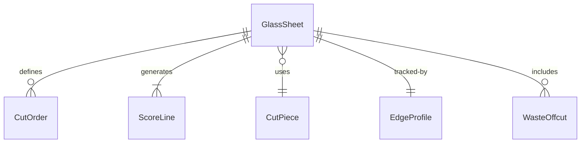
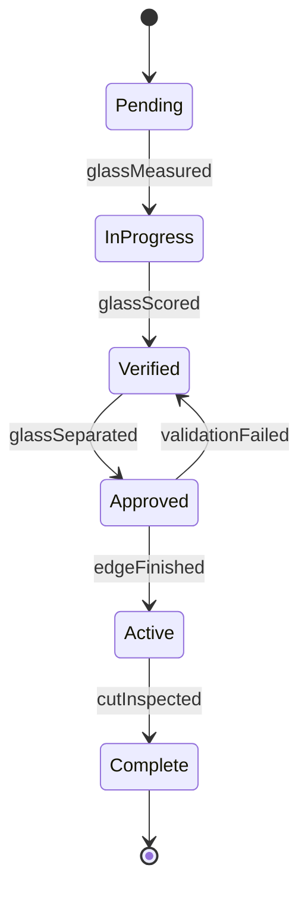
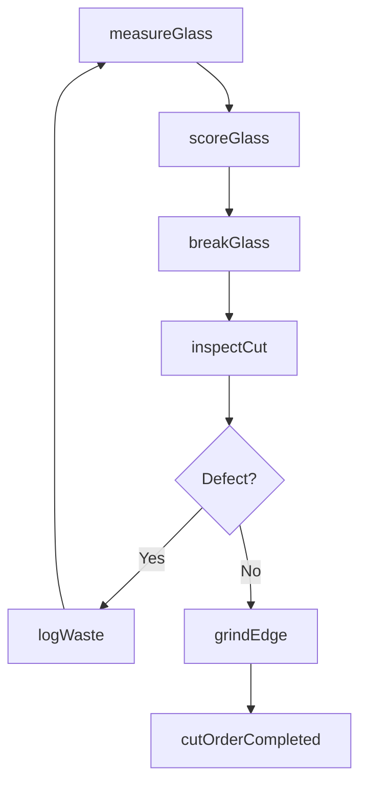
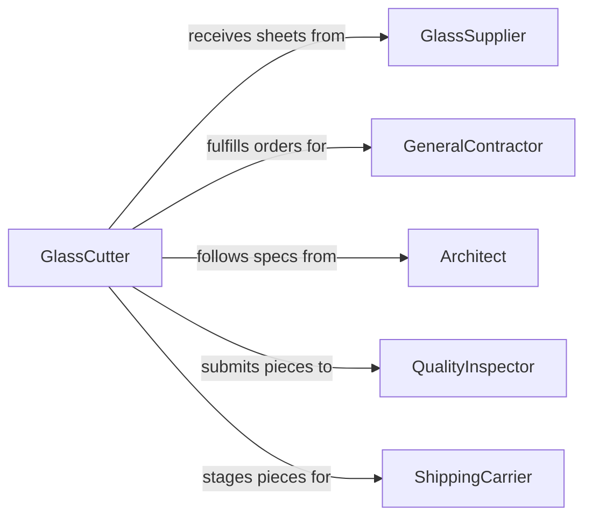

# Cut Glass

> Business-as-Code definition for glass cutting operations. Models the process of scoring, breaking, and finishing glass to specified dimensions and shapes for construction, manufacturing, and specialty applications.

## Overview

Glass cutting encompasses measuring, scoring, and separating glass sheets, panes, and specialty glass products to precise dimensions and profiles. This definition covers flat glass fabrication for windows and architectural applications, tempered and laminated glass processing, and decorative glass shaping for artistic or commercial use.

## Actors

| Actor | Description |
|-------|-------------|
| GlassSupplier | Provides raw glass sheets and specialty glass materials |
| GeneralContractor | Orders cut glass for construction and renovation projects |
| Architect | Specifies glass dimensions, types, and performance requirements |
| QualityInspector | Verifies cut glass meets dimensional and safety standards |
| ShippingCarrier | Transports finished glass products to job sites |
| Customer | End client requesting custom glass cutting services |

## Roles

| Role | Description |
|------|-------------|
| GlassCutter | Operates cutting tools and scores glass to specifications |
| ShopForeman | Oversees glass cutting operations and schedules work orders |
| QualityTechnician | Inspects cuts for accuracy, edge quality, and defects |
| MaterialHandler | Moves glass sheets between storage, cutting stations, and shipping |

## Entities

| Entity | Description |
|--------|-------------|
| GlassSheet | A raw glass panel awaiting cutting |
| CutOrder | A work order specifying dimensions, glass type, and quantity |
| ScoreLine | A guided cut line marked on the glass surface |
| CutPiece | A finished glass piece separated from the parent sheet |
| EdgeProfile | The finish specification for cut glass edges |
| WasteOffcut | Remnant glass material from cutting operations |
| CuttingTemplate | A pattern or guide used for shaped or curved cuts |

## Actions

| Action | Description |
|--------|-------------|
| measureGlass | Calculate and mark dimensions on glass sheets |
| scoreGlass | Create a controlled fracture line using a cutting wheel or laser |
| breakGlass | Separate glass along the scored line using controlled pressure |
| grindEdge | Smooth and finish cut glass edges to specification |
| inspectCut | Verify dimensional accuracy and edge quality of cut pieces |
| templatCut | Apply a template for non-rectangular or curved cuts |
| logWaste | Record offcut material for reuse tracking or disposal |

## Events

| Event | Description |
|-------|-------------|
| glassMeasured | Dimensions have been marked on the glass sheet |
| glassScored | A score line has been successfully created |
| glassSeparated | Glass has been broken along the score line |
| edgeFinished | Cut edge has been ground or polished to specification |
| cutInspected | Quality inspection of the cut piece is complete |
| cutOrderCompleted | All pieces for a cut order have been finished |
| defectDetected | A crack, chip, or dimensional error has been identified |

## Searches

| Search | Description |
|--------|-------------|
| findCutOrders | List cut orders by status, glass type, or due date |
| getGlassInventory | Retrieve available glass sheets by type and dimensions |
| getCutYield | Calculate material utilization rate for completed orders |
| findDefects | Locate cut pieces flagged with quality issues |
| getWasteLog | Retrieve offcut records for a given period |


## Entity Relationships



## State Diagram


## Workflow



## Actor Relationships



## Usage

### Calling Actions

```typescript
import { cutGlass } from '@headlessly/cut-glass'

const glass = cutGlass()

// Measure and score a glass sheet
const measurement = await glass.measureGlass({
  sheetId: 'GS-2024-0451',
  dimensions: { width: 48, height: 72, unit: 'inches' },
  glassType: 'tempered'
})

// Score the glass along measured lines
await glass.scoreGlass({
  sheetId: measurement.sheetId,
  scoreLine: { startX: 0, startY: 0, endX: 48, endY: 0 },
  tool: 'carbide-wheel'
})

// Inspect the finished cut
const inspection = await glass.inspectCut({
  pieceId: 'CP-2024-0892',
  toleranceMm: 1.5
})
```

### Event-Driven Automation

```typescript
// Alert on defect detection
glass.defectDetected(async ({ pieceId, defectType, severity }) => {
  if (severity === 'critical') {
    await notify({
      to: 'shop-foreman',
      message: `Critical defect on piece ${pieceId}: ${defectType}`
    })
  }
})

// Auto-update inventory on order completion
glass.cutOrderCompleted(async ({ orderId, pieces }) => {
  for (const piece of pieces) {
    await inventory.deductSheet({ sheetId: piece.sourceSheetId })
  }
})
```
