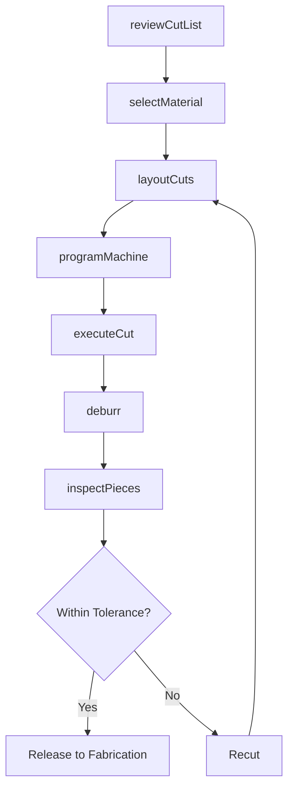
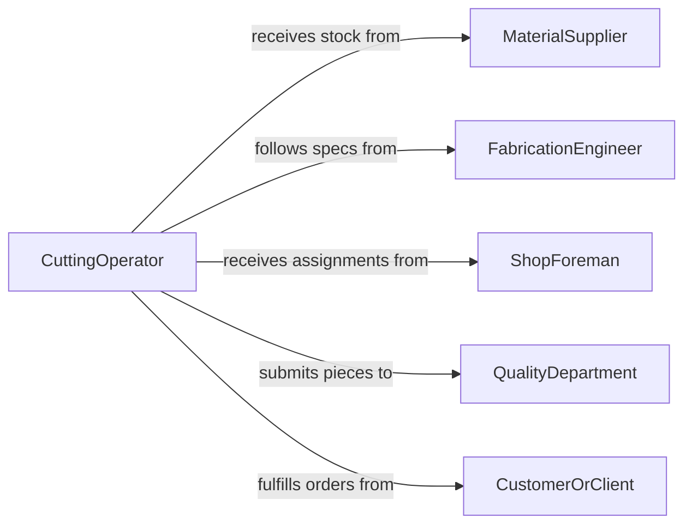

# Cut Industrial Materials Preparation Fabrication

> Business-as-Code definition for cutting industrial materials in preparation for fabrication or processing. Models the process of measuring, marking, and cutting metals, plastics, composites, and other industrial stock to specified dimensions.

## Overview

Cutting industrial materials in preparation for fabrication involves measuring and marking raw stock such as steel plate, aluminum extrusions, plastic sheet, pipe, tubing, and composite panels, then cutting them to precise dimensions using saws, shears, plasma cutters, laser cutters, or waterjet machines. This activity is the first step in most manufacturing and fabrication workflows, where dimensional accuracy and clean cuts directly affect downstream welding, machining, bending, and assembly operations.

## Actors

| Actor | Description |
|-------|-------------|
| MaterialSupplier | Provides raw stock with mill certifications and material specifications |
| FabricationEngineer | Specifies cut dimensions, tolerances, and material grades for each job |
| ShopForeman | Schedules cutting operations and assigns jobs to available machines |
| QualityDepartment | Inspects cut pieces for dimensional accuracy and surface quality |
| CustomerOrClient | Submits fabrication orders that drive cutting requirements |

## Roles

| Role | Description |
|------|-------------|
| CuttingOperator | Sets up and operates cutting machines to process raw materials |
| LayoutTechnician | Measures, marks, and lays out cut lines on raw stock |
| CNCProgrammer | Creates cutting programs for automated plasma, laser, and waterjet systems |
| MaterialHandler | Moves raw stock to the cutting area and transports cut pieces to fabrication |

## Entities

| Entity | Description |
|--------|-------------|
| RawStock | Uncut industrial material such as plate, bar, tube, or sheet |
| CutList | A document specifying each piece to be cut with dimensions and quantity |
| CuttingProgram | A CNC file defining tool paths for automated cutting machines |
| CutPiece | A piece of material cut to specification and ready for fabrication |
| Kerf | The width of material removed by the cutting tool, affecting final dimensions |
| MaterialCertification | A mill test report documenting the chemical and mechanical properties of the stock |

## Actions

| Action | Description |
|--------|-------------|
| reviewCutList | Examine the cut list for dimensions, quantities, and material requirements |
| selectMaterial | Choose the correct raw stock based on grade, thickness, and certification |
| layoutCuts | Measure and mark cut lines on the raw stock to optimize material usage |
| programMachine | Load or create the CNC cutting program for automated equipment |
| executeCut | Operate the cutting machine to produce pieces per the cut list |
| deburr | Remove sharp edges, slag, and burrs from cut pieces |
| inspectPieces | Verify cut dimensions, edge quality, and material condition against tolerances |

## Events

| Event | Description |
|-------|-------------|
| cutListReviewed | The cut list has been examined and confirmed for production |
| materialSelected | Raw stock has been chosen and staged at the cutting area |
| cutsLaidOut | Cut lines have been marked on the raw stock |
| machineProgrammed | The CNC cutting program has been loaded and verified |
| cutExecuted | Material has been cut to produce the specified pieces |
| piecesDeburred | Sharp edges and slag have been removed from cut pieces |
| piecesInspected | Dimensional and quality inspection of cut pieces is complete |

## Searches

| Search | Description |
|--------|-------------|
| findCutLists | List cut lists by job, material type, or production status |
| getMaterialInventory | Retrieve available raw stock by grade, size, and quantity |
| getCutPieces | Look up completed cut pieces by job, dimensions, or inspection status |
| getMachineSchedule | Check cutting machine availability and current job queue |

## Workflow



## Actor Relationships



## Usage

### Calling Actions

```typescript
import { cutIndustrialMaterialsPreparationFabrication } from '@headlessly/cut-industrial-materials-preparation-fabrication'

const cutting = cutIndustrialMaterialsPreparationFabrication()

// Review a cut list for a structural steel job
const cutList = await cutting.reviewCutList({
  jobId: 'FAB-2026-0312',
  pieces: [
    { partNo: 'BM-01', material: 'A36-steel', thickness: 0.5, width: 12, length: 96, qty: 4 },
    { partNo: 'PL-03', material: 'A36-steel', thickness: 0.375, width: 24, length: 48, qty: 8 },
    { partNo: 'TB-07', material: '304-stainless', od: 2.0, wall: 0.065, length: 36, qty: 12 }
  ]
})

// Select material and program the plasma cutter
await cutting.selectMaterial({
  cutListId: cutList.id,
  stockItems: [
    { stockId: 'PLT-A36-050-4x8', certNo: 'MTR-44821' },
    { stockId: 'PLT-A36-0375-4x8', certNo: 'MTR-44822' }
  ]
})

await cutting.programMachine({
  cutListId: cutList.id,
  machineId: 'PLASMA-HYP-XPR300',
  nestingStrategy: 'optimize-yield',
  kerfAllowance: 0.0625
})

// Execute cuts and inspect
await cutting.executeCut({ cutListId: cutList.id, machineId: 'PLASMA-HYP-XPR300' })
await cutting.deburr({ cutListId: cutList.id, method: 'grinding' })
```

### Event-Driven Automation

```typescript
// Notify fabrication when cut pieces pass inspection
cutting.piecesInspected(async ({ jobId, cutListId, allPassed }) => {
  if (allPassed) {
    await notify({
      to: 'fabrication-shop',
      message: `Cut pieces for job ${jobId} inspected and ready for welding/assembly`
    })
  }
})

// Track material yield for cost accounting
cutting.cutExecuted(async ({ cutListId, materialUsed, wasteGenerated }) => {
  await recordMaterialUsage({
    cutListId,
    usedLbs: materialUsed,
    wasteLbs: wasteGenerated,
    yieldPercent: (materialUsed / (materialUsed + wasteGenerated)) * 100
  })
})
```
