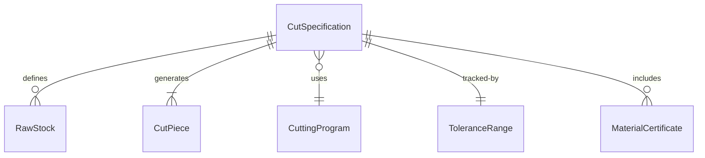
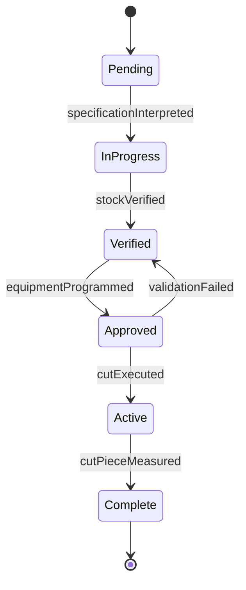
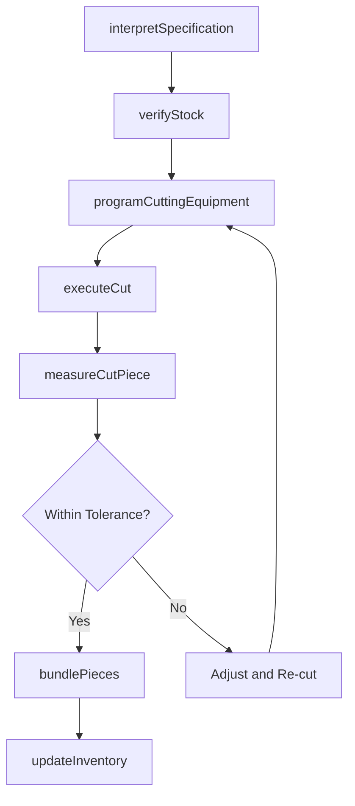
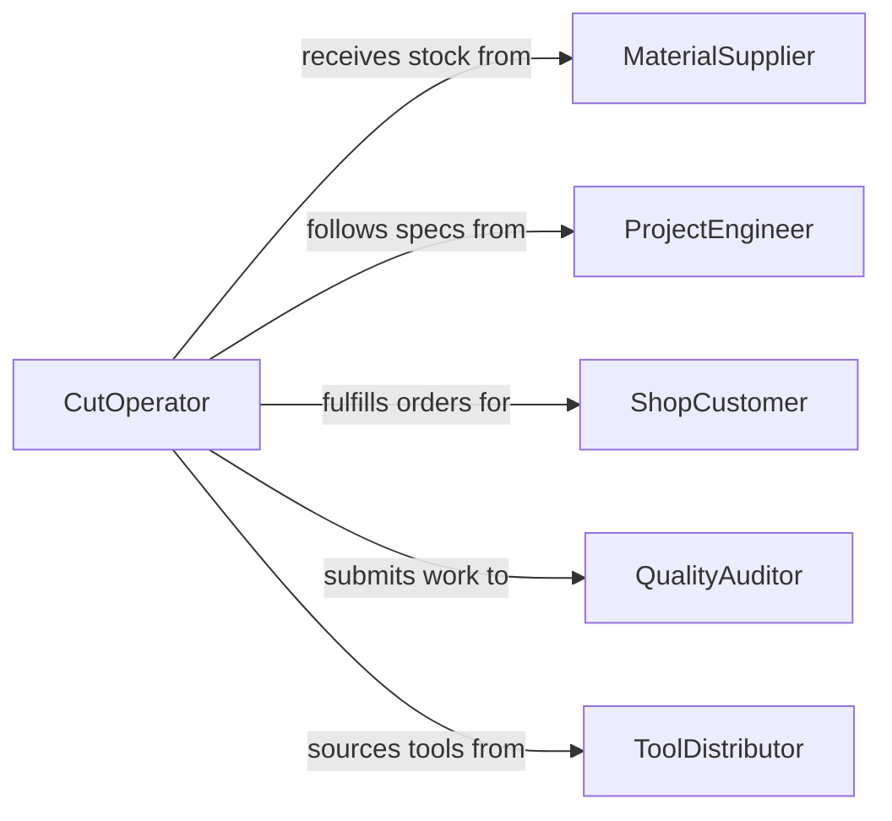

# Cut Materials According Specifications Needs

> Business-as-Code definition for cutting materials according to specifications or needs. Models the general-purpose process of interpreting technical drawings or work orders and cutting a variety of materials to required dimensions using appropriate tools and methods.

## Overview

Cutting materials according to specifications or needs is a foundational fabrication and construction activity that spans multiple material types including wood, metal, plastic, fabric, glass, and composites. Workers interpret blueprints, work orders, or verbal instructions to determine required dimensions, select the appropriate cutting tool and technique, and produce pieces that meet tolerance and finish requirements. This activity applies across industries from manufacturing and construction to garment production and signage, wherever raw stock must be reduced to specific shapes and sizes for downstream assembly or installation.

## Actors

| Actor | Description |
|-------|-------------|
| MaterialSupplier | Provides raw stock in standard sizes and grades |
| ProjectEngineer | Creates specifications, drawings, and cut schedules |
| ShopCustomer | Requests custom-cut materials for specific projects |
| QualityAuditor | Evaluates cutting accuracy and process compliance on a periodic basis |
| ToolDistributor | Supplies cutting equipment, blades, and consumables |

## Roles

| Role | Description |
|------|-------------|
| CutOperator | Reads specifications and operates cutting equipment to produce parts |
| ShopLeader | Prioritizes cutting jobs, assigns operators, and manages workflow |
| MaterialHandler | Stages raw stock for cutting and moves finished pieces to the next station |
| QualityChecker | Performs in-process dimensional checks on cut pieces |

## Entities

| Entity | Description |
|--------|-------------|
| CutSpecification | A document or work order defining the material, dimensions, quantity, and tolerances |
| RawStock | Uncut material available for processing in standard lengths, sheets, or rolls |
| CutPiece | A finished piece that has been cut to the required specification |
| CuttingProgram | Machine instructions or settings for automated cutting equipment |
| ToleranceRange | The acceptable deviation from nominal dimensions for a given specification |
| MaterialCertificate | Documentation of the grade, composition, and properties of the raw stock |

## Actions

| Action | Description |
|--------|-------------|
| interpretSpecification | Review the cut specification to understand dimensions, material, and tolerances |
| verifyStock | Confirm that the available raw stock matches the material certificate and spec |
| programCuttingEquipment | Enter dimensions and settings into the cutting machine or prepare manual setup |
| executeCut | Perform the cutting operation to produce the specified piece |
| measureCutPiece | Check the finished piece against the tolerance range |
| bundlePieces | Group cut pieces by job, assembly, or delivery destination |
| updateInventory | Adjust raw stock and finished piece counts in the inventory system |

## Events

| Event | Description |
|-------|-------------|
| specificationInterpreted | The cut specification has been reviewed and understood by the operator |
| stockVerified | Raw material has been confirmed as matching the required grade and dimensions |
| equipmentProgrammed | The cutting machine has been set up with the correct parameters |
| cutExecuted | A piece has been successfully cut from the raw stock |
| cutPieceMeasured | Dimensional inspection of the cut piece is complete |
| piecesBundled | Cut pieces have been grouped and labeled for the next process step |
| inventoryUpdated | Stock levels have been adjusted to reflect consumed and produced material |

## Searches

| Search | Description |
|--------|-------------|
| findCutSpecifications | List open cut specifications by job, material type, or due date |
| getStockAvailability | Check raw stock inventory by material, grade, and dimensions |
| getCutAccuracy | Retrieve pass/fail rates for cut pieces by operator or machine |
| findBundledPieces | Locate finished bundles by job number or assembly destination |


## Entity Relationships



## State Diagram


## Workflow



## Actor Relationships



## Usage

### Calling Actions

```typescript
import { cutMaterialsAccordingSpecificationsNeeds } from '@headlessly/cut-materials-according-specifications-needs'

const cutting = cutMaterialsAccordingSpecificationsNeeds()

// Interpret a cut specification from a work order
const spec = await cutting.interpretSpecification({
  workOrderId: 'WO-2026-1847',
  drawingRef: 'DWG-BRACKET-ASSY-04'
})

// Verify available stock
const stock = await cutting.verifyStock({
  material: 'aluminum-6061-T6',
  requiredDimensions: { thickness: 6.35, width: 100, minLength: 500 },
  quantity: 24
})

// Execute cuts according to the specification
for (const item of spec.items) {
  const piece = await cutting.executeCut({
    stockId: stock.id,
    dimensions: item.dimensions,
    method: 'cnc-router',
    program: item.cuttingProgram
  })

  await cutting.measureCutPiece({
    pieceId: piece.id,
    toleranceMm: item.tolerance
  })
}

// Bundle and update inventory
await cutting.bundlePieces({ workOrderId: 'WO-2026-1847', destination: 'assembly-station-3' })
```

### Event-Driven Automation

```typescript
// Auto-reorder stock when levels are low
cutting.inventoryUpdated(async ({ material, remainingQuantity, reorderPoint }) => {
  if (remainingQuantity <= reorderPoint) {
    await createPurchaseOrder({
      material,
      quantity: reorderPoint * 2,
      priority: 'standard'
    })
  }
})

// Alert shop leader when cut accuracy drops
cutting.cutPieceMeasured(async ({ operator, passed }) => {
  if (!passed) {
    const accuracy = await cutting.getCutAccuracy({ operator, period: 'current-shift' })
    if (accuracy.passRate < 0.97) {
      await notify({
        to: 'shop-leader',
        message: `Cut accuracy for ${operator} at ${(accuracy.passRate * 100).toFixed(1)}% this shift`
      })
    }
  }
})
```
