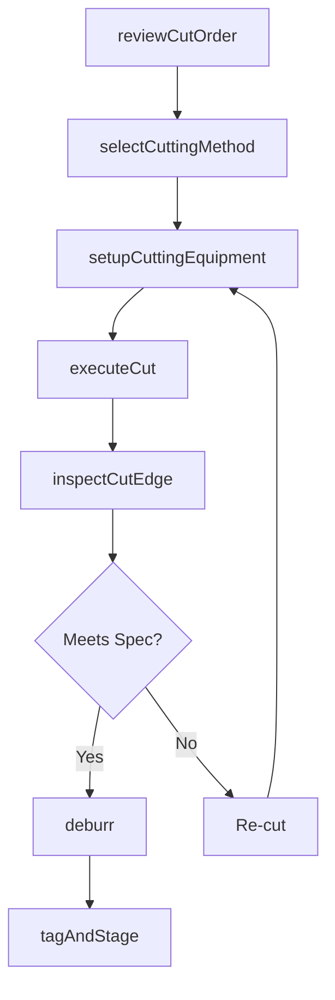
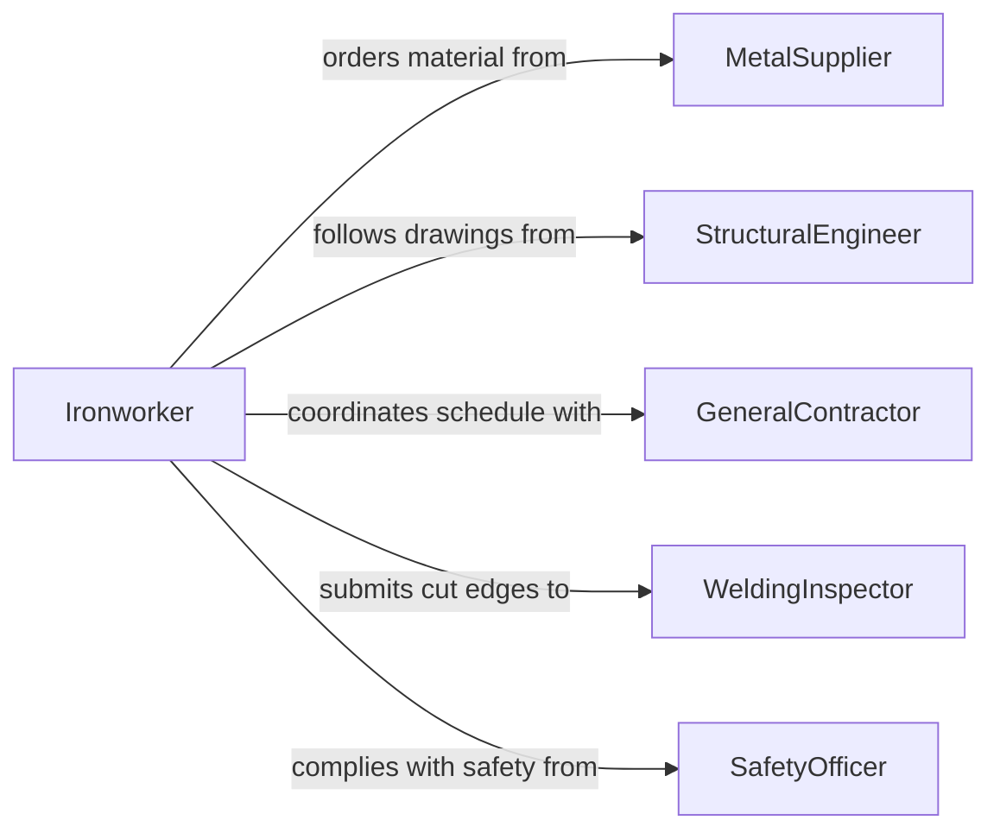

# Cut Metal Components Installation

> Business-as-Code definition for cutting metal components for installation. Models the process of measuring, marking, and cutting ferrous and non-ferrous metals using mechanical and thermal cutting methods for fabrication and construction projects.

## Overview

Cutting metal components for installation involves interpreting engineering drawings, selecting the appropriate cutting method for the metal type and thickness, and producing parts that meet dimensional and finish specifications. Common methods include plasma cutting, oxy-fuel torching, band sawing, shearing, and abrasive cutting. This activity is critical in structural steel erection, HVAC ductwork, piping systems, and sheet metal fabrication where precise fit-up determines joint integrity and overall project quality.

## Actors

| Actor | Description |
|-------|-------------|
| MetalSupplier | Provides raw steel, aluminum, copper, and specialty alloys |
| StructuralEngineer | Specifies material grades, dimensions, and tolerances for metal components |
| GeneralContractor | Coordinates installation schedules and site logistics |
| WeldingInspector | Verifies cut quality at weld prep edges and joint fit-up |
| SafetyOfficer | Enforces hot work permits, PPE requirements, and ventilation standards |

## Roles

| Role | Description |
|------|-------------|
| Ironworker | Cuts structural steel members for framing and erection |
| SheetMetalWorker | Cuts sheet metal for ductwork, flashing, and enclosures |
| PipeFitter | Cuts pipe and tubing to length with bevel or square ends |
| FabricationSupervisor | Manages cutting operations, tool calibration, and quality control |

## Entities

| Entity | Description |
|--------|-------------|
| CutOrder | A specification of metal parts to be cut with dimensions, material, and quantities |
| MetalStock | Raw material inventory including plate, bar, tube, and sheet |
| CutPart | A finished metal component that has been cut to specification |
| CuttingMethod | The technique used such as plasma, oxy-fuel, band saw, or shear |
| BevelSpecification | The angle and land dimensions required for weld preparation on cut edges |
| HeatAffectedZone | The area adjacent to a thermal cut that may require post-cut treatment |

## Actions

| Action | Description |
|--------|-------------|
| reviewCutOrder | Validate cut specifications against engineering drawings and material availability |
| selectCuttingMethod | Choose the appropriate cutting technique based on material type and thickness |
| setupCuttingEquipment | Configure the cutting tool with proper speed, feed, and consumables |
| executeCut | Perform the cutting operation on the metal stock |
| inspectCutEdge | Examine the cut surface for quality, straightness, and bevel accuracy |
| deburr | Remove sharp edges, slag, or burrs from cut components |
| tagAndStage | Label cut parts and organize them for transport to the installation area |

## Events

| Event | Description |
|-------|-------------|
| cutOrderReviewed | The cut order has been validated and materials confirmed available |
| cuttingMethodSelected | The cutting technique has been determined for the material and part |
| equipmentSetupComplete | The cutting tool is configured and ready for operation |
| metalCutCompleted | A metal component has been successfully cut to specification |
| cutEdgeInspected | The quality of the cut surface has been evaluated |
| partDeburred | Sharp edges and slag have been removed from the finished part |
| partTaggedAndStaged | The cut component has been labeled and staged for installation |

## Searches

| Search | Description |
|--------|-------------|
| findCutOrders | Retrieve cut orders by project, material type, or status |
| getMetalStockLevels | Check available inventory of metal stock by grade and dimension |
| getCutQualityLog | Review inspection results for cut parts by project or operator |
| findPartsReadyForInstall | List tagged and staged parts awaiting transport or installation |

## Workflow



## Actor Relationships



## Usage

### Calling Actions

```typescript
import { cutMetalComponentsInstallation } from '@headlessly/cut-metal-components-installation'

const metalCutting = cutMetalComponentsInstallation()

// Review a cut order for structural steel
const order = await metalCutting.reviewCutOrder({
  projectId: 'warehouse-expansion',
  drawingRef: 'S-201-beam-schedule'
})

// Execute cuts for W-flange beams
const part = await metalCutting.executeCut({
  stockId: 'W12x26-stock-lot-44',
  dimensions: { length: 7200 }, // mm
  cuttingMethod: 'band-saw',
  bevel: { angle: 30, land: 1.6 }
})

// Inspect and finish the cut
await metalCutting.inspectCutEdge({
  partId: part.id,
  toleranceMm: 1.5,
  checkBevel: true
})

await metalCutting.deburr({ partId: part.id })
```

### Event-Driven Automation

```typescript
// Notify welding inspector when bevel cuts are ready
metalCutting.partDeburred(async ({ partId, hasBevel, projectId }) => {
  if (hasBevel) {
    await notify({
      to: 'welding-inspector',
      message: `Part ${partId} on project ${projectId} ready for weld prep inspection`
    })
  }
})

// Reorder stock when inventory drops below threshold
metalCutting.metalCutCompleted(async ({ materialGrade, remainingStock }) => {
  if (remainingStock.lengthMm < 3000) {
    await createPurchaseOrder({
      material: materialGrade,
      quantity: 5,
      unit: 'lengths'
    })
  }
})
```
