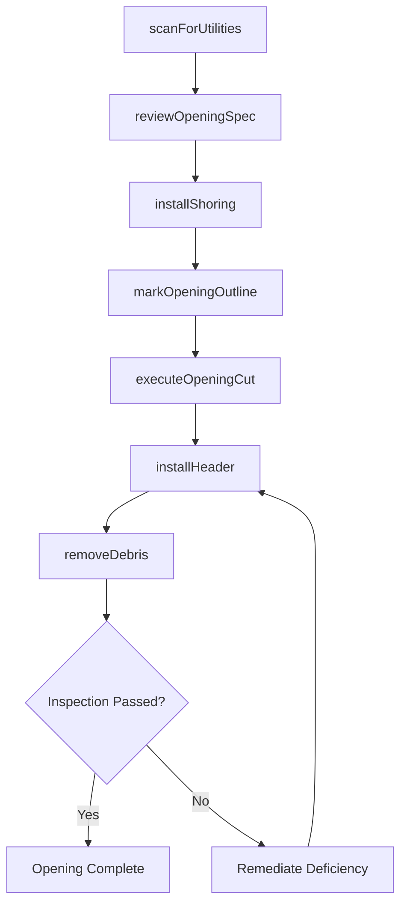
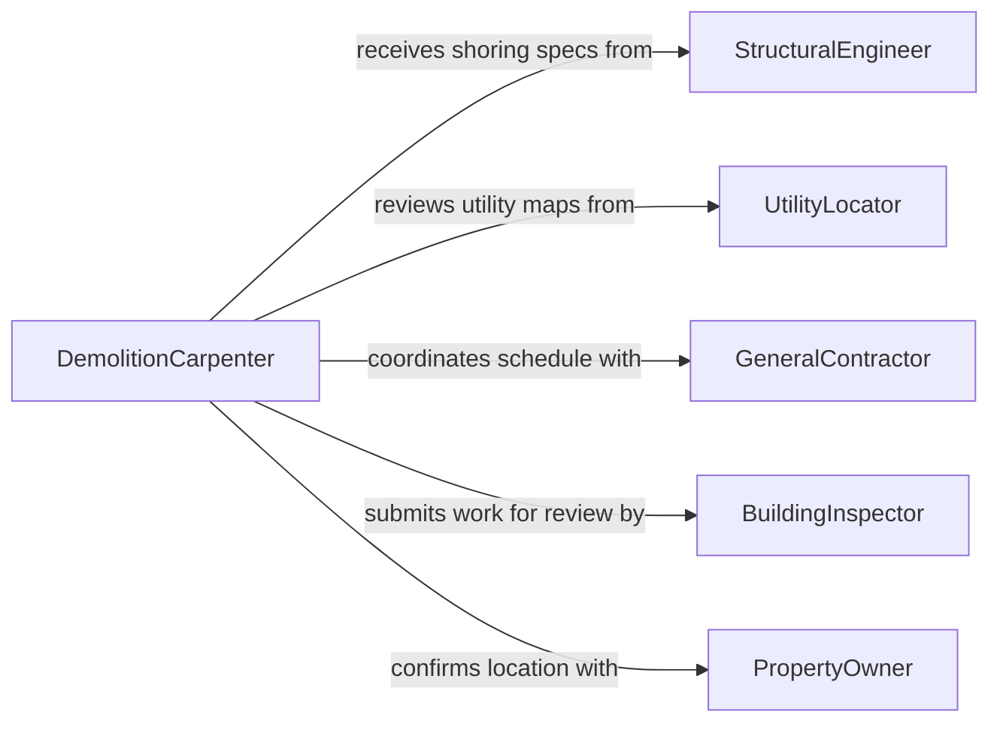

# Cut Openings Existing Structures

> Business-as-Code definition for cutting openings in existing structures. Models the process of creating new doorways, windows, vent penetrations, and utility pass-throughs in walls, floors, roofs, and foundations during renovation or retrofit work.

## Overview

Cutting openings in existing structures involves surveying the location for hidden utilities and structural members, planning the opening dimensions and temporary supports, and executing precise cuts through wall assemblies, floor decks, roof sheathing, or concrete foundations. This activity is common in renovation projects where new doors, windows, HVAC penetrations, plumbing runs, or electrical conduit paths must be created in previously enclosed spaces. It requires coordination between trades to avoid damaging existing systems and to maintain structural integrity throughout the process.

## Actors

| Actor | Description |
|-------|-------------|
| StructuralEngineer | Evaluates load paths and specifies required temporary shoring and headers |
| UtilityLocator | Scans walls and floors to identify hidden electrical, plumbing, and gas lines |
| GeneralContractor | Coordinates the sequencing of opening cuts with other trade activities |
| BuildingInspector | Reviews the completed opening for code compliance and structural adequacy |
| PropertyOwner | Approves the location and size of new openings based on design intent |

## Roles

| Role | Description |
|------|-------------|
| DemolitionCarpenter | Performs the cutting and removal of structural and finish materials |
| ConcreteCutter | Operates core drills and wall saws to cut openings in concrete and masonry |
| Laborer | Installs temporary shoring, removes debris, and provides tool support |
| SiteSupervisor | Oversees the cutting operation ensuring safety protocols and sequencing are followed |

## Entities

| Entity | Description |
|--------|-------------|
| OpeningSpecification | The engineered dimensions, location, and required reinforcement for a new opening |
| UtilityScan | The results of a subsurface scan identifying hidden pipes, wires, and reinforcement |
| TemporaryShoring | Structural supports installed to carry loads while the opening is being cut |
| HeaderBeam | A structural member installed above the opening to redistribute loads |
| CuttingPermit | Authorization to proceed with the cut after engineering and utility reviews |
| DebrisManifest | A log of removed material type and quantity for disposal or recycling |

## Actions

| Action | Description |
|--------|-------------|
| scanForUtilities | Perform subsurface detection to locate hidden wires, pipes, and rebar |
| reviewOpeningSpec | Validate the opening dimensions and reinforcement requirements against drawings |
| installShoring | Erect temporary supports to maintain structural load paths during cutting |
| markOpeningOutline | Transfer the opening dimensions onto the wall, floor, or roof surface |
| executeOpeningCut | Cut through the structure along the marked outline using appropriate tools |
| installHeader | Place and secure the structural header or lintel above the new opening |
| removeDebris | Clear cut material and transport it to the designated disposal area |

## Events

| Event | Description |
|-------|-------------|
| utilitiesScanCompleted | Hidden utilities have been located and mapped at the cut area |
| openingSpecReviewed | The opening specification has been validated by the structural engineer |
| shoringInstalled | Temporary supports are in place and load-bearing capacity confirmed |
| openingOutlineMarked | The cut lines have been drawn on the structure surface |
| openingCutCompleted | The structural material has been fully cut and removed from the opening |
| headerInstalled | The load-bearing header has been secured above the new opening |
| debrisRemoved | Cut material has been cleared and logged for disposal |

## Searches

| Search | Description |
|--------|-------------|
| findPlannedOpenings | List openings scheduled for cutting by project, floor, or status |
| getUtilityScanResults | Retrieve subsurface scan data for a specific wall or floor section |
| getShoringStatus | Check whether temporary supports are in place for a planned opening |
| getOpeningInspections | Find inspection records for completed openings by project or date |

## Workflow



## Actor Relationships



## Usage

### Calling Actions

```typescript
import { cutOpeningsExistingStructures } from '@headlessly/cut-openings-existing-structures'

const openings = cutOpeningsExistingStructures()

// Scan a wall section before cutting a new doorway
const scan = await openings.scanForUtilities({
  projectId: 'office-renovation-bldg-c',
  location: { wall: 'W-14', floor: 2 },
  scanType: 'ground-penetrating-radar'
})

// Review and validate the opening specification
await openings.reviewOpeningSpec({
  openingId: 'DOOR-214',
  width: 914, // mm
  height: 2134, // mm
  wallType: 'load-bearing-wood-frame',
  headerSpec: 'LVL-3.5x11.875-double'
})

// Execute the cut after shoring is in place
await openings.installShoring({ openingId: 'DOOR-214', shoringType: 'temporary-post-beam' })
await openings.executeOpeningCut({
  openingId: 'DOOR-214',
  cuttingTool: 'reciprocating-saw',
  dustControl: 'vacuum-shroud'
})
```

### Event-Driven Automation

```typescript
// Alert trades when an opening is ready for their work
openings.headerInstalled(async ({ openingId, projectId, openingType }) => {
  const nextTrade = openingType === 'door' ? 'door-installer' : 'window-installer'
  await notify({
    to: nextTrade,
    message: `Opening ${openingId} on project ${projectId} is framed and ready for installation`
  })
})

// Block cutting if utility scan is incomplete
openings.openingOutlineMarked(async ({ openingId, location }) => {
  const scan = await openings.getUtilityScanResults({ location })
  if (!scan || scan.status !== 'complete') {
    await notify({
      to: 'site-supervisor',
      message: `Cannot proceed with cut on ${openingId} - utility scan incomplete`
    })
  }
})
```
