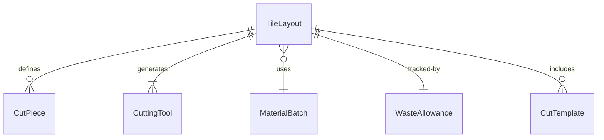
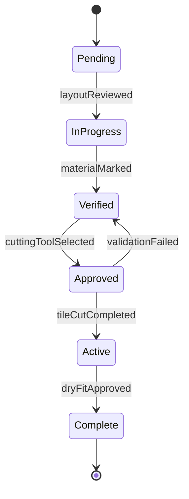
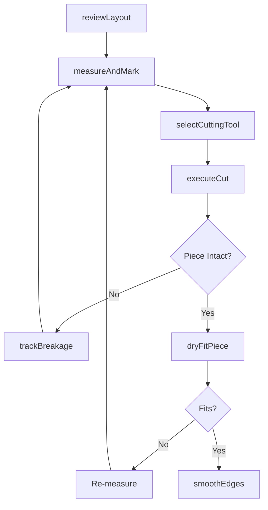
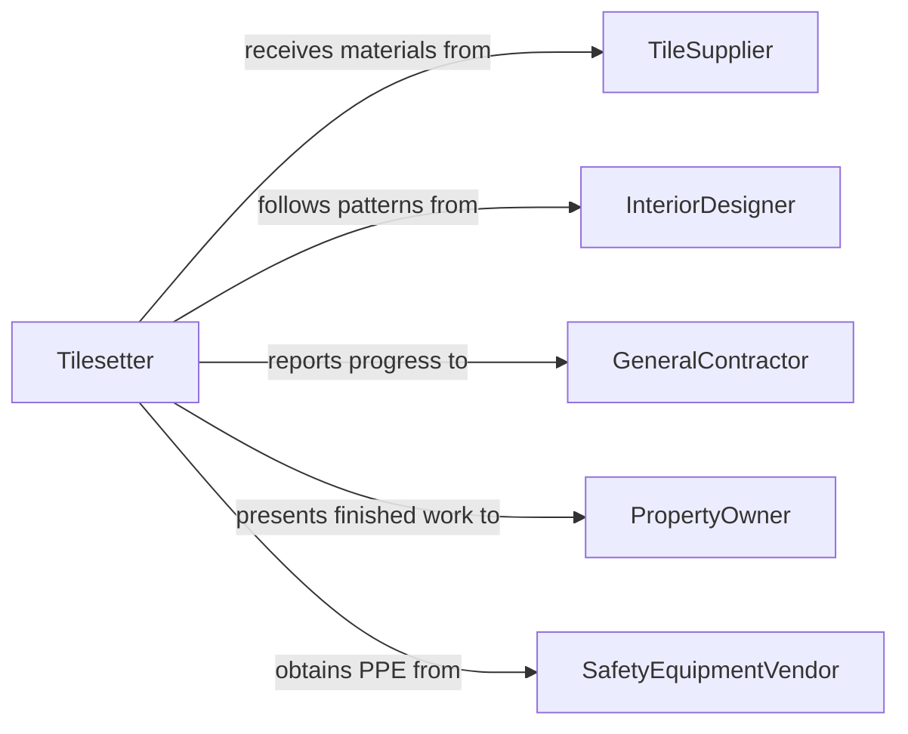

# Cut Tile Stone Masonry Materials

> Business-as-Code definition for cutting tile, stone, or other masonry materials. Models the process of measuring, scoring, and cutting ceramic, porcelain, natural stone, and concrete masonry units to fit layout patterns and installation areas.

## Overview

Cutting tile, stone, and masonry materials involves selecting the correct cutting tool and technique for the material type, transferring layout dimensions onto the workpiece, and executing precise cuts to achieve the required shape and fit. Wet saws, tile nippers, angle grinders with diamond blades, and manual snap cutters are commonly used depending on the material hardness and the complexity of the cut. This activity is essential in flooring, wall cladding, countertop, and exterior hardscape installations where clean edges and tight joints define the quality of the finished work.

## Actors

| Actor | Description |
|-------|-------------|
| TileSupplier | Provides ceramic, porcelain, and natural stone materials |
| InteriorDesigner | Specifies tile patterns, layouts, and material selections |
| GeneralContractor | Manages project timelines and coordinates trade schedules |
| PropertyOwner | Approves material choices and finished installation quality |
| SafetyEquipmentVendor | Supplies PPE, dust suppression systems, and cutting tool accessories |

## Roles

| Role | Description |
|------|-------------|
| Tilesetter | Measures, cuts, and installs tile and stone to the specified layout |
| Mason | Cuts brick, block, and natural stone for structural and decorative applications |
| LeadInstaller | Oversees cutting operations and ensures pattern accuracy across the crew |
| ToolOperator | Operates and maintains wet saws and specialized cutting equipment |

## Entities

| Entity | Description |
|--------|-------------|
| TileLayout | The planned arrangement of tiles showing cuts, patterns, and grout lines |
| CutPiece | A tile or stone unit that has been cut to a specific dimension or shape |
| CuttingTool | Equipment such as wet saws, snap cutters, or angle grinders used for cutting |
| MaterialBatch | A lot of tile or stone from the same production run ensuring color consistency |
| WasteAllowance | The percentage of extra material ordered to account for cuts, breakage, and waste |
| CutTemplate | A physical or digital pattern used to transfer complex shapes onto materials |

## Actions

| Action | Description |
|--------|-------------|
| reviewLayout | Examine the tile layout to identify all required cuts and special shapes |
| measureAndMark | Transfer dimensions and cut lines from the layout onto the material |
| selectCuttingTool | Choose the appropriate tool based on material type and cut complexity |
| executeCut | Perform the cut using a wet saw, snapper, or grinder |
| dryFitPiece | Place the cut piece into position without adhesive to verify fit |
| smoothEdges | Grind or sand cut edges to remove sharpness and achieve clean joints |
| trackBreakage | Record pieces lost to breakage during cutting for waste accounting |

## Events

| Event | Description |
|-------|-------------|
| layoutReviewed | The tile layout has been analyzed and all cuts identified |
| materialMarked | Cut lines have been transferred onto the tile or stone piece |
| cuttingToolSelected | The appropriate cutting method has been determined for the material |
| tileCutCompleted | A tile or stone piece has been successfully cut to specification |
| dryFitApproved | The cut piece fits correctly in its intended location |
| edgesSmoothed | Cut edges have been finished for clean joint alignment |
| breakageRecorded | A piece lost during cutting has been logged against the waste allowance |

## Searches

| Search | Description |
|--------|-------------|
| findCutsByLayout | List all required cuts for a specific tile layout or room |
| getMaterialInventory | Check available tile or stone stock by type, size, and batch |
| getBreakageRate | Retrieve breakage statistics by material type or operator |
| findPendingCuts | List cuts not yet completed for an active installation |


## Entity Relationships



## State Diagram


## Workflow



## Actor Relationships



## Usage

### Calling Actions

```typescript
import { cutTileStoneMasonryMaterials } from '@headlessly/cut-tile-stone-masonry-materials'

const tileCutting = cutTileStoneMasonryMaterials()

// Review layout for a bathroom floor installation
const layout = await tileCutting.reviewLayout({
  projectId: 'master-bath-renovation',
  roomId: 'bathroom-1',
  layoutRef: 'herringbone-12x24'
})

// Cut a tile to fit against the wall edge
const piece = await tileCutting.executeCut({
  materialType: 'porcelain',
  batchId: 'batch-2026-Q1-ivory',
  dimensions: { length: 185, width: 100 }, // mm
  cutType: 'straight',
  tool: 'wet-saw'
})

// Verify the fit before setting
await tileCutting.dryFitPiece({
  pieceId: piece.id,
  position: { row: 3, column: 8 },
  groutGap: 3 // mm
})
```

### Event-Driven Automation

```typescript
// Alert when breakage exceeds waste allowance
tileCutting.breakageRecorded(async ({ projectId, totalBreakage, wasteAllowance }) => {
  if (totalBreakage > wasteAllowance * 0.8) {
    await notify({
      to: 'lead-installer',
      message: `Breakage at ${Math.round(totalBreakage / wasteAllowance * 100)}% of allowance on project ${projectId}`
    })
  }
})

// Log completed cuts for production tracking
tileCutting.tileCutCompleted(async ({ projectId, materialType, operator }) => {
  await updateProductionLog({
    projectId,
    activity: 'tile-cutting',
    materialType,
    operator,
    timestamp: new Date()
  })
})
```
