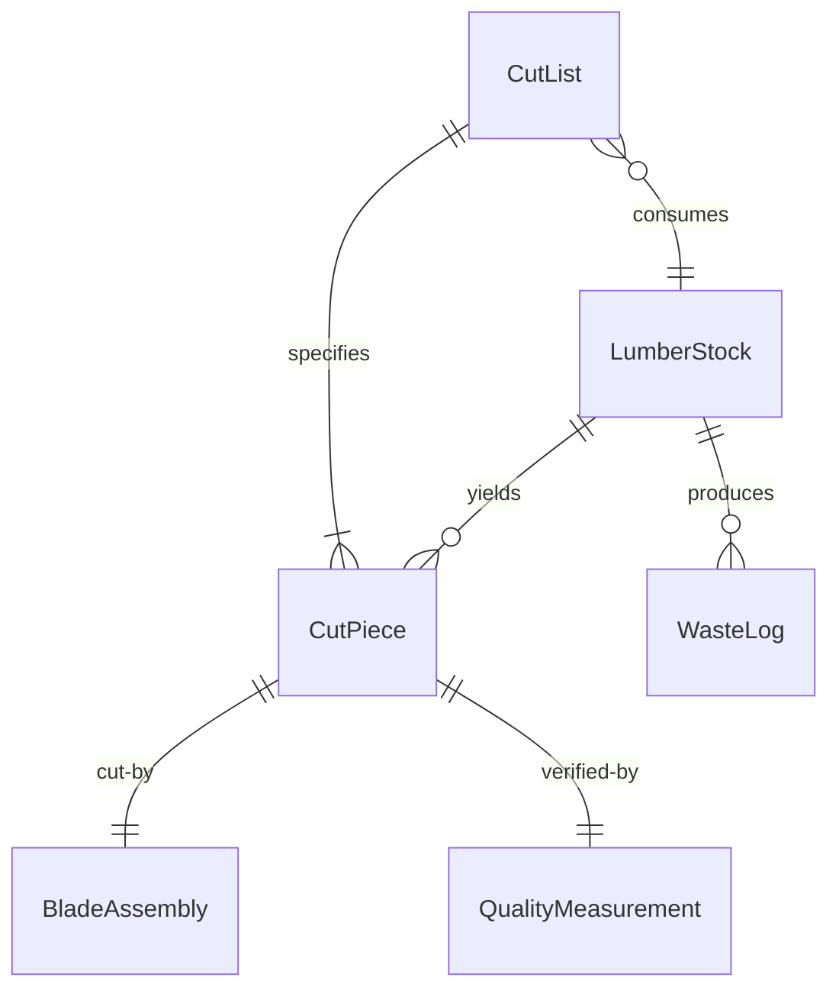
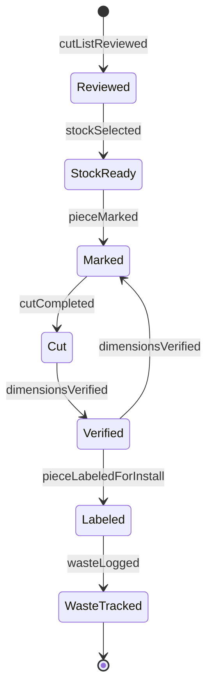
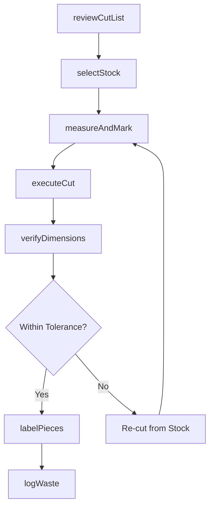
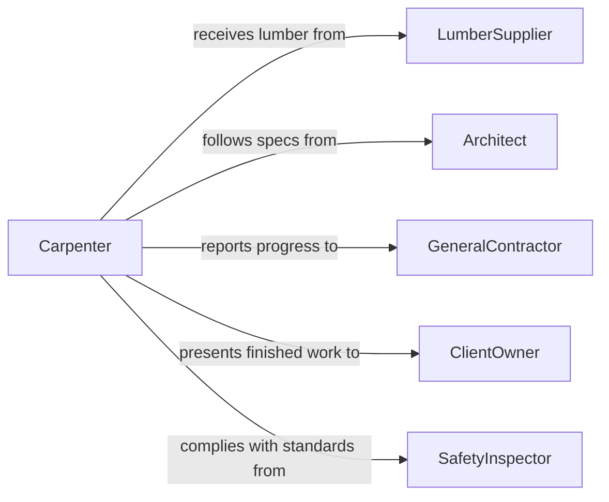

# Cut Wood Components Installation

> Business-as-Code definition for cutting wood components for installation. Models the process of measuring, marking, and cutting lumber and wood products to precise dimensions for construction, cabinetry, and finish carpentry.

## Overview

Cutting wood components for installation involves selecting appropriate lumber stock, interpreting blueprints or cut lists, measuring and marking dimensions, and operating saws and cutting tools to produce pieces that fit precisely within a construction or woodworking project. This activity is foundational to framing, trim carpentry, cabinetmaking, and furniture assembly. Accuracy in cutting directly impacts the quality and structural integrity of the finished installation.

## Actors

| Actor | Description |
|-------|-------------|
| LumberSupplier | Provides raw wood stock, sheet goods, and specialty lumber |
| GeneralContractor | Specifies project requirements and coordinates installation schedules |
| Architect | Creates design drawings and specifications that determine cut dimensions |
| SafetyInspector | Evaluates compliance with workplace safety standards for tool operation |
| ClientOwner | Approves design specifications and final quality of installed components |

## Roles

| Role | Description |
|------|-------------|
| Carpenter | Measures, marks, and cuts wood components using hand and power tools |
| LeadFramer | Oversees cutting operations on framing projects and manages cut lists |
| CabinetMaker | Performs precision cuts for cabinetry and millwork components |
| ShopForeman | Manages workshop cutting operations, tool maintenance, and material flow |

## Entities

| Entity | Description |
|--------|-------------|
| CutList | A detailed specification of all wood pieces needed with dimensions and quantities |
| LumberStock | Raw wood material selected for cutting based on species, grade, and dimensions |
| CutPiece | An individual wood component that has been cut to specification |
| BladeAssembly | The saw blade or cutting tool configured for a specific material and cut type |
| WasteLog | A record of offcuts and scrap generated during cutting operations |
| QualityMeasurement | A dimensional check confirming a cut piece meets tolerance requirements |

## Actions

| Action | Description |
|--------|-------------|
| reviewCutList | Examine the cut list against available stock and project drawings |
| selectStock | Choose appropriate lumber based on species, grade, and required dimensions |
| measureAndMark | Transfer dimensions from the cut list onto the lumber for cutting |
| executeCut | Operate the saw or cutting tool to produce the specified piece |
| verifyDimensions | Measure the cut piece to confirm it meets tolerance specifications |
| labelPieces | Mark finished pieces with identifiers for assembly or installation location |
| logWaste | Record offcuts and scrap material for reuse or disposal tracking |

## Events

| Event | Description |
|-------|-------------|
| cutListReviewed | The cut list has been validated against stock and drawings |
| stockSelected | Lumber has been chosen and staged for cutting |
| pieceMarked | Dimensions and cut lines have been transferred onto the stock |
| cutCompleted | A wood component has been successfully cut to specification |
| dimensionsVerified | A cut piece has passed dimensional quality check |
| pieceLabeledForInstall | A finished piece has been tagged with its installation location |
| wasteLogged | Offcut material has been recorded and sorted |

## Searches

| Search | Description |
|--------|-------------|
| findCutLists | Retrieve cut lists by project, date, or status |
| getStockAvailability | Check lumber inventory by species, grade, and dimensions |
| getCutHistory | View completed cuts for a project or work session |
| getWasteSummary | Retrieve waste and offcut totals by project or material type |


## Entity Relationships



## State Diagram


## Workflow



## Actor Relationships



## Usage

### Calling Actions

```typescript
import { cutWoodComponentsInstallation } from '@headlessly/cut-wood-components-installation'

const woodCutting = cutWoodComponentsInstallation()

// Review cut list for a kitchen cabinet project
const cutList = await woodCutting.reviewCutList({
  projectId: 'kitchen-remodel-2026',
  drawingRef: 'cabinet-elevations-v3'
})

// Execute a series of cuts from the list
for (const item of cutList.items) {
  const piece = await woodCutting.executeCut({
    stockId: item.stockId,
    dimensions: { length: item.length, width: item.width, thickness: item.thickness },
    cutType: item.cutType,
    bladeType: 'carbide-80t'
  })

  await woodCutting.verifyDimensions({
    pieceId: piece.id,
    tolerance: 0.8 // mm
  })
}
```

### Event-Driven Automation

```typescript
// Flag pieces that fail dimensional check
woodCutting.dimensionsVerified(async ({ pieceId, passed, deviation }) => {
  if (!passed) {
    await notify({
      to: 'lead-framer',
      message: `Piece ${pieceId} out of tolerance by ${deviation}mm - re-cut required`
    })
  }
})

// Track waste ratios per project
woodCutting.wasteLogged(async ({ projectId, materialType, wasteVolume }) => {
  await updateMetrics({
    projectId,
    metric: 'waste-ratio',
    value: wasteVolume
  })
})
```
