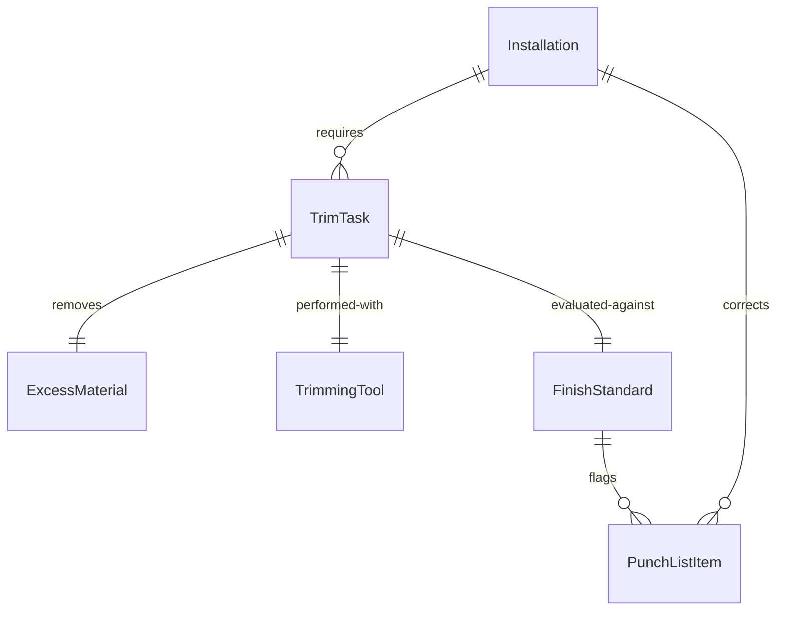
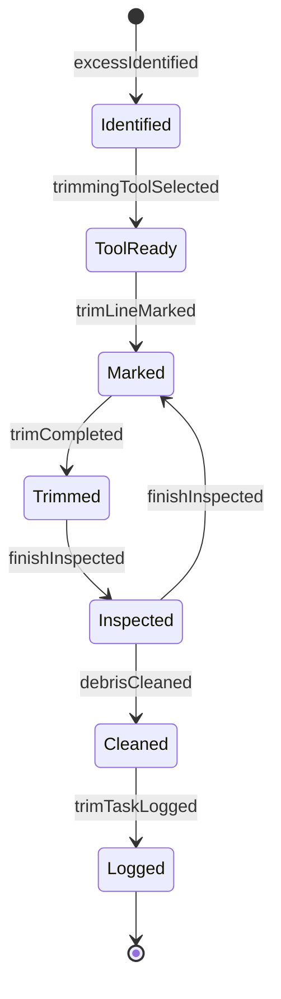
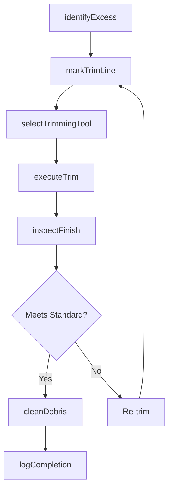
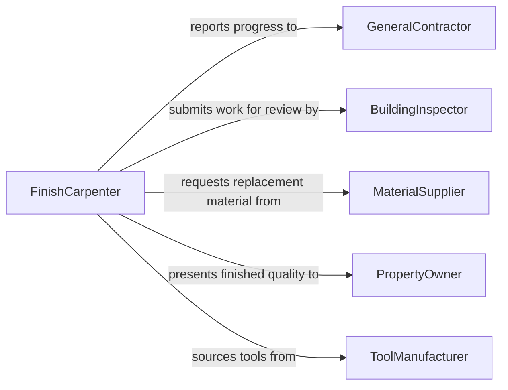

# Trim Excess Material Installations

> Business-as-Code definition for trimming excess material from installations. Models the finishing process of removing protruding, overlapping, or surplus material after components have been installed to achieve a clean, flush, and professional appearance.

## Overview

Trimming excess material from installations is a finishing operation performed after components such as flooring, insulation, drywall, roofing, siding, piping, or electrical conduit have been placed. Workers use utility knives, routers, oscillating tools, snips, or saws to remove material that extends beyond edges, joints, or designated boundaries. This activity ensures proper fit, aesthetic quality, and functional performance of the completed installation, and it often immediately precedes final inspection or finishing treatments such as painting or caulking.

## Actors

| Actor | Description |
|-------|-------------|
| GeneralContractor | Coordinates finishing schedules and quality expectations |
| BuildingInspector | Evaluates completed installations for code compliance and workmanship |
| MaterialSupplier | Provides replacement materials when over-trimming requires rework |
| PropertyOwner | Reviews finished quality and approves the completed work |
| ToolManufacturer | Supplies specialized trimming tools, blades, and accessories |

## Roles

| Role | Description |
|------|-------------|
| FinishCarpenter | Trims wood, laminate, and composite materials at joints and edges |
| Installer | Removes excess material from flooring, insulation, or membrane installations |
| Electrician | Trims conduit, wire sheathing, and cable runs to final length at termination points |
| QualityInspector | Verifies that trimmed edges meet finish standards before handoff |

## Entities

| Entity | Description |
|--------|-------------|
| Installation | The completed assembly of components that requires finishing trim work |
| TrimTask | A specific trimming operation defined by location, material, and method |
| ExcessMaterial | The surplus portion to be removed from an installed component |
| TrimmingTool | The cutting instrument selected for the material and precision required |
| FinishStandard | The quality criteria that define acceptable edge, gap, and surface conditions |
| PunchListItem | A deficiency noted during inspection that may require additional trimming |

## Actions

| Action | Description |
|--------|-------------|
| identifyExcess | Survey the installation to locate areas where material protrudes or overlaps |
| selectTrimmingTool | Choose the appropriate tool for the material type and precision needed |
| markTrimLine | Indicate the exact line where excess material should be removed |
| executeTrim | Cut or remove the surplus material along the marked line |
| inspectFinish | Verify that the trimmed edge meets the applicable finish standard |
| cleanDebris | Remove trimmings, shavings, and dust from the work area |
| logCompletion | Record the trimming task as complete for project tracking |

## Events

| Event | Description |
|-------|-------------|
| excessIdentified | Areas requiring trimming have been located on the installation |
| trimmingToolSelected | The appropriate cutting tool has been chosen for the task |
| trimLineMarked | The cut line has been indicated on the excess material |
| trimCompleted | Excess material has been successfully removed from the installation |
| finishInspected | The trimmed edge has been evaluated against finish standards |
| debrisCleaned | Work area has been cleared of trimmings and waste |
| trimTaskLogged | The trimming operation has been recorded in the project log |

## Searches

| Search | Description |
|--------|-------------|
| findPendingTrims | List installations with identified excess material awaiting trimming |
| getTrimHistory | Retrieve completed trim tasks by project, room, or installer |
| getPunchListItems | Find inspection deficiencies related to trimming quality |
| getFinishStandards | Look up applicable finish criteria by material type and installation category |


## Entity Relationships



## State Diagram


## Workflow



## Actor Relationships



## Usage

### Calling Actions

```typescript
import { trimExcessMaterialInstallations } from '@headlessly/trim-excess-material-installations'

const trimming = trimExcessMaterialInstallations()

// Identify excess material on a flooring installation
const excessAreas = await trimming.identifyExcess({
  projectId: 'office-buildout-floor-3',
  installationType: 'luxury-vinyl-plank',
  roomId: 'conference-room-B'
})

// Execute trim for each identified area
for (const area of excessAreas) {
  await trimming.executeTrim({
    installationId: area.installationId,
    location: area.location,
    materialType: 'vinyl',
    tool: 'utility-knife',
    trimLine: area.trimLine
  })
}

// Inspect the finished work
const inspection = await trimming.inspectFinish({
  projectId: 'office-buildout-floor-3',
  roomId: 'conference-room-B',
  standard: 'commercial-flooring-level-2'
})
```

### Event-Driven Automation

```typescript
// Create punch list items for failed inspections
trimming.finishInspected(async ({ installationId, passed, deficiencies }) => {
  if (!passed) {
    for (const deficiency of deficiencies) {
      await createPunchListItem({
        installationId,
        description: deficiency.description,
        location: deficiency.location,
        priority: deficiency.severity
      })
    }
  }
})

// Notify contractor when all trim tasks in a room are complete
trimming.trimTaskLogged(async ({ projectId, roomId }) => {
  const pending = await trimming.findPendingTrims({ projectId, roomId })
  if (pending.length === 0) {
    await notify({
      to: 'general-contractor',
      message: `All trimming complete in ${roomId} - ready for final inspection`
    })
  }
})
```
