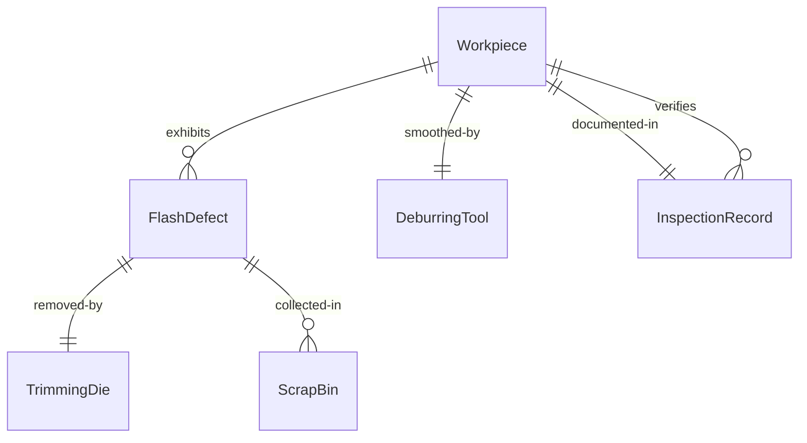
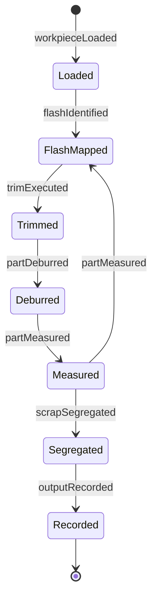
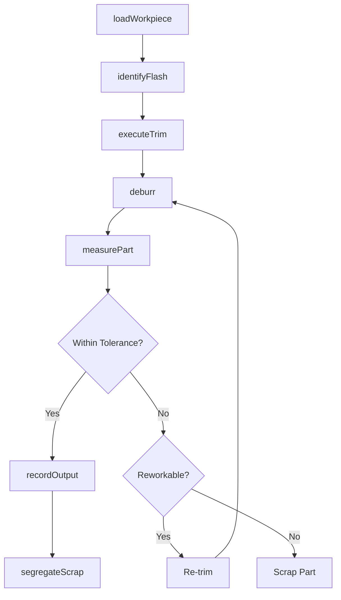
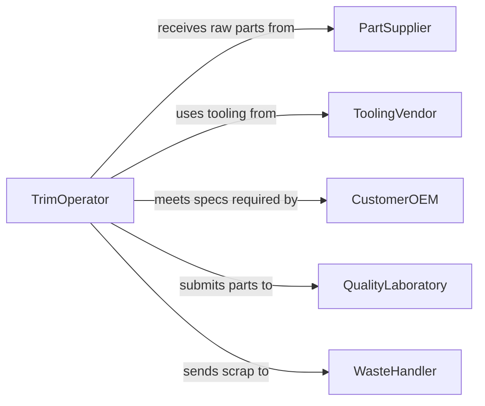

# Trim Excess Material Workpieces

> Business-as-Code definition for trimming excess material from workpieces. Models the manufacturing and fabrication process of removing flash, sprues, burrs, and surplus material from cast, molded, stamped, or machined parts to bring them to final dimensions.

## Overview

Trimming excess material from workpieces is a secondary manufacturing operation that removes unwanted material left over from primary forming processes such as casting, injection molding, stamping, forging, or CNC machining. This includes cutting flash from mold parting lines, snipping sprues and gates from castings, grinding burrs from stamped edges, and routing excess from composite layups. The quality of trimming directly affects part fit, function, and appearance, making it a critical step before assembly or finishing operations.

## Actors

| Actor | Description |
|-------|-------------|
| PartSupplier | Delivers raw castings, moldings, or stampings requiring post-process trimming |
| ToolingVendor | Provides trimming dies, deburring tools, and replacement blades |
| CustomerOEM | Specifies dimensional tolerances and surface finish requirements |
| QualityLaboratory | Performs measurement and surface analysis on trimmed parts |
| WasteHandler | Collects and processes scrap material generated during trimming |

## Roles

| Role | Description |
|------|-------------|
| TrimOperator | Operates trimming equipment and hand tools to remove excess material |
| QualityTechnician | Inspects trimmed parts for compliance with dimensional and surface specs |
| ProductionSupervisor | Manages trimming workflow, staffing, and throughput targets |
| ToolRoomMachinist | Maintains and sharpens trimming dies, blades, and fixtures |

## Entities

| Entity | Description |
|--------|-------------|
| Workpiece | The part being processed that has excess material to be removed |
| FlashDefect | Excess material formed along parting lines or mold seams |
| TrimmingDie | A precision tool that shears excess material in a single press operation |
| DeburringTool | A hand or powered tool used to smooth edges after trimming |
| InspectionRecord | Documentation of dimensional checks performed on a trimmed workpiece |
| ScrapBin | A container for collecting trimmed material segregated by alloy or polymer type |

## Actions

| Action | Description |
|--------|-------------|
| loadWorkpiece | Position the raw part in the trimming fixture or die |
| identifyFlash | Locate excess material, flash lines, sprues, and burrs on the workpiece |
| executeTrim | Remove excess material using the trimming die, shears, or hand tools |
| deburr | Smooth trimmed edges to meet surface finish requirements |
| measurePart | Verify that the trimmed workpiece meets dimensional tolerances |
| segregateScrap | Sort trimmed material into appropriate scrap bins by material type |
| recordOutput | Log the trimmed part into the production tracking system |

## Events

| Event | Description |
|-------|-------------|
| workpieceLoaded | A raw part has been secured in the trimming fixture |
| flashIdentified | Excess material locations have been mapped on the workpiece |
| trimExecuted | Surplus material has been removed from the workpiece |
| partDeburred | Edges have been smoothed to meet finish specifications |
| partMeasured | Dimensional inspection of the trimmed part is complete |
| scrapSegregated | Trimmed waste material has been sorted by type |
| outputRecorded | The finished part has been logged in the production system |

## Searches

| Search | Description |
|--------|-------------|
| findWorkpiecesAwaitingTrim | List parts in queue for trimming by batch, part number, or priority |
| getTrimmingYield | Retrieve pass/fail rates for trimmed parts by production run |
| getScrapVolume | Check total scrap generated by material type or shift |
| findInspectionRecords | Locate quality records for trimmed parts by part number or date |


## Entity Relationships



## State Diagram


## Workflow



## Actor Relationships



## Usage

### Calling Actions

```typescript
import { trimExcessMaterialWorkpieces } from '@headlessly/trim-excess-material-workpieces'

const trimming = trimExcessMaterialWorkpieces()

// Load a batch of injection-molded parts for trimming
const workpiece = await trimming.loadWorkpiece({
  partNumber: 'HB-4420-HOUSING',
  batchId: 'MOLD-2026-0212',
  material: 'ABS',
  fixtureId: 'TRIM-FIX-08'
})

// Execute the trimming operation
await trimming.executeTrim({
  workpieceId: workpiece.id,
  method: 'die-trim',
  trimmingDie: 'TD-4420-REV-C'
})

// Measure the finished part
const measurement = await trimming.measurePart({
  workpieceId: workpiece.id,
  toleranceMm: 0.15,
  checkPoints: ['parting-line', 'gate-area', 'snap-fit-tab']
})
```

### Event-Driven Automation

```typescript
// Escalate when trim yield drops below target
trimming.partMeasured(async ({ batchId, passed }) => {
  const yield_ = await trimming.getTrimmingYield({ batchId })
  if (yield_.passRate < 0.95) {
    await notify({
      to: 'production-supervisor',
      message: `Trim yield for batch ${batchId} at ${(yield_.passRate * 100).toFixed(1)}% - below 95% target`
    })
  }
})

// Auto-request tool sharpening based on output count
trimming.outputRecorded(async ({ trimmingDie, cycleCount }) => {
  if (cycleCount % 5000 === 0) {
    await createMaintenanceRequest({
      tool: trimmingDie,
      action: 'sharpen-inspect',
      priority: 'scheduled'
    })
  }
})
```
