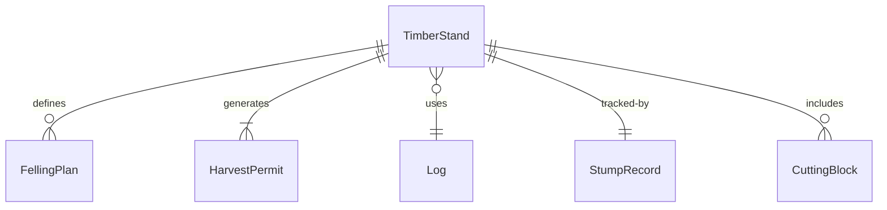
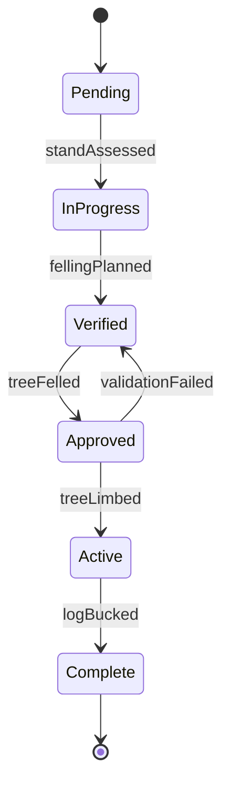
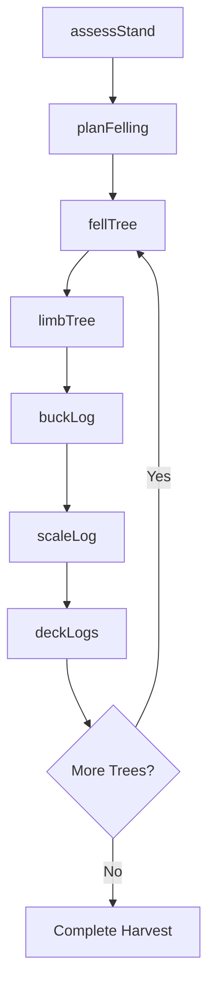
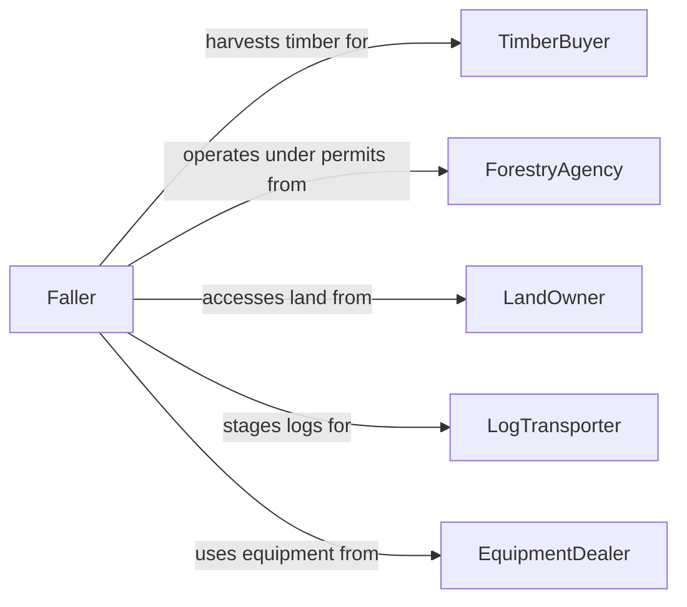

# Cut Trees or Logs

> Business-as-Code definition for tree felling and log bucking operations. Models the planning, cutting, and processing of standing timber and harvested logs for forestry, lumber, and land clearing purposes.

## Overview

Cutting trees or logs involves assessing timber stands, planning felling direction, operating chainsaws or mechanical harvesters, and bucking felled trees into manageable log lengths. This definition covers commercial timber harvesting, hazard tree removal, land clearing, and firewood processing operations where safe felling techniques and regulatory compliance with forestry permits are essential.

## Actors

| Actor | Description |
|-------|-------------|
| TimberBuyer | Purchases standing timber or cut logs for sawmill processing |
| ForestryAgency | Issues harvesting permits and enforces sustainable forestry practices |
| LandOwner | Owns the property where trees are being cut |
| LogTransporter | Hauls cut logs from the harvest site to mills or yards |
| EquipmentDealer | Supplies chainsaws, harvesters, and felling equipment |
| Arborist | Assesses tree health and recommends removal candidates |

## Roles

| Role | Description |
|------|-------------|
| Faller | Performs directional felling of standing trees |
| Bucker | Cuts felled trees into specified log lengths |
| ForestryForeman | Plans harvest operations and enforces safety protocols |
| EquipmentOperator | Operates mechanical harvesters and processing heads |

## Entities

| Entity | Description |
|--------|-------------|
| TimberStand | A group of trees designated for harvesting |
| FellingPlan | A document specifying cut order, direction, and safety zones |
| HarvestPermit | Regulatory authorization to cut trees on a given parcel |
| Log | A bucked section of a felled tree with measured dimensions |
| StumpRecord | Documentation of each tree removed including species and diameter |
| CuttingBlock | A defined area within a timber stand scheduled for harvest |
| LoadTicket | A record of logs loaded for transport with species and volume |

## Actions

| Action | Description |
|--------|-------------|
| assessStand | Evaluate timber stand for species, volume, and felling conditions |
| planFelling | Determine cut sequence, lean direction, and escape routes |
| fellTree | Cut a standing tree at the base and direct its fall |
| limbTree | Remove branches from a felled tree |
| buckLog | Cut a felled tree into specified log lengths |
| scaleLog | Measure and record log diameter, length, and grade |
| deckLogs | Stack cut logs at a landing area for transport |

## Events

| Event | Description |
|-------|-------------|
| standAssessed | Timber stand evaluation has been completed |
| fellingPlanned | Cut sequence and safety plan have been established |
| treeFelled | A tree has been cut and directed to the ground |
| treeLimbed | Branches have been removed from a felled tree |
| logBucked | A felled tree has been cut into log lengths |
| logScaled | Log dimensions and grade have been recorded |
| logsDecked | Cut logs have been stacked at the landing |

## Searches

| Search | Description |
|--------|-------------|
| findHarvestPermits | Locate permits by parcel, date, or forestry agency |
| getStandVolume | Retrieve estimated timber volume for a cutting block |
| getLogInventory | List scaled logs at a landing by species and grade |
| findStumpRecords | Look up removal records by species, diameter, or location |


## Entity Relationships



## State Diagram


## Workflow



## Actor Relationships



## Usage

### Calling Actions

```typescript
import { cutTreesLogs } from '@headlessly/cut-trees-logs'

const logging = cutTreesLogs()

// Assess a timber stand
const stand = await logging.assessStand({
  parcelId: 'PARCEL-2024-0089',
  species: ['douglas-fir', 'western-red-cedar'],
  estimatedVolumeMbf: 150
})

// Fell a tree with directional control
await logging.fellTree({
  treeId: 'T-0045',
  species: 'douglas-fir',
  diameterInches: 24,
  fallDirection: 'northeast',
  escapeRoute: 'southwest'
})

// Scale the bucked log
const log = await logging.scaleLog({
  logId: 'LOG-2024-1102',
  lengthFeet: 32,
  smallEndDiameterInches: 14,
  grade: 'sawlog-2'
})
```

### Event-Driven Automation

```typescript
// Track harvest progress against permit limits
logging.logScaled(async ({ permitId, cumulativeVolumeMbf, permitLimitMbf }) => {
  if (cumulativeVolumeMbf > permitLimitMbf * 0.9) {
    await notify({
      to: 'forestry-foreman',
      message: `Permit ${permitId}: 90% of volume limit reached`
    })
  }
})

// Schedule transport when landing is full
logging.logsDecked(async ({ landingId, logCount }) => {
  if (logCount >= 50) {
    await transport.schedulePickup({ landingId, priority: 'standard' })
  }
})
```
