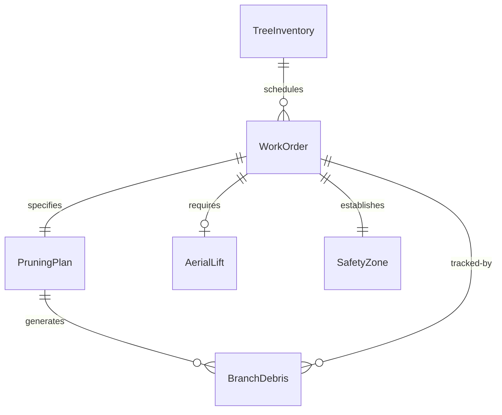
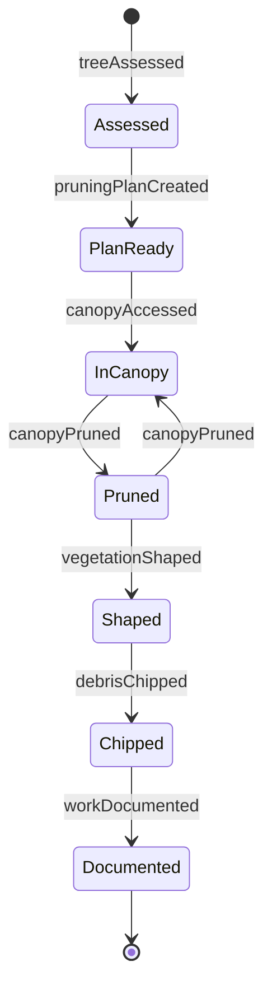
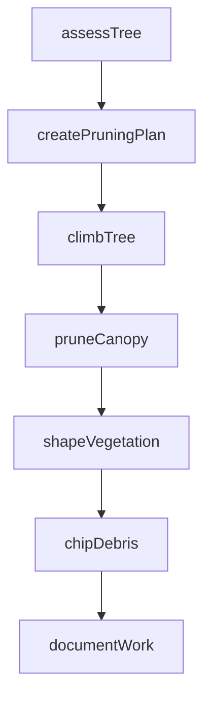
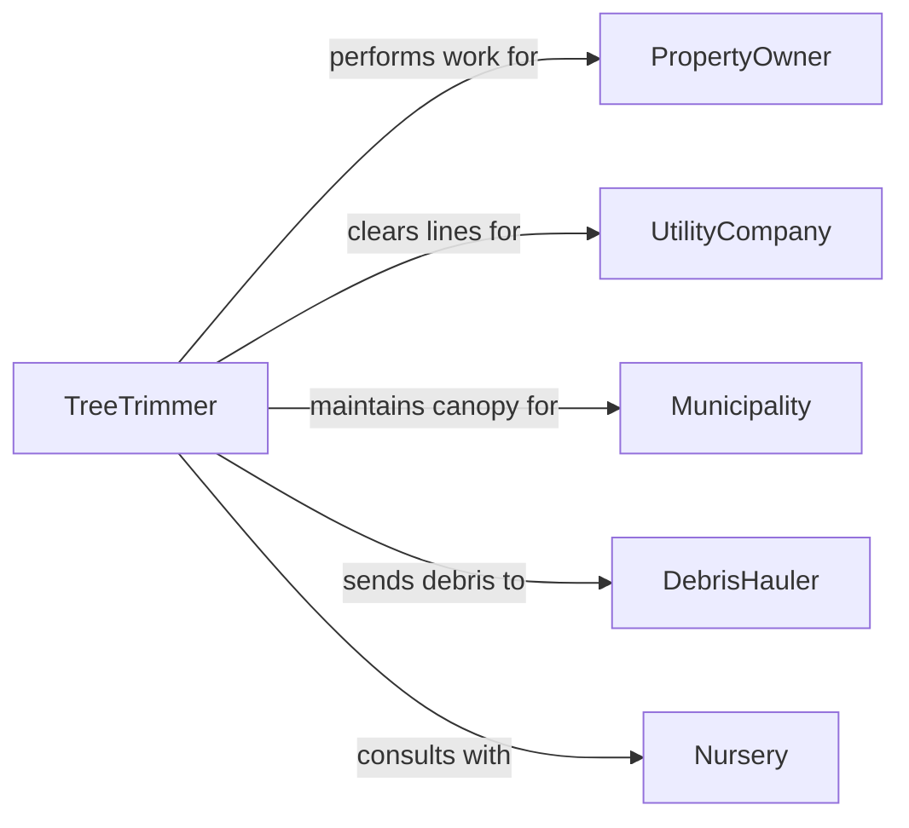

# Trim Trees or Other Vegetation

> Business-as-Code definition for tree trimming and vegetation maintenance. Models the assessment, pruning, shaping, and debris management of trees, shrubs, and hedges for arboriculture, landscaping, and utility clearance operations.

## Overview

Trimming trees or other vegetation involves assessing plant health and structure, selecting pruning cuts, removing dead or hazardous branches, and shaping canopies for aesthetics, safety, or utility clearance. This definition covers residential and commercial tree care, municipal right-of-way maintenance, orchard pruning, and utility line clearance programs.

## Actors

| Actor | Description |
|-------|-------------|
| PropertyOwner | Requests tree trimming services for their property |
| UtilityCompany | Requires vegetation clearance around power lines and infrastructure |
| Municipality | Manages public tree canopy and right-of-way vegetation |
| DebrisHauler | Removes and disposes of cut branches and green waste |
| Nursery | Advises on species-specific pruning practices and plant health |

## Roles

| Role | Description |
|------|-------------|
| Arborist | Assesses tree health and specifies pruning requirements |
| TreeTrimmer | Climbs or uses aerial lifts to perform pruning cuts |
| GroundCrew | Manages rope systems, feeds chippers, and clears debris |
| CrewLeader | Coordinates trimming operations and enforces safety standards |

## Entities

| Entity | Description |
|--------|-------------|
| TreeInventory | A catalog of trees on a property with species, size, and condition |
| PruningPlan | Specifications for which branches to remove and pruning method |
| WorkOrder | A service request detailing trees to trim and scope of work |
| BranchDebris | Cut branches and foliage requiring chipping or disposal |
| AerialLift | A bucket truck or elevated platform for canopy access |
| SafetyZone | A roped-off area beneath the work zone to protect pedestrians |

## Actions

| Action | Description |
|--------|-------------|
| assessTree | Evaluate tree health, structure, and trimming needs |
| createPruningPlan | Specify branch removal targets and pruning techniques |
| climbTree | Access the canopy using climbing gear or aerial lift |
| pruneCanopy | Remove dead, diseased, or interfering branches |
| shapeVegetation | Trim shrubs, hedges, or ornamental trees to desired form |
| chipDebris | Process cut branches through a wood chipper |
| documentWork | Record completed trimming with before and after notes |

## Events

| Event | Description |
|-------|-------------|
| treeAssessed | Health and structural evaluation is complete |
| pruningPlanCreated | Branch removal specifications have been documented |
| canopyAccessed | Trimmer has reached the work zone in the canopy |
| canopyPruned | Dead or targeted branches have been removed |
| vegetationShaped | Shrubs or hedges have been trimmed to form |
| debrisChipped | Cut material has been processed through the chipper |
| workDocumented | Completed trimming has been logged with photos |

## Searches

| Search | Description |
|--------|-------------|
| findWorkOrders | List trimming jobs by property, status, or scheduled date |
| getTreeInventory | Retrieve tree records by species, location, or condition |
| getPruningHistory | Look up past trimming events for a specific tree |
| findOverdueTrims | Identify trees past their scheduled maintenance date |


## Entity Relationships



## State Diagram


## Workflow



## Actor Relationships



## Usage

### Calling Actions

```typescript
import { trimTreesVegetation } from '@headlessly/trim-trees-vegetation'

const trimming = trimTreesVegetation()

// Assess a tree for trimming needs
const assessment = await trimming.assessTree({
  treeId: 'OAK-0122',
  species: 'live-oak',
  location: '1234 Main St',
  concerns: ['dead-branches', 'utility-clearance']
})

// Prune the canopy
await trimming.pruneCanopy({
  treeId: 'OAK-0122',
  pruningType: 'crown-cleaning',
  maxRemovalPercent: 25,
  clearanceFromLinesFeet: 10
})

// Document completed work
await trimming.documentWork({
  workOrderId: 'WO-2024-0445',
  treeId: 'OAK-0122',
  branchesRemoved: 12,
  debrisVolumeYards: 3
})
```

### Event-Driven Automation

```typescript
// Schedule follow-up for disease-flagged trees
trimming.treeAssessed(async ({ treeId, healthIssues }) => {
  if (healthIssues.includes('disease')) {
    await scheduling.createFollowUp({
      treeId,
      reason: 'disease-monitoring',
      intervalMonths: 6
    })
  }
})

// Notify utility company on clearance completion
trimming.canopyPruned(async ({ treeId, utilityLinesClearedFeet }) => {
  if (utilityLinesClearedFeet > 0) {
    await notify({
      to: 'utility-company',
      message: `Tree ${treeId}: ${utilityLinesClearedFeet}ft clearance achieved`
    })
  }
})
```
