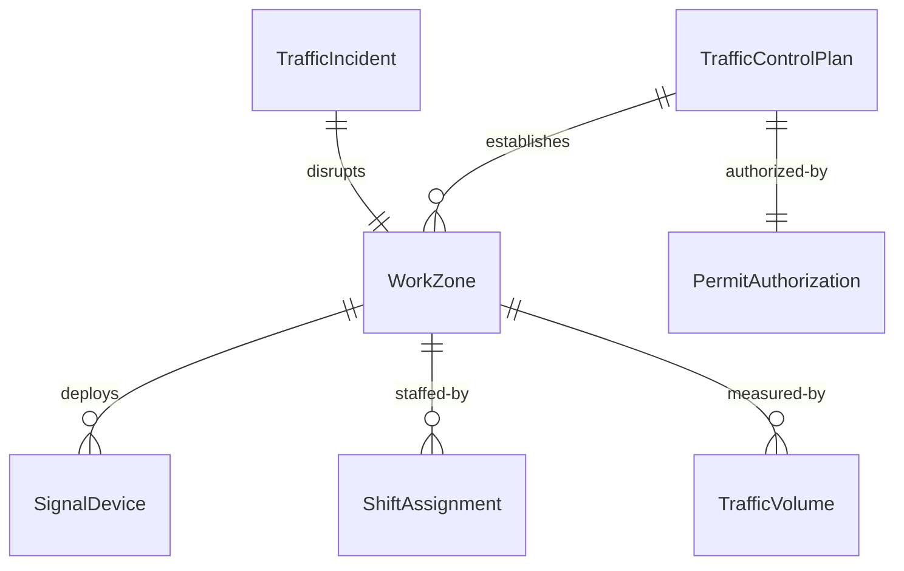
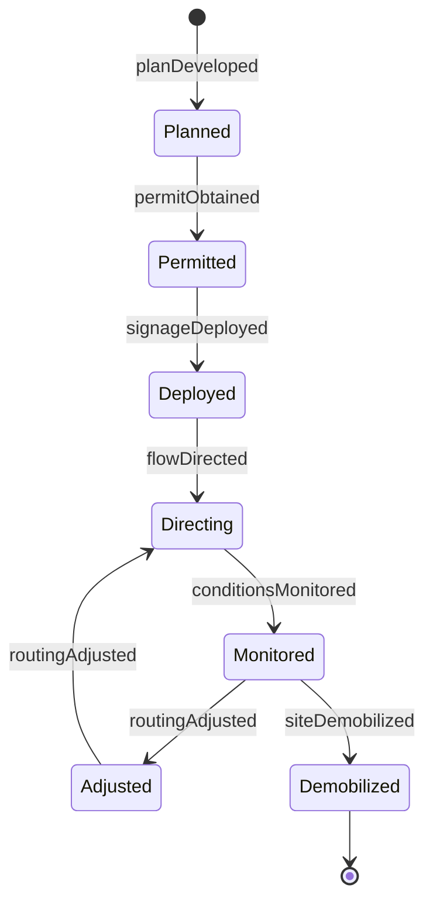
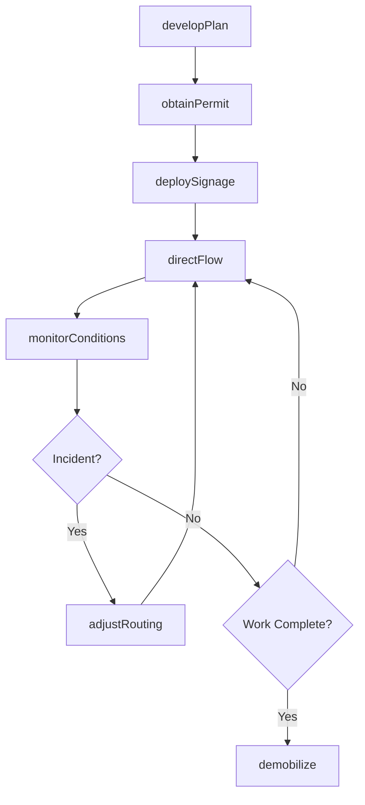
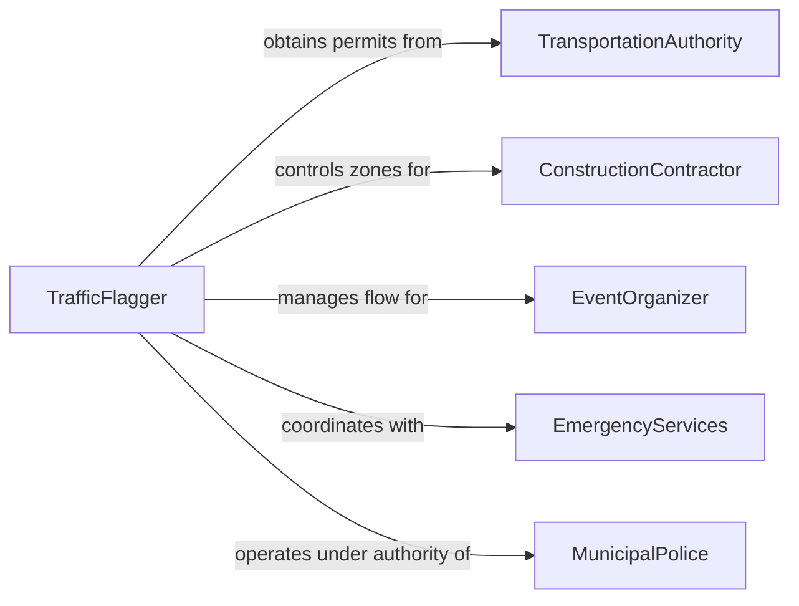

# Direct Vehicle Traffic

> Business-as-Code definition for vehicle traffic direction. Models the planning, signaling, routing, and monitoring of vehicle movement at construction zones, special events, accident scenes, and facility entrances by flaggers, traffic officers, and ground crews.

## Overview

Directing vehicle traffic involves establishing traffic control zones, positioning personnel with signaling devices, communicating routing instructions to drivers, and adapting flow patterns in response to changing conditions. This definition covers construction zone flagging operations, law enforcement traffic direction at intersections, airport ground marshalling, parking lot and event traffic management, and emergency scene vehicle routing.

## Actors

| Actor | Description |
|-------|-------------|
| TransportationAuthority | Issues permits and approves traffic control plans for public roads |
| ConstructionContractor | Requires traffic control during roadway or utility construction |
| EventOrganizer | Coordinates traffic management for concerts, sports, or public events |
| EmergencyServices | Requires traffic direction at accident, fire, or disaster scenes |
| MunicipalPolice | Provides law enforcement authority for traffic direction |
| AirportOperations | Manages ground vehicle movement on runways and aprons |

## Roles

| Role | Description |
|------|-------------|
| TrafficFlagger | Uses signs, flags, and paddles to direct vehicles through work zones |
| TrafficOfficer | Exercises police authority to direct vehicles at intersections or scenes |
| GroundMarshal | Guides aircraft and ground vehicles on airport surfaces |
| TrafficControlSupervisor | Plans traffic control layouts and oversees flagger crews |

## Entities

| Entity | Description |
|--------|-------------|
| TrafficControlPlan | A diagram specifying sign placement, lane closures, and flagger positions |
| WorkZone | A designated area where traffic patterns are altered for construction or events |
| SignalDevice | Flags, paddles, wands, or electronic message boards used to direct traffic |
| TrafficIncident | An event requiring immediate rerouting of vehicle traffic |
| PermitAuthorization | A document approving temporary traffic control on public roads |
| ShiftAssignment | A scheduled period for a flagger or officer to direct traffic |
| TrafficVolume | A count of vehicles passing through the control point per time period |

## Actions

| Action | Description |
|--------|-------------|
| developPlan | Create a traffic control plan with sign placement and flagger positions |
| obtainPermit | Secure authorization from the transportation authority for traffic control |
| deploySignage | Position cones, barricades, signs, and electronic message boards |
| directFlow | Signal vehicles to stop, proceed, or change lanes using manual devices |
| monitorConditions | Observe traffic volume, speed, and compliance with control measures |
| adjustRouting | Modify traffic patterns in response to incidents or changing conditions |
| demobilize | Remove traffic control devices and restore normal traffic flow |

## Events

| Event | Description |
|-------|-------------|
| planDeveloped | Traffic control plan has been completed and approved |
| permitObtained | Authorization for temporary traffic control has been granted |
| signageDeployed | All signs, cones, and barricades are in position |
| flowDirected | Active traffic direction is underway at the control point |
| conditionsMonitored | Traffic volume and compliance data have been recorded |
| routingAdjusted | Traffic patterns have been modified in response to conditions |
| siteDemobilized | Traffic control devices have been removed and normal flow restored |

## Searches

| Search | Description |
|--------|-------------|
| findActiveZones | Locate traffic control zones currently in operation |
| getTrafficVolume | Retrieve vehicle count data for a control point or time period |
| getShiftSchedule | Look up flagger or officer shift assignments by date or location |
| findPermits | List traffic control permits by project, road, or status |
| getIncidentLog | Retrieve traffic incidents requiring routing changes |


## Entity Relationships



## State Diagram


## Workflow



## Actor Relationships



## Usage

### Calling Actions

```typescript
import { directVehicleTraffic } from '@headlessly/direct-vehicle-traffic'

const traffic = directVehicleTraffic()

// Develop a traffic control plan
const plan = await traffic.developPlan({
  projectId: 'ROAD-2024-0087',
  location: 'Main St & 3rd Ave',
  closureType: 'single-lane',
  duration: { start: '2024-09-15T07:00', end: '2024-09-15T17:00' },
  flaggerPositions: 2
})

// Deploy signage and begin directing traffic
await traffic.deploySignage({
  planId: plan.id,
  devices: ['advance-warning-signs', 'channelizing-drums', 'stop-slow-paddles'],
  taperLength: 150
})

// Monitor traffic conditions during active direction
const conditions = await traffic.monitorConditions({
  zoneId: 'ZONE-2024-0087-A',
  metrics: ['vehicle-count', 'average-speed', 'queue-length']
})
```

### Event-Driven Automation

```typescript
// Alert supervisor when queue length exceeds threshold
traffic.conditionsMonitored(async ({ zoneId, queueLength, threshold }) => {
  if (queueLength > threshold) {
    await notify({
      to: 'traffic-control-supervisor',
      message: `Queue at zone ${zoneId} exceeds ${threshold} vehicles. Consider routing adjustment.`
    })
  }
})

// Log incident when routing is adjusted
traffic.routingAdjusted(async ({ zoneId, reason, newPattern }) => {
  await incidents.log({
    zoneId,
    reason,
    newPattern,
    timestamp: new Date().toISOString()
  })
})
```
