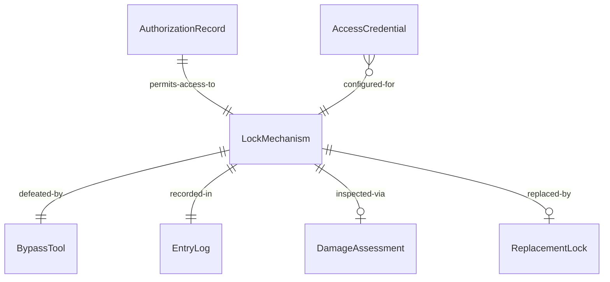
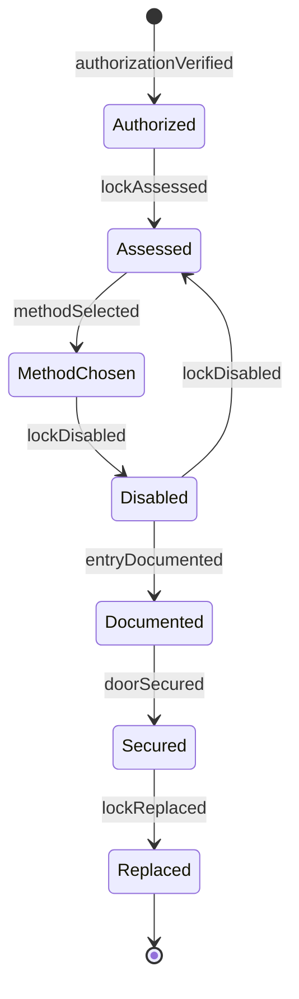
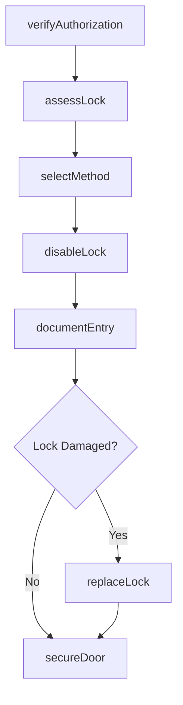
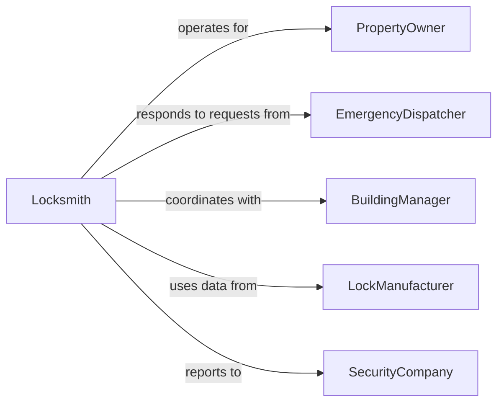

# Disable Door Locks

> Business-as-Code definition for door lock disabling. Models the assessment, bypassing, removal, and documentation of mechanical, electronic, and smart lock systems for authorized access, maintenance, rekeying, and emergency entry operations.

## Overview

Disabling door locks involves assessing the lock type and mechanism, selecting the appropriate bypass or removal technique, executing the disable operation without unnecessary damage, and documenting the action for security and compliance purposes. This definition covers locksmith lock picking and bypass for lockouts, emergency forced entry by fire and rescue personnel, lock removal during building renovation, electronic access control system overrides, and automotive lock disabling for vehicle recovery.

## Actors

| Actor | Description |
|-------|-------------|
| PropertyOwner | Authorizes lock disabling for their building or vehicle |
| EmergencyDispatcher | Requests forced entry for medical, fire, or police emergencies |
| BuildingManager | Coordinates lock changes during tenant turnover or renovation |
| LockManufacturer | Provides technical data on lock mechanisms and authorized bypass methods |
| SecurityCompany | Monitors access events and verifies authorization for lock overrides |

## Roles

| Role | Description |
|------|-------------|
| Locksmith | Uses specialized tools to pick, bypass, or remove lock mechanisms |
| FirefighterForcibleEntry | Breaches locked doors using tools and techniques during emergencies |
| AccessControlTechnician | Overrides or resets electronic and smart lock systems |
| SecurityOfficer | Verifies authorization and documents lock disabling events |

## Entities

| Entity | Description |
|--------|-------------|
| LockMechanism | The pin tumbler, deadbolt, electronic, or smart lock being disabled |
| AuthorizationRecord | Documentation verifying permission to disable the lock |
| BypassTool | A pick set, bump key, decoder, or override device used to disable the lock |
| EntryLog | A time-stamped record of the lock disabling event |
| DamageAssessment | A report documenting any damage to the lock or door during the operation |
| ReplacementLock | A new lock mechanism installed after the original is disabled or removed |
| AccessCredential | A key, code, card, or biometric that the lock was previously configured to accept |

## Actions

| Action | Description |
|--------|-------------|
| verifyAuthorization | Confirm legal and procedural permission to disable the lock |
| assessLock | Identify the lock type, brand, and security features |
| selectMethod | Choose the least-destructive bypass or removal technique |
| disableLock | Pick, bypass, decode, or physically remove the lock mechanism |
| documentEntry | Record the time, method, authorization, and condition of the lock |
| secureDoor | Ensure the door is secured after entry, either by relocking or temporary measures |
| replaceLock | Install a new lock mechanism if the original was removed or damaged |

## Events

| Event | Description |
|-------|-------------|
| authorizationVerified | Permission to disable the lock has been confirmed |
| lockAssessed | Lock type and security features have been identified |
| methodSelected | Bypass or removal technique has been chosen |
| lockDisabled | Lock mechanism has been successfully bypassed or removed |
| entryDocumented | Lock disabling event has been logged with full details |
| doorSecured | Door has been relocked or temporarily secured after entry |
| lockReplaced | A new lock mechanism has been installed |

## Searches

| Search | Description |
|--------|-------------|
| findEntryLogs | Locate lock disabling events by location, date, or authorization type |
| getAuthorizationRecords | Retrieve permission documentation for a specific lock disable event |
| findPendingReplacements | List disabled locks awaiting replacement or rekeying |
| getDamageAssessments | Retrieve damage reports from forced or non-standard lock entries |
| getLockHistory | Look up all disable and replacement events for a specific door |


## Entity Relationships



## State Diagram


## Workflow



## Actor Relationships



## Usage

### Calling Actions

```typescript
import { disableDoorLocks } from '@headlessly/disable-door-locks'

const locks = disableDoorLocks()

// Verify authorization and assess the lock
await locks.verifyAuthorization({
  requestId: 'LOCK-2024-0092',
  requestedBy: 'building-manager',
  property: '1420 Main St, Unit 3B',
  reason: 'tenant-lockout',
  authorizationType: 'property-owner-consent'
})

const assessment = await locks.assessLock({
  location: '1420 Main St, Unit 3B, Front Door',
  lockType: 'pin-tumbler-deadbolt',
  brand: 'Schlage',
  securityPins: 'spool-and-serrated'
})

// Disable the lock using the least-destructive method
await locks.disableLock({
  requestId: 'LOCK-2024-0092',
  method: 'single-pin-picking',
  tool: 'standard-hook-pick',
  tensionTool: 'top-of-keyway',
  destructive: false
})
```

### Event-Driven Automation

```typescript
// Schedule lock replacement after forced entry
locks.lockDisabled(async ({ requestId, location, destructive }) => {
  if (destructive) {
    await scheduling.createAppointment({
      type: 'lock-replacement',
      location,
      reference: requestId,
      priority: 'same-day'
    })
  }
})

// Notify security company of all lock disable events
locks.entryDocumented(async ({ requestId, location, method, authorizedBy }) => {
  await security.logEvent({
    type: 'lock-disabled',
    requestId,
    location,
    method,
    authorizedBy,
    timestamp: new Date().toISOString()
  })
})
```
