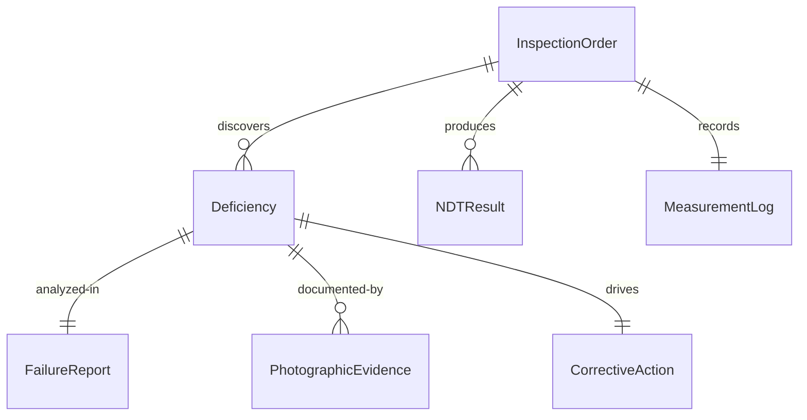
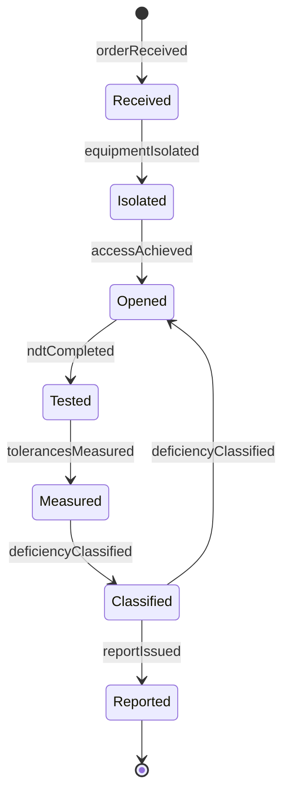
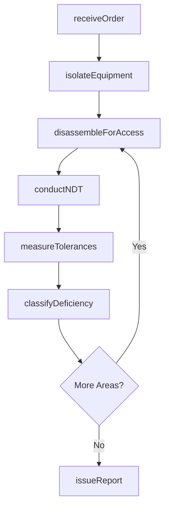
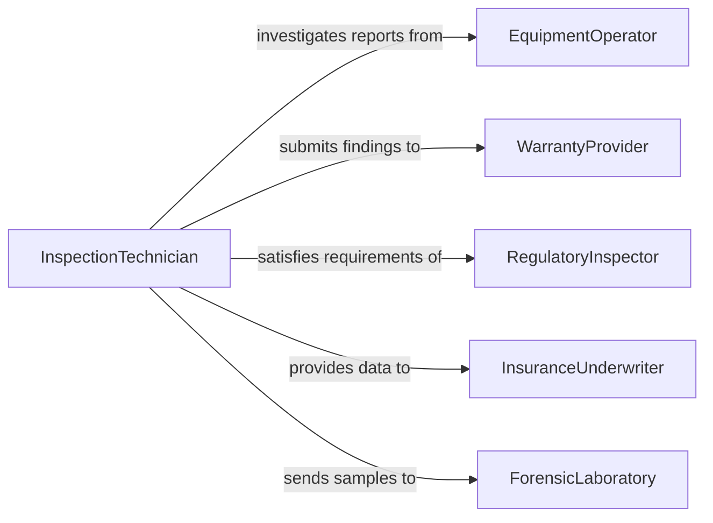

# Disassemble Equipment to Inspect for Deficiencies

> Business-as-Code definition for diagnostic equipment disassembly. Models the systematic teardown of machinery, instruments, and systems to identify hidden defects, root causes of failure, and latent deficiencies that cannot be detected through external inspection alone.

## Overview

Disassembling equipment to inspect for deficiencies involves opening sealed or enclosed assemblies, examining internal components under magnification or with nondestructive testing, measuring wear tolerances, and identifying the root cause of performance degradation or failure. This definition covers failure analysis teardowns, warranty claim investigations, regulatory compliance inspections, and condition-based monitoring follow-ups for industrial, medical, and aviation equipment.

## Actors

| Actor | Description |
|-------|-------------|
| EquipmentOperator | Reports performance issues triggering the inspection |
| WarrantyProvider | Evaluates deficiency findings for warranty coverage determination |
| RegulatoryInspector | Mandates equipment inspections under safety regulations |
| InsuranceUnderwriter | Assesses equipment condition for risk and coverage decisions |
| ForensicLaboratory | Performs metallurgical or materials analysis on failed components |

## Roles

| Role | Description |
|------|-------------|
| InspectionTechnician | Disassembles equipment and performs visual and measured inspections |
| FailureAnalyst | Identifies root causes of defects and recommends corrective actions |
| NDTSpecialist | Conducts nondestructive testing such as ultrasonic or dye penetrant inspection |
| DocumentationClerk | Records findings, photographs, and measurement data |

## Entities

| Entity | Description |
|--------|-------------|
| InspectionOrder | A directive to disassemble and inspect specific equipment |
| Deficiency | A defect, wear condition, or failure mode discovered during inspection |
| FailureReport | A document detailing the root cause and contributing factors of a deficiency |
| NDTResult | Nondestructive testing data such as crack detection or wall thickness readings |
| MeasurementLog | Recorded dimensions, clearances, and tolerances of inspected components |
| PhotographicEvidence | Images documenting the condition of disassembled components |
| CorrectiveAction | A recommended repair, replacement, or design change based on findings |

## Actions

| Action | Description |
|--------|-------------|
| receiveOrder | Accept and review the inspection directive and equipment history |
| isolateEquipment | De-energize and prepare equipment for safe disassembly |
| disassembleForAccess | Open enclosures and remove components to expose areas of concern |
| conductNDT | Perform nondestructive testing on suspect components |
| measureTolerances | Record dimensional data and compare against design specifications |
| classifyDeficiency | Categorize each finding by type, severity, and probable cause |
| issueReport | Compile findings into a formal deficiency or failure analysis report |

## Events

| Event | Description |
|-------|-------------|
| orderReceived | Inspection directive has been accepted and equipment history reviewed |
| equipmentIsolated | Equipment has been safely de-energized and prepared for teardown |
| accessAchieved | Internal components have been exposed for inspection |
| ndtCompleted | Nondestructive testing results have been recorded |
| tolerancesMeasured | All dimensional data has been captured and compared to specifications |
| deficiencyClassified | Findings have been categorized by type, severity, and cause |
| reportIssued | Formal inspection report has been compiled and distributed |

## Searches

| Search | Description |
|--------|-------------|
| findInspectionOrders | Locate inspection directives by equipment, date, or priority |
| getDeficiencyHistory | Retrieve past deficiency findings for a specific piece of equipment |
| getNDTResults | Look up nondestructive testing data by component or inspection date |
| findOpenCorrectiveActions | List unresolved corrective actions by equipment or severity |
| getFailureReports | Retrieve root cause analysis documents by equipment or failure mode |


## Entity Relationships



## State Diagram


## Workflow



## Actor Relationships



## Usage

### Calling Actions

```typescript
import { disassembleEquipmentInspectDeficiencies } from '@headlessly/disassemble-equipment-inspect-deficiencies'

const inspection = disassembleEquipmentInspectDeficiencies()

// Disassemble a turbine for inspection
await inspection.disassembleForAccess({
  orderId: 'INSP-2024-0317',
  equipmentId: 'GAS-TURBINE-003',
  sections: ['combustion-liner', 'first-stage-blades', 'bearing-journal'],
  photographEach: true
})

// Conduct nondestructive testing on blades
const ndt = await inspection.conductNDT({
  orderId: 'INSP-2024-0317',
  component: 'first-stage-blades',
  methods: ['fluorescent-penetrant', 'eddy-current'],
  acceptanceCriteria: 'AMS-2647'
})

// Classify the deficiency
await inspection.classifyDeficiency({
  orderId: 'INSP-2024-0317',
  component: 'first-stage-blade-7',
  type: 'thermal-fatigue-crack',
  severity: 'critical',
  probableCause: 'hot-section-over-temperature',
  corrective: 'replace-blade-set'
})
```

### Event-Driven Automation

```typescript
// Escalate critical deficiencies immediately
inspection.deficiencyClassified(async ({ orderId, severity, equipmentId, type }) => {
  if (severity === 'critical') {
    await notify({
      to: 'plant-manager',
      message: `Critical deficiency found on ${equipmentId}: ${type}. Equipment must remain out of service.`
    })
  }
})

// Submit warranty claim when report is issued
inspection.reportIssued(async ({ orderId, equipmentId, deficiencies, warrantyEligible }) => {
  if (warrantyEligible) {
    await warranty.submitClaim({
      orderId,
      equipmentId,
      deficiencies,
      supportingDocuments: ['failure-report', 'ndt-results', 'photographs']
    })
  }
})
```
