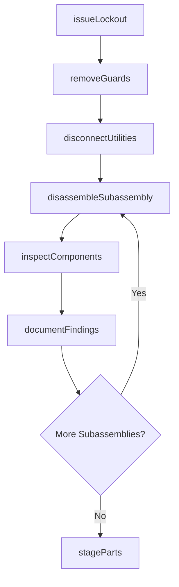
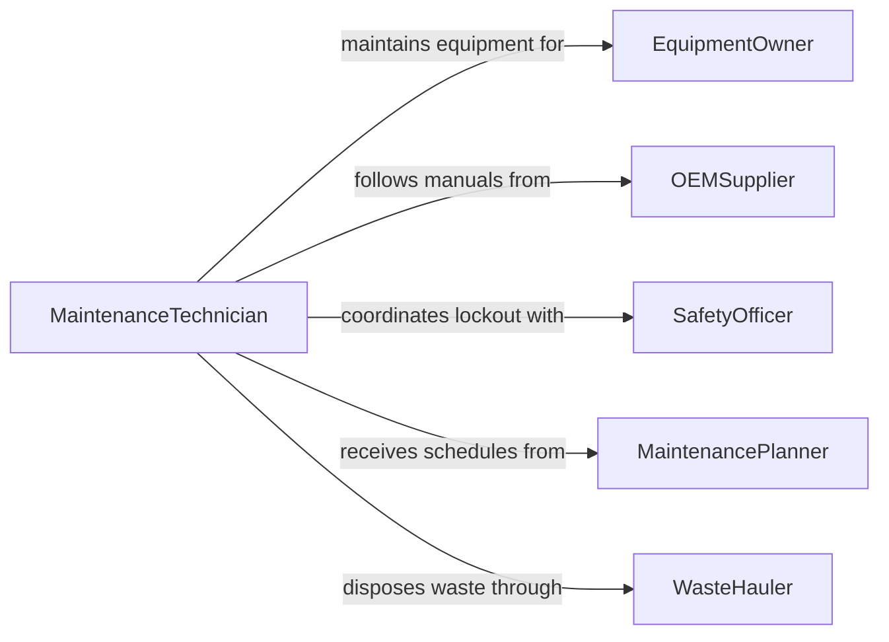

# Disassemble Equipment for Maintenance or Repair

> Business-as-Code definition for equipment disassembly for maintenance. Models the lockout, systematic teardown, component inspection, and documentation of industrial, commercial, and mechanical equipment to enable scheduled maintenance or corrective repair.

## Overview

Disassembling equipment for maintenance or repair involves following lockout/tagout procedures, removing guards and covers, disconnecting utilities, systematically taking apart assemblies in the correct sequence, inspecting components for wear, and documenting findings for repair planning. This definition covers pump and compressor teardowns, conveyor system disassembly, production line equipment overhauls, and rotating machinery maintenance.

## Actors

| Actor | Description |
|-------|-------------|
| EquipmentOwner | Authorizes maintenance downtime and funds repair activities |
| OEMSupplier | Provides replacement parts, service manuals, and technical support |
| SafetyOfficer | Enforces lockout/tagout and confined space entry procedures |
| MaintenancePlanner | Schedules preventive and corrective maintenance windows |
| WasteHauler | Removes spent lubricants, worn parts, and hazardous materials |

## Roles

| Role | Description |
|------|-------------|
| MaintenanceTechnician | Disassembles, inspects, and reassembles equipment |
| MechanicalEngineer | Specifies repair procedures and replacement part requirements |
| SafetyCoordinator | Verifies lockout/tagout compliance before disassembly begins |
| PartsClerk | Stages replacement parts and tracks removed component inventory |

## Entities

| Entity | Description |
|--------|-------------|
| Equipment | The machine or system being disassembled for maintenance |
| WorkOrder | A maintenance request specifying the equipment, scope, and schedule |
| LockoutTagout | A safety procedure isolating energy sources before disassembly |
| DisassemblySequence | The documented order of steps for taking apart the equipment |
| WornComponent | A part identified for replacement during disassembly inspection |
| ServiceManual | The OEM technical document detailing disassembly and reassembly procedures |
| InspectionFindings | A record of component conditions discovered during teardown |

## Actions

| Action | Description |
|--------|-------------|
| issueLockout | Isolate all energy sources and apply lockout/tagout devices |
| removeGuards | Take off safety covers, shields, and access panels |
| disconnectUtilities | Detach electrical, pneumatic, hydraulic, and coolant connections |
| disassembleSubassembly | Remove components in the sequence specified by the service manual |
| inspectComponents | Examine each removed part for wear, damage, or contamination |
| documentFindings | Record component conditions, measurements, and replacement needs |
| stageParts | Organize removed parts and stage replacements for reassembly |

## Events

| Event | Description |
|-------|-------------|
| lockoutIssued | All energy sources have been isolated and tagged |
| guardsRemoved | Safety covers and access panels have been taken off |
| utilitiesDisconnected | All utility connections have been safely detached |
| subassemblyDisassembled | Equipment section has been taken apart per the sequence |
| componentsInspected | Removed parts have been examined and measured |
| findingsDocumented | Inspection results and replacement needs have been recorded |
| partsStaged | Removed and replacement parts have been organized for reassembly |

## Searches

| Search | Description |
|--------|-------------|
| findWorkOrders | Locate maintenance work orders by equipment, date, or priority |
| getDisassemblyHistory | Retrieve past teardown records for a specific piece of equipment |
| getInspectionFindings | Look up component condition data from previous disassemblies |
| findReplacementParts | Search available inventory for parts needed during reassembly |
| getLockoutRecords | Verify lockout/tagout documentation for a maintenance event |

## Workflow



## Actor Relationships



## Usage

### Calling Actions

```typescript
import { disassembleEquipmentMaintenanceRepair } from '@headlessly/disassemble-equipment-maintenance-repair'

const maintenance = disassembleEquipmentMaintenanceRepair()

// Issue lockout/tagout
await maintenance.issueLockout({
  workOrderId: 'WO-2024-0881',
  equipmentId: 'PUMP-CENTRIFUGAL-014',
  energySources: ['480v-electrical', 'compressed-air-90psi', 'process-fluid'],
  lockoutBy: 'TECH-0042'
})

// Disassemble the pump assembly
await maintenance.disassembleSubassembly({
  workOrderId: 'WO-2024-0881',
  subassembly: 'impeller-housing',
  sequence: ['coupling-guard', 'coupling-bolts', 'bearing-housing', 'impeller-nut', 'impeller'],
  torqueLog: true
})

// Inspect removed components
const findings = await maintenance.inspectComponents({
  workOrderId: 'WO-2024-0881',
  components: ['impeller', 'wear-ring', 'mechanical-seal', 'bearings'],
  measurements: ['runout', 'clearance', 'surface-finish']
})
```

### Event-Driven Automation

```typescript
// Auto-order replacement parts when worn components are found
maintenance.componentsInspected(async ({ workOrderId, wornComponents }) => {
  for (const part of wornComponents) {
    await purchasing.orderPart({
      workOrderId,
      partNumber: part.partNumber,
      priority: part.severity === 'critical' ? 'expedite' : 'standard'
    })
  }
})

// Notify planner when disassembly findings are documented
maintenance.findingsDocumented(async ({ workOrderId, equipmentId, replacementCount }) => {
  await notify({
    to: 'maintenance-planner',
    message: `Equipment ${equipmentId} teardown complete. ${replacementCount} parts need replacement.`
  })
})
```
