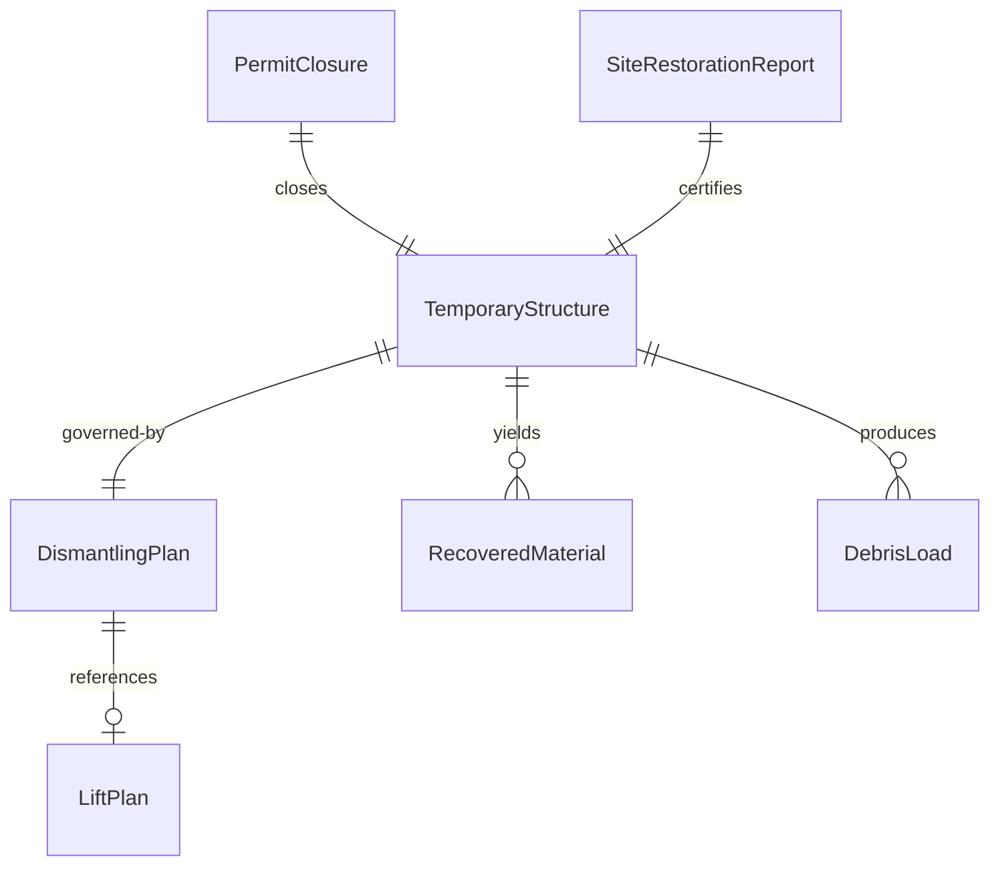
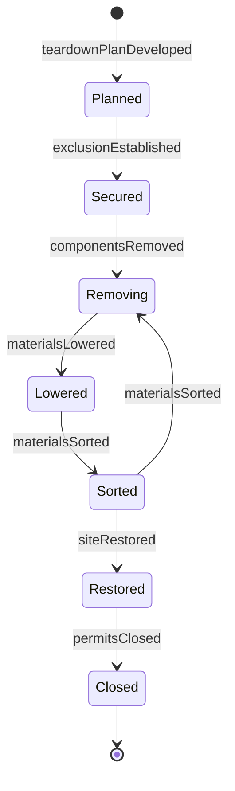
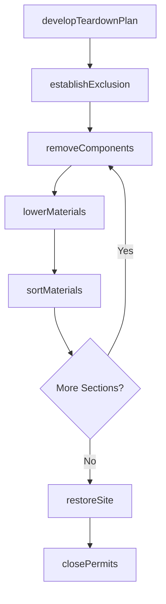
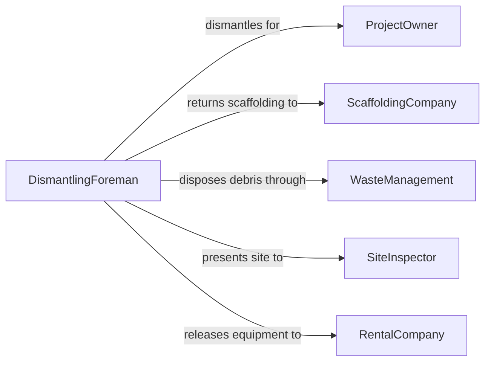

# Dismantle Equipment or Temporary Structures

> Business-as-Code definition for dismantling equipment and temporary structures. Models the planned teardown, material recovery, site cleanup, and documentation of scaffolding, formwork, temporary buildings, staging equipment, and event installations.

## Overview

Dismantling equipment or temporary structures involves planning the reverse sequence of assembly, safely lowering or removing components, sorting materials for reuse or disposal, and restoring the site to its original condition. This definition covers scaffolding teardown, concrete formwork stripping, temporary event stage and tent removal, construction trailer decommissioning, and modular structure disassembly.

## Actors

| Actor | Description |
|-------|-------------|
| ProjectOwner | Authorizes dismantling and specifies site restoration requirements |
| ScaffoldingCompany | Supplies and retrieves scaffolding systems and components |
| WasteManagement | Collects and processes debris and non-reusable materials |
| SiteInspector | Verifies dismantling safety and site restoration compliance |
| RentalCompany | Retrieves temporary buildings, trailers, and rented equipment |

## Roles

| Role | Description |
|------|-------------|
| DismantlingForeman | Plans the teardown sequence and directs the dismantling crew |
| Rigger | Operates cranes and rigging to lower heavy components safely |
| Laborer | Performs manual teardown, sorting, and site cleanup tasks |
| SafetyWatchperson | Monitors for hazards during the dismantling process |

## Entities

| Entity | Description |
|--------|-------------|
| TemporaryStructure | A scaffold, formwork, tent, stage, or temporary building to be dismantled |
| DismantlingPlan | A document specifying the teardown sequence, equipment, and safety measures |
| RecoveredMaterial | Components salvaged during dismantling for reuse or recycling |
| DebrisLoad | Waste material collected during teardown for disposal |
| SiteRestorationReport | Documentation confirming the site has been returned to its original condition |
| LiftPlan | A rigging plan for lowering heavy dismantled components |
| PermitClosure | Administrative closure of construction or event permits after dismantling |

## Actions

| Action | Description |
|--------|-------------|
| developTeardownPlan | Create a dismantling sequence with safety measures and equipment needs |
| establishExclusion | Set up barriers and exclusion zones around the dismantling area |
| removeComponents | Take apart the structure or equipment in the planned reverse sequence |
| lowerMaterials | Use cranes, hoists, or manual methods to bring down heavy sections |
| sortMaterials | Separate recovered components from waste and recyclable debris |
| restoreSite | Clean and grade the area to meet site restoration requirements |
| closePermits | Submit final documentation and close construction or event permits |

## Events

| Event | Description |
|-------|-------------|
| teardownPlanDeveloped | Dismantling sequence and safety measures have been finalized |
| exclusionEstablished | Barriers and exclusion zones are in place around the work area |
| componentsRemoved | Structure or equipment sections have been taken apart |
| materialsLowered | Heavy components have been safely brought to ground level |
| materialsSorted | Recovered items and waste have been separated and staged |
| siteRestored | Area has been cleaned and returned to its original condition |
| permitsClosed | All related permits have been formally closed |

## Searches

| Search | Description |
|--------|-------------|
| findDismantlingJobs | Locate teardown projects by site, date, or structure type |
| getRecoveredInventory | Retrieve inventory of materials salvaged during dismantling |
| getSiteRestorations | Look up site restoration reports by project or location |
| findPendingTeardowns | List structures scheduled for dismantling by priority or date |
| getWasteManifests | Retrieve disposal records for debris generated during teardown |


## Entity Relationships



## State Diagram


## Workflow



## Actor Relationships



## Usage

### Calling Actions

```typescript
import { dismantleEquipmentTemporaryStructures } from '@headlessly/dismantle-equipment-temporary-structures'

const dismantling = dismantleEquipmentTemporaryStructures()

// Develop a scaffolding teardown plan
const plan = await dismantling.developTeardownPlan({
  projectId: 'PROJ-2024-0456',
  structureType: 'tube-and-clamp-scaffold',
  heightMeters: 18,
  sequence: 'top-down-bay-by-bay',
  craneRequired: true
})

// Remove scaffold components
await dismantling.removeComponents({
  planId: plan.id,
  section: 'north-elevation-top-lift',
  components: ['guardrails', 'platforms', 'ledgers', 'standards'],
  crewSize: 4
})

// Restore the site after complete teardown
await dismantling.restoreSite({
  projectId: 'PROJ-2024-0456',
  tasks: ['remove-base-plates', 'fill-anchor-holes', 'grade-surface', 'remove-exclusion-fencing'],
  inspectionRequired: true
})
```

### Event-Driven Automation

```typescript
// Notify rental company when equipment is ready for pickup
dismantling.materialsSorted(async ({ projectId, recoveredItems }) => {
  const rentalItems = recoveredItems.filter(item => item.ownership === 'rental')
  if (rentalItems.length > 0) {
    await notify({
      to: 'rental-company',
      message: `${rentalItems.length} rental items ready for pickup at project ${projectId}`
    })
  }
})

// Auto-close permits when site is restored
dismantling.siteRestored(async ({ projectId }) => {
  await dismantling.closePermits({ projectId, restorationVerified: true })
})
```
