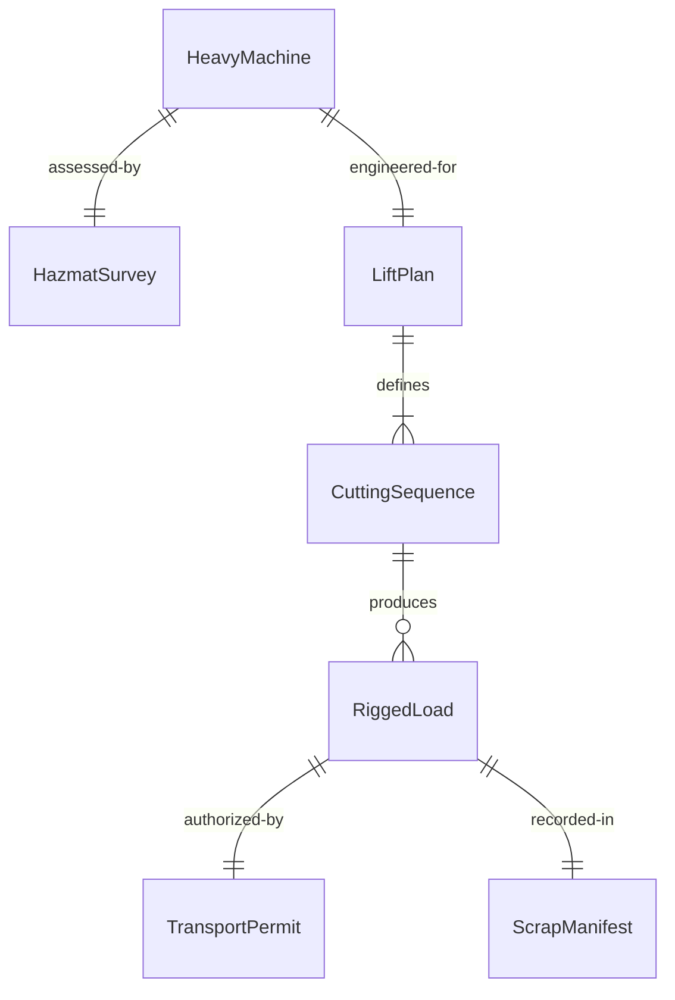
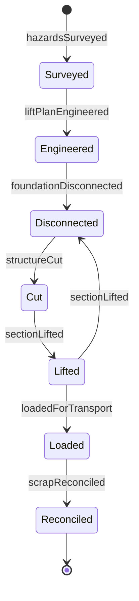
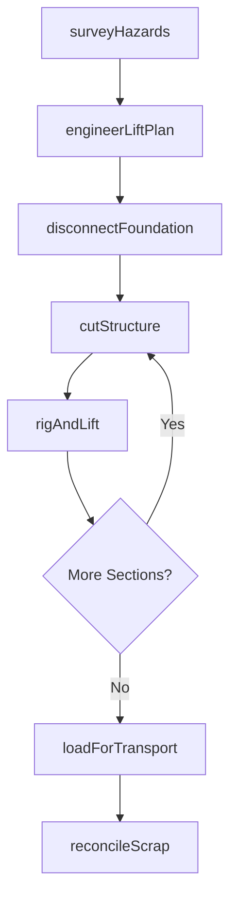
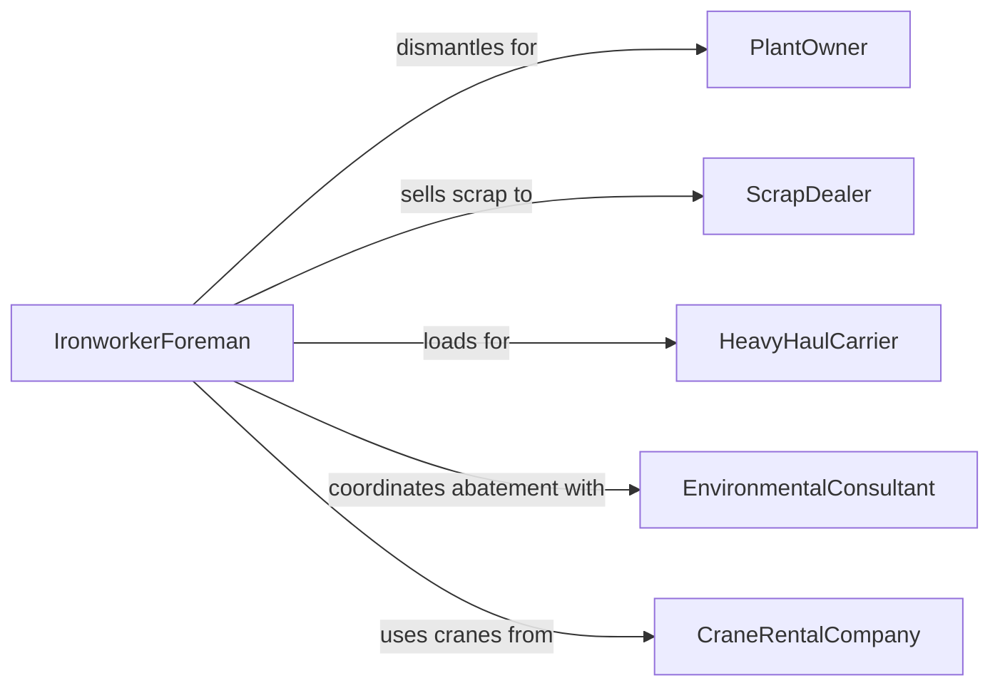

# Dismantle Heavy Equipment or Machinery

> Business-as-Code definition for heavy equipment dismantling. Models the engineering, rigging, cutting, and transport of large-scale industrial machinery, construction equipment, and plant systems being decommissioned, relocated, or scrapped.

## Overview

Dismantling heavy equipment or machinery involves developing lift and rigging plans, cutting structural members, disconnecting utilities and foundations, separating major assemblies with cranes and heavy rigging, and loading components for transport or scrap processing. This definition covers plant decommissioning of boilers, turbines, and process vessels, demolition of bridge cranes and overhead systems, disassembly of mining draglines and excavators, and scrapping of obsolete manufacturing lines.

## Actors

| Actor | Description |
|-------|-------------|
| PlantOwner | Authorizes decommissioning and specifies scope of dismantling |
| ScrapDealer | Purchases ferrous and non-ferrous metals recovered during dismantling |
| HeavyHaulCarrier | Transports oversized dismantled components to their destination |
| EnvironmentalConsultant | Manages asbestos, lead, and hazardous material abatement during teardown |
| CraneRentalCompany | Provides mobile cranes and rigging equipment for heavy lifts |
| PermittingAuthority | Issues demolition and heavy transport permits |

## Roles

| Role | Description |
|------|-------------|
| DismantlingEngineer | Designs lift plans, cutting sequences, and structural analysis for teardown |
| IronworkerForeman | Directs the cutting, rigging, and lowering of heavy steel sections |
| CraneOperator | Operates mobile or tower cranes for heavy component removal |
| HazmatTechnician | Handles and removes hazardous materials encountered during dismantling |

## Entities

| Entity | Description |
|--------|-------------|
| HeavyMachine | A large piece of equipment or machinery being dismantled |
| LiftPlan | An engineered document specifying crane capacity, rigging, and pick points |
| CuttingSequence | The planned order of structural cuts to maintain stability during teardown |
| RiggedLoad | A heavy component prepared with slings, shackles, and spreader bars for lifting |
| HazmatSurvey | An assessment of hazardous materials present in the equipment being dismantled |
| TransportPermit | Authorization for oversized or overweight loads on public roads |
| ScrapManifest | A document listing materials recovered and their weight for scrap sale |

## Actions

| Action | Description |
|--------|-------------|
| surveyHazards | Assess the equipment for asbestos, lead, PCBs, and other hazardous materials |
| engineerLiftPlan | Design crane positioning, rigging configurations, and pick sequences |
| disconnectFoundation | Sever anchor bolts, piping, and utility connections to the building or foundation |
| cutStructure | Use torches, saws, or shears to separate major structural sections |
| rigAndLift | Attach rigging hardware and use cranes to lower dismantled sections |
| loadForTransport | Position components on trailers for heavy haul or scrap processing |
| reconcileScrap | Weigh and document all recovered materials for sale or disposal |

## Events

| Event | Description |
|-------|-------------|
| hazardsSurveyed | Hazardous material assessment has been completed |
| liftPlanEngineered | Crane and rigging plans have been approved by a qualified engineer |
| foundationDisconnected | Equipment has been severed from its mounting and utility connections |
| structureCut | Major sections have been separated per the cutting sequence |
| sectionLifted | A heavy component has been rigged and lowered to grade |
| loadedForTransport | Dismantled sections have been placed on transport vehicles |
| scrapReconciled | Recovered material weights and values have been documented |

## Searches

| Search | Description |
|--------|-------------|
| findDismantlingProjects | Locate heavy equipment teardown jobs by site, equipment, or status |
| getLiftPlans | Retrieve engineered rigging plans for a specific dismantling project |
| getHazmatReports | Look up hazardous material survey results by project or equipment |
| findTransportPermits | List heavy haul permits by route, date, or load description |
| getScrapRecovery | Retrieve scrap weight and revenue data by project or material type |


## Entity Relationships



## State Diagram


## Workflow



## Actor Relationships



## Usage

### Calling Actions

```typescript
import { dismantleHeavyEquipmentMachinery } from '@headlessly/dismantle-heavy-equipment-machinery'

const dismantling = dismantleHeavyEquipmentMachinery()

// Engineer a lift plan for a boiler teardown
const liftPlan = await dismantling.engineerLiftPlan({
  projectId: 'DECOM-2024-0019',
  equipmentType: 'water-tube-boiler',
  weightTons: 85,
  dimensions: { lengthM: 12, widthM: 4, heightM: 8 },
  craneCapacity: '200-ton-mobile',
  pickPoints: ['drum-lifting-lugs', 'mud-drum-lugs']
})

// Cut and lift a boiler section
await dismantling.cutStructure({
  projectId: 'DECOM-2024-0019',
  section: 'upper-drum-and-tubes',
  method: 'oxy-fuel-torch',
  stabilization: 'temporary-bracing'
})

await dismantling.rigAndLift({
  projectId: 'DECOM-2024-0019',
  section: 'upper-drum-and-tubes',
  rigging: ['4-leg-chain-sling', '30-ton-shackles'],
  estimatedWeightTons: 22
})
```

### Event-Driven Automation

```typescript
// Auto-schedule heavy haul when sections are ready for transport
dismantling.sectionLifted(async ({ projectId, section, weightTons }) => {
  if (weightTons > 20) {
    await transport.scheduleHeavyHaul({
      projectId,
      description: section,
      weightTons,
      permitRequired: true
    })
  }
})

// Track scrap revenue for project accounting
dismantling.scrapReconciled(async ({ projectId, materials }) => {
  const totalRevenue = materials.reduce((sum, m) => sum + m.weightTons * m.pricePerTon, 0)
  await accounting.recordRevenue({
    projectId,
    category: 'scrap-recovery',
    amount: totalRevenue
  })
})
```
