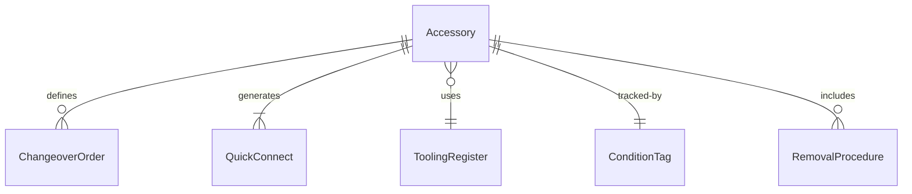
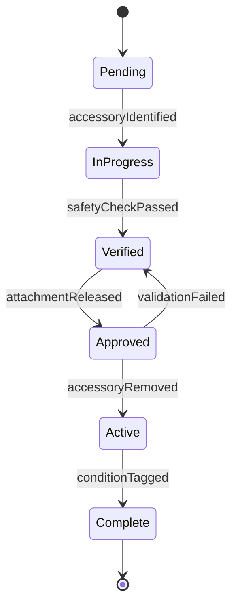
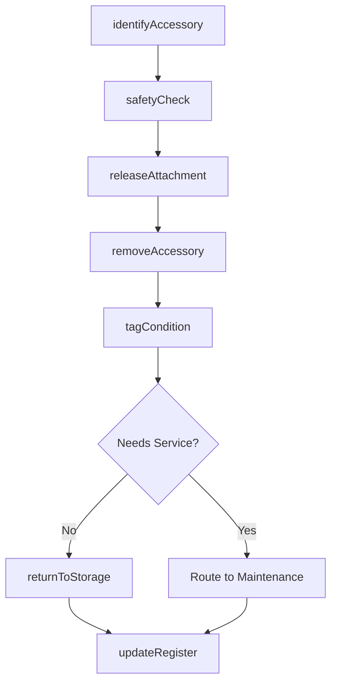
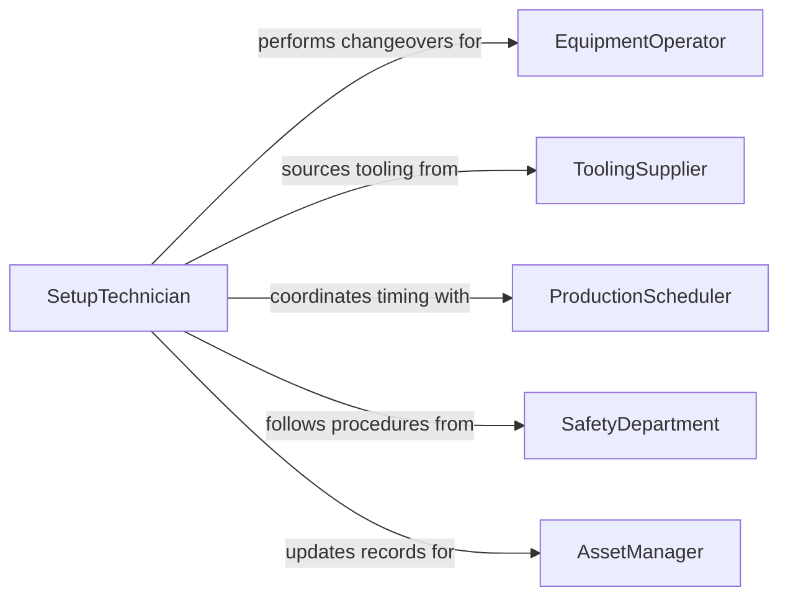

# Remove Accessories, Tools, or Other Parts from Equipment

> Business-as-Code definition for equipment accessory removal. Models the detachment, handling, and tracking of tooling, attachments, fixtures, and peripheral accessories from production machinery, construction equipment, and laboratory instruments for changeover, maintenance, or reconfiguration.

## Overview

Removing accessories, tools, or other parts from equipment involves identifying the correct detachment sequence, releasing clamps, fasteners, or quick-connect mechanisms, safely handling the removed item, and updating tooling or accessory tracking systems. This definition covers CNC tool holder changes, excavator bucket swaps, printing press plate removal, laboratory instrument probe detachment, and agricultural implement disconnection.

## Actors

| Actor | Description |
|-------|-------------|
| EquipmentOperator | Requests accessory removal for job changeover or maintenance |
| ToolingSupplier | Provides replacement tools, attachments, and accessories |
| ProductionScheduler | Coordinates changeover timing with production run schedules |
| SafetyDepartment | Enforces safe removal procedures and lockout requirements |
| AssetManager | Tracks accessory inventory, location, and condition |

## Roles

| Role | Description |
|------|-------------|
| SetupTechnician | Removes and installs accessories and tooling on equipment |
| ToolCrib Attendant | Issues, receives, and tracks tools and accessories |
| QualityChecker | Verifies accessory condition and calibration after removal |
| MaintenanceLead | Oversees accessory removal during planned maintenance activities |

## Entities

| Entity | Description |
|--------|-------------|
| Accessory | A detachable tool, attachment, or fixture mounted on equipment |
| ChangeoverOrder | A directive specifying which accessories to remove and install |
| QuickConnect | A rapid-attach mechanism enabling fast accessory swaps |
| ToolingRegister | An inventory record of all accessories assigned to a machine |
| ConditionTag | A label indicating the status of a removed accessory |
| RemovalProcedure | Step-by-step instructions for safely detaching an accessory |
| CalibrationRecord | Documentation of an accessory's measurement accuracy or alignment |

## Actions

| Action | Description |
|--------|-------------|
| identifyAccessory | Confirm which tool or attachment needs to be removed |
| safetyCheck | Verify equipment is in a safe state before detaching accessories |
| releaseAttachment | Disengage clamps, bolts, or quick-connect mechanisms |
| removeAccessory | Physically detach the accessory from the equipment |
| tagCondition | Label the removed accessory with its current condition status |
| returnToStorage | Transport the accessory to the tool crib or storage location |
| updateRegister | Record the removal in the tooling register and asset management system |

## Events

| Event | Description |
|-------|-------------|
| accessoryIdentified | Target accessory has been confirmed for removal |
| safetyCheckPassed | Equipment has been verified safe for accessory detachment |
| attachmentReleased | Clamps or fasteners have been disengaged |
| accessoryRemoved | Accessory has been physically detached from the equipment |
| conditionTagged | Removed accessory has been labeled with its condition status |
| returnedToStorage | Accessory has been delivered to the tool crib or storage area |
| registerUpdated | Tooling register and asset records have been updated |

## Searches

| Search | Description |
|--------|-------------|
| findChangeoverOrders | Locate accessory changeover requests by machine, date, or job |
| getToolingRegister | Retrieve current accessory assignments for a specific machine |
| findAccessoryLocation | Look up the current storage location of a specific accessory |
| getConditionHistory | Retrieve condition tag records for an accessory over time |
| findPendingChangeovers | List upcoming changeovers requiring accessory removal |


## Entity Relationships



## State Diagram


## Workflow



## Actor Relationships



## Usage

### Calling Actions

```typescript
import { removeAccessoriesToolsPartsEquipment } from '@headlessly/remove-accessories-tools-parts-equipment'

const tooling = removeAccessoriesToolsPartsEquipment()

// Remove a CNC tool holder for changeover
await tooling.identifyAccessory({
  machineId: 'CNC-LATHE-007',
  accessoryType: 'tool-holder',
  position: 'turret-station-4',
  toolId: 'TH-BT40-0221'
})

await tooling.releaseAttachment({
  machineId: 'CNC-LATHE-007',
  mechanism: 'drawbar-pneumatic',
  position: 'turret-station-4'
})

await tooling.removeAccessory({
  machineId: 'CNC-LATHE-007',
  toolId: 'TH-BT40-0221',
  handlingNotes: 'carbide-insert-fragile'
})
```

### Event-Driven Automation

```typescript
// Route worn accessories to maintenance
tooling.conditionTagged(async ({ toolId, condition }) => {
  if (condition === 'worn' || condition === 'damaged') {
    await maintenance.createWorkOrder({
      assetId: toolId,
      type: 'tool-reconditioning',
      priority: condition === 'damaged' ? 'urgent' : 'standard'
    })
  }
})

// Track changeover time for production efficiency
tooling.registerUpdated(async ({ machineId, changeoverStarted, changeoverCompleted }) => {
  const durationMinutes = (changeoverCompleted - changeoverStarted) / 60000
  await production.logChangeover({ machineId, durationMinutes })
})
```
