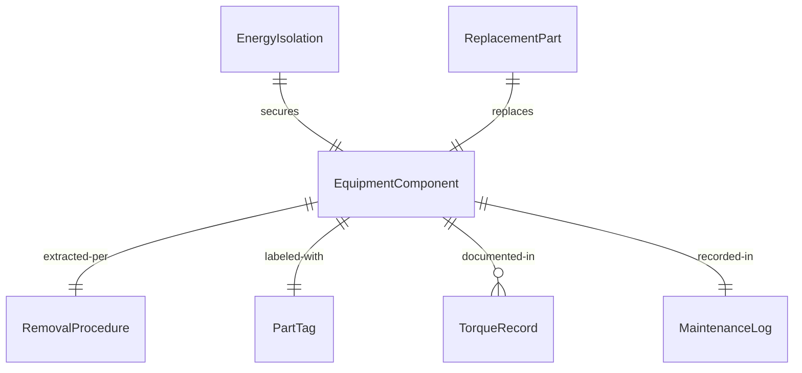
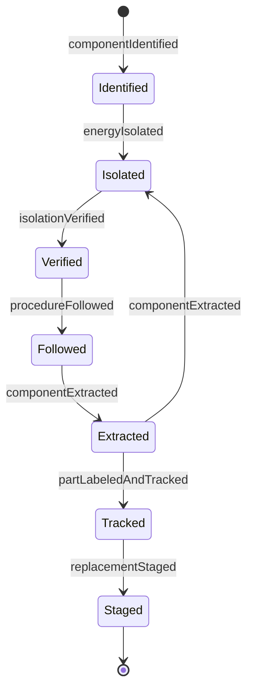
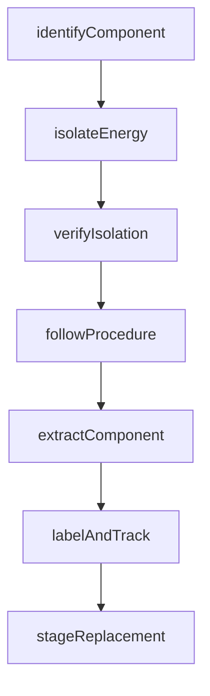
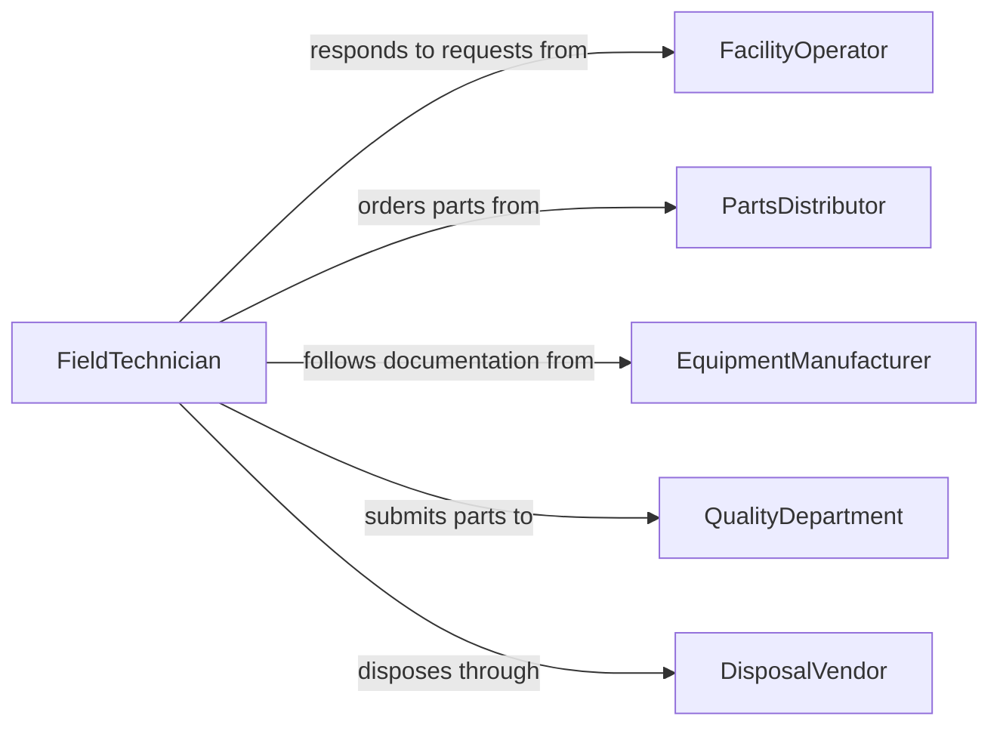

# Remove Parts or Components from Equipment

> Business-as-Code definition for equipment part removal. Models the identification, isolation, extraction, and documentation of components from industrial machinery, production equipment, and building systems for replacement, upgrade, or failure analysis.

## Overview

Removing parts or components from equipment involves consulting technical documentation to identify the target part, isolating the equipment from energy sources, following a systematic extraction procedure, and documenting the removal for maintenance records. This definition covers motor and gearbox replacement on production lines, circuit board extraction from control panels, filter and valve removal from process systems, and bearing replacement on rotating equipment.

## Actors

| Actor | Description |
|-------|-------------|
| FacilityOperator | Reports the need for part removal due to malfunction or scheduled maintenance |
| PartsDistributor | Supplies replacement components matching equipment specifications |
| EquipmentManufacturer | Provides technical documentation and part identification support |
| QualityDepartment | Evaluates removed parts for failure analysis or warranty claims |
| DisposalVendor | Handles end-of-life parts containing regulated or hazardous materials |

## Roles

| Role | Description |
|------|-------------|
| FieldTechnician | Removes and replaces parts on-site at the equipment location |
| MaintenanceEngineer | Specifies removal procedures and authorizes component swaps |
| StockroomClerk | Issues replacement parts and receives removed components |
| SafetyTechnician | Verifies energy isolation and safe working conditions before removal |

## Entities

| Entity | Description |
|--------|-------------|
| EquipmentComponent | A specific part or module being removed from the equipment |
| RemovalProcedure | Step-by-step instructions for safely extracting the component |
| EnergyIsolation | Documentation of electrical, pneumatic, or hydraulic lockout |
| ReplacementPart | The new component staged for installation after removal |
| PartTag | An identification label tracking the removed part through disposition |
| TorqueRecord | Documented fastener torque values during removal for reassembly reference |
| MaintenanceLog | A running record of all parts removed and installed on the equipment |

## Actions

| Action | Description |
|--------|-------------|
| identifyComponent | Locate the part using equipment drawings, serial numbers, or BOM references |
| isolateEnergy | Lock out electrical, pneumatic, hydraulic, and thermal energy sources |
| followProcedure | Execute the documented removal steps in the correct sequence |
| extractComponent | Physically remove the part from its mounting or housing |
| labelAndTrack | Apply a tracking tag and record the removal in maintenance systems |
| stageReplacement | Position the new component for installation |
| verifyIsolation | Confirm zero-energy state before and after removal activities |

## Events

| Event | Description |
|-------|-------------|
| componentIdentified | Target part has been located and confirmed for removal |
| energyIsolated | All energy sources have been locked out and verified |
| procedureFollowed | Removal steps have been executed per documented procedure |
| componentExtracted | Part has been physically removed from the equipment |
| partLabeledAndTracked | Tracking tag has been applied and records updated |
| replacementStaged | New component is in position for installation |
| isolationVerified | Zero-energy state has been confirmed after removal |

## Searches

| Search | Description |
|--------|-------------|
| findRemovalTasks | Locate part removal jobs by equipment, part number, or status |
| getMaintenanceLog | Retrieve the full history of parts removed from a specific machine |
| findReplacementStock | Check inventory availability for a replacement component |
| getRemovalProcedures | Look up documented extraction steps for a specific part |
| getPartDisposition | Track the status of a removed part through repair, scrap, or return |


## Entity Relationships



## State Diagram


## Workflow



## Actor Relationships



## Usage

### Calling Actions

```typescript
import { removePartsComponentsEquipment } from '@headlessly/remove-parts-components-equipment'

const partRemoval = removePartsComponentsEquipment()

// Identify and isolate before removing a motor
await partRemoval.identifyComponent({
  equipmentId: 'CONVEYOR-BELT-012',
  componentType: 'drive-motor',
  partNumber: 'ABB-M3AA-160L-4',
  location: 'head-pulley-drive'
})

await partRemoval.isolateEnergy({
  equipmentId: 'CONVEYOR-BELT-012',
  sources: ['480v-3ph-disconnect', 'vfd-output'],
  lockoutDevices: ['padlock-red-0042', 'circuit-lock-0018'],
  verifiedBy: 'TECH-0055'
})

// Extract the motor
await partRemoval.extractComponent({
  equipmentId: 'CONVEYOR-BELT-012',
  component: 'drive-motor',
  fasteners: ['4x-M16-mounting-bolts', 'coupling-set-screws'],
  liftMethod: 'chain-hoist-500kg'
})
```

### Event-Driven Automation

```typescript
// Auto-stage replacement when component is extracted
partRemoval.componentExtracted(async ({ equipmentId, partNumber }) => {
  const replacement = await inventory.reserve({ partNumber })
  await partRemoval.stageReplacement({
    equipmentId,
    replacementId: replacement.id,
    deliverTo: 'equipment-location'
  })
})

// Update asset management on part removal
partRemoval.partLabeledAndTracked(async ({ equipmentId, partNumber, condition }) => {
  await assets.updateComponent({
    equipmentId,
    partNumber,
    status: 'removed',
    condition,
    removedDate: new Date().toISOString()
  })
})
```
