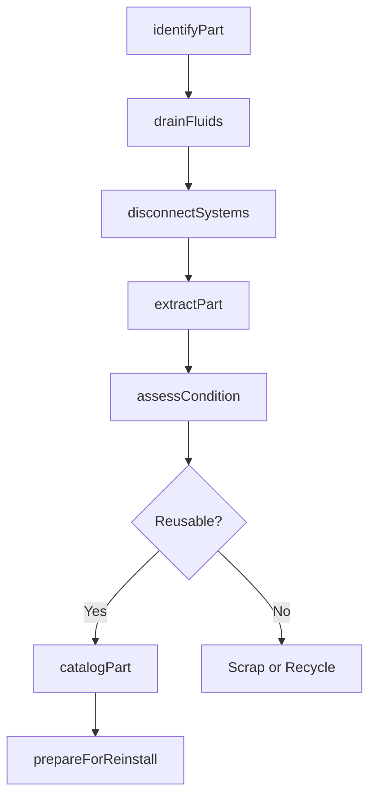
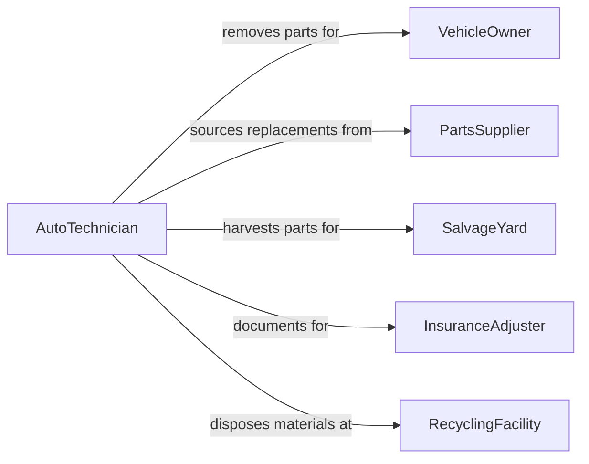

# Remove Parts or Components from Vehicles

> Business-as-Code definition for vehicle part removal. Models the identification, disconnection, extraction, and cataloging of parts and components from automobiles, trucks, aircraft, and marine vessels for repair, replacement, recycling, or salvage operations.

## Overview

Removing parts or components from vehicles involves identifying the target component, disconnecting electrical, hydraulic, and mechanical connections, extracting the part without damaging surrounding systems, and cataloging the removed item for repair, replacement, or resale. This definition covers engine and transmission removal, body panel disassembly, electrical module extraction, suspension component replacement, and salvage yard part harvesting.

## Actors

| Actor | Description |
|-------|-------------|
| VehicleOwner | Authorizes part removal for repair or modification of their vehicle |
| PartsSupplier | Provides replacement components for reinstallation |
| SalvageYard | Purchases or processes vehicles for part recovery and resale |
| InsuranceAdjuster | Authorizes part removal as part of a damage claim |
| RecyclingFacility | Accepts removed parts containing hazardous materials for proper disposal |

## Roles

| Role | Description |
|------|-------------|
| AutoTechnician | Removes and reinstalls vehicle parts using hand and power tools |
| ServiceAdvisor | Documents required part removals and communicates with the vehicle owner |
| PartsSpecialist | Identifies, catalogs, and inventories removed components |
| ShopForeman | Assigns removal tasks and oversees bay workflow |

## Entities

| Entity | Description |
|--------|-------------|
| VehiclePart | A component being removed from the vehicle |
| RemovalOrder | A work instruction specifying which parts to remove and why |
| Vehicle | The automobile, truck, or vessel from which parts are being extracted |
| DisconnectionSequence | The documented order of disconnecting systems before extraction |
| PartConditionReport | An assessment of the removed part's usability or damage |
| HazardousMaterial | Fluids or components requiring special handling during removal |
| InventoryRecord | A catalog entry for a removed part entering stock or salvage |

## Actions

| Action | Description |
|--------|-------------|
| identifyPart | Locate and confirm the target component on the vehicle |
| disconnectSystems | Remove electrical, hydraulic, and mechanical connections in sequence |
| extractPart | Physically remove the component from the vehicle |
| assessCondition | Evaluate the removed part for reuse, rebuild, or scrap |
| drainFluids | Safely capture and contain hazardous fluids during removal |
| catalogPart | Record part details and enter into inventory or salvage tracking |
| prepareForReinstall | Clean mounting surfaces and stage replacement components |

## Events

| Event | Description |
|-------|-------------|
| partIdentified | Target component has been located and confirmed on the vehicle |
| systemsDisconnected | All connections to the part have been safely removed |
| partExtracted | Component has been physically removed from the vehicle |
| conditionAssessed | Part condition has been evaluated and documented |
| fluidsDrained | Hazardous fluids have been captured and contained |
| partCataloged | Removed part has been entered into inventory or salvage records |
| reinstallReady | Mounting area is clean and replacement component is staged |

## Searches

| Search | Description |
|--------|-------------|
| findRemovalOrders | Locate part removal work orders by vehicle, status, or technician |
| getPartConditions | Retrieve condition reports for removed parts by VIN or part number |
| findSalvageParts | Search inventory of removed parts available for resale |
| getFluidDisposal | Track hazardous fluid capture and disposal records |
| getVehicleHistory | Look up all parts previously removed from a specific vehicle |

## Workflow



## Actor Relationships



## Usage

### Calling Actions

```typescript
import { removePartsComponentsVehicles } from '@headlessly/remove-parts-components-vehicles'

const removal = removePartsComponentsVehicles()

// Identify and remove a transmission
await removal.identifyPart({
  vehicleId: 'VIN-1HGCM82633A004352',
  partType: 'automatic-transmission',
  partNumber: 'AT-6L80E'
})

await removal.disconnectSystems({
  vehicleId: 'VIN-1HGCM82633A004352',
  connections: ['transmission-cooler-lines', 'shift-cable', 'wiring-harness', 'driveshaft', 'bell-housing-bolts'],
  sequence: 'top-down'
})

await removal.extractPart({
  vehicleId: 'VIN-1HGCM82633A004352',
  partType: 'automatic-transmission',
  liftEquipment: 'transmission-jack',
  weightKg: 95
})
```

### Event-Driven Automation

```typescript
// Auto-order replacement when part is extracted
removal.partExtracted(async ({ vehicleId, partType, partNumber }) => {
  await parts.orderReplacement({
    vehicleId,
    partNumber,
    source: 'oem-dealer',
    priority: 'next-day'
  })
})

// Track hazardous fluid disposal
removal.fluidsDrained(async ({ vehicleId, fluidType, volumeLiters }) => {
  await environmental.logDisposal({
    vehicleId,
    fluidType,
    volumeLiters,
    containerId: await containers.assignNext(fluidType)
  })
})
```
