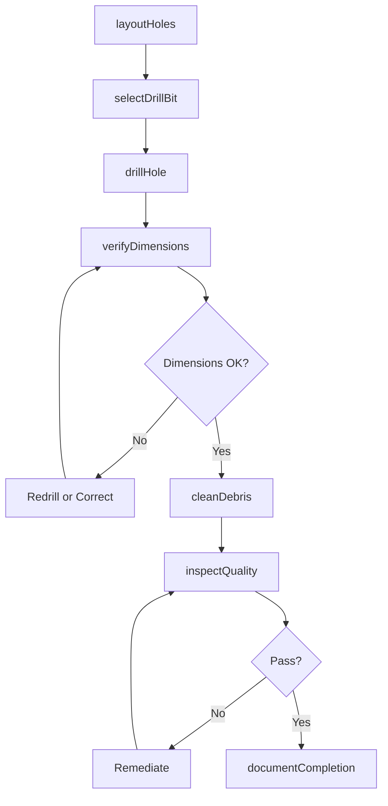
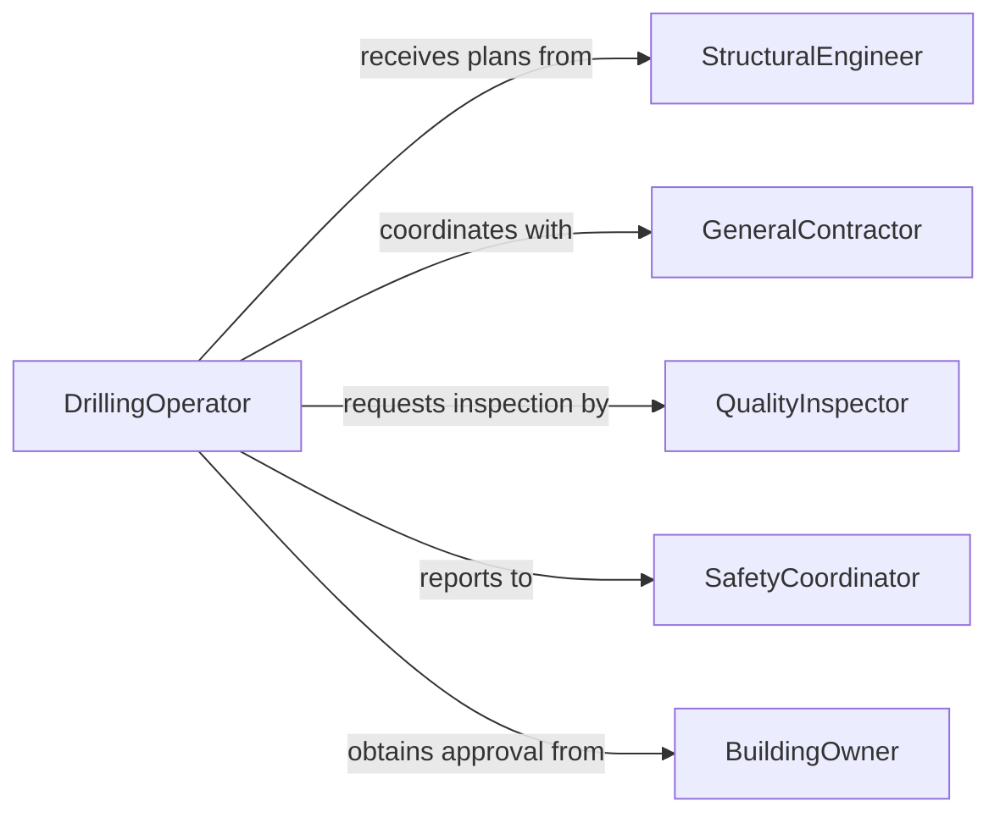

# Drill Holes Construction Materials

> Business-as-Code definition for drilling holes in construction materials. Models the complete drilling workflow from layout through inspection and cleanup.

## Overview

Drilling holes in construction materials involves creating precise openings in concrete, masonry, metal, wood, and composite materials for anchors, fasteners, utilities, and structural connections. This definition exposes actions for hole layout, drilling operations, quality verification, and cleanup, with events for progress tracking and safety compliance.

## Actors

| Actor | Description |
|-------|-------------|
| GeneralContractor | Coordinates drilling work within project schedule |
| StructuralEngineer | Specifies hole locations and dimensions |
| UtilityCompany | Requires openings for electrical, plumbing, or HVAC |
| MaterialSupplier | Provides drill bits and drilling equipment |
| SafetyInspector | Verifies drilling meets safety standards |
| BuildingOwner | Approves penetrations in existing structures |

## Roles

| Role | Description |
|------|-------------|
| DrillingOperator | Executes drilling operations |
| LayoutTechnician | Marks hole locations per specifications |
| QualityInspector | Verifies hole dimensions and placement |
| SafetyCoordinator | Monitors hazard controls during drilling |

## Entities

| Entity | Description |
|--------|-------------|
| DrillingPlan | Specifications for hole locations and sizes |
| HoleLocation | Marked position for drilling operation |
| DrillBit | Cutting tool for specific material and size |
| Hole | Completed opening in construction material |
| DebrisCollection | Dust and material removed during drilling |
| InspectionReport | Documentation of hole quality verification |

## Actions

| Action | Description |
|--------|-------------|
| layoutHoles | Mark hole positions per engineering plans |
| selectDrillBit | Choose appropriate bit for material and size |
| drillHole | Execute drilling operation to specified depth |
| verifyDimensions | Measure hole diameter and depth |
| cleanDebris | Remove dust and material from hole and area |
| inspectQuality | Verify hole meets specifications |
| documentCompletion | Record drilling work for project records |

## Events

| Event | Description |
|-------|-------------|
| holesLaidOut | Hole positions marked and verified |
| drillBitSelected | Appropriate cutting tool chosen |
| holeDrilled | Drilling operation completed |
| dimensionsVerified | Hole measurements confirmed |
| debrisCleaned | Dust and material removed |
| qualityInspected | Quality verification completed |
| completionDocumented | Drilling work recorded |

## Searches

| Search | Description |
|--------|-------------|
| findHoles | List holes by location, size, or status |
| getDrillingPlans | Retrieve drilling specifications |
| getInspections | Find inspection records and results |
| getProgress | Get completion status by area or phase |

## Workflow



## Actor Relationships



## Usage

### Calling Actions

```typescript
import { drillHolesConstructionMaterials } from '@headlessly/drill-holes-construction-materials'

const drilling = drillHolesConstructionMaterials()

// Layout holes for anchor installation in concrete slab
const layout = await drilling.layoutHoles({
  projectId: 'proj-2026-001',
  location: 'Floor 3 - Equipment Room',
  material: 'concrete-slab',
  holes: [
    { id: 'H1', x: 120, y: 80, diameter: 0.75, depth: 6 },
    { id: 'H2', x: 180, y: 80, diameter: 0.75, depth: 6 },
    { id: 'H3', x: 120, y: 140, diameter: 0.75, depth: 6 },
    { id: 'H4', x: 180, y: 140, diameter: 0.75, depth: 6 }
  ],
  units: 'inches'
})

// Select drill bit and drill holes
const bit = await drilling.selectDrillBit({
  material: 'concrete',
  holeDiameter: 0.75,
  holeDepth: 6,
  bitType: 'carbide-masonry',
  drillType: 'rotary-hammer'
})

const hole = await drilling.drillHole({
  layoutId: layout.id,
  holeId: 'H1',
  drillBitId: bit.id,
  speed: 1200,
  speedUnit: 'rpm',
  feedPressure: 'medium'
})

// Verify dimensions and clean
const verification = await drilling.verifyDimensions({
  holeId: hole.id,
  measuredDiameter: 0.76,
  measuredDepth: 6.25,
  tolerance: 0.0625
})

await drilling.cleanDebris({
  holeId: hole.id,
  cleaningMethod: 'vacuum-brush',
  debrisDisposal: 'construction-waste'
})
```

### Event-Driven Automation

```typescript
// Alert when hole dimensions are out of tolerance
drilling.dimensionsVerified(async ({ holeId, verified, measuredDiameter, specDiameter }) => {
  if (!verified) {
    const deviation = Math.abs(measuredDiameter - specDiameter)

    await notify({
      to: 'quality-team',
      priority: 'high',
      message: `Hole ${holeId} diameter out of spec by ${deviation.toFixed(3)} inches`
    })
  }
})

// Track drilling progress and notify when area is complete
drilling.completionDocumented(async ({ layoutId, location }) => {
  const allHoles = await drilling.findHoles({ layoutId })
  const completedHoles = allHoles.filter(h => h.status === 'completed')

  if (completedHoles.length === allHoles.length) {
    await notify({
      to: 'project-manager',
      message: `All drilling complete for ${location}`,
      totalHoles: allHoles.length
    })

    await updateSchedule({
      activity: 'drilling',
      location,
      status: 'completed'
    })
  }
})
```
