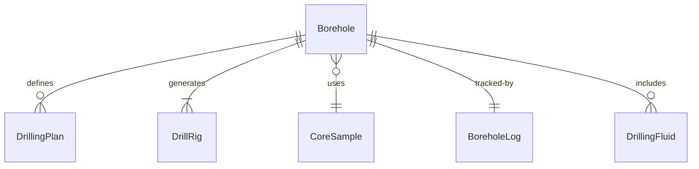
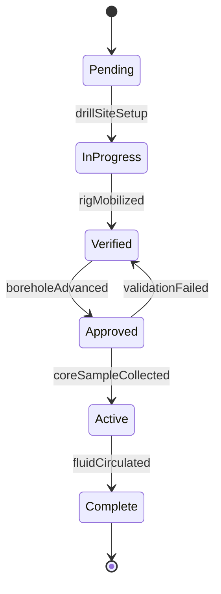
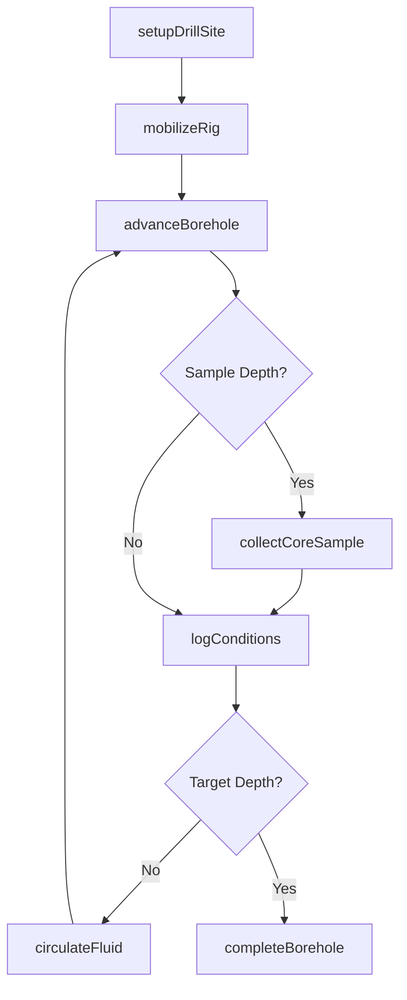
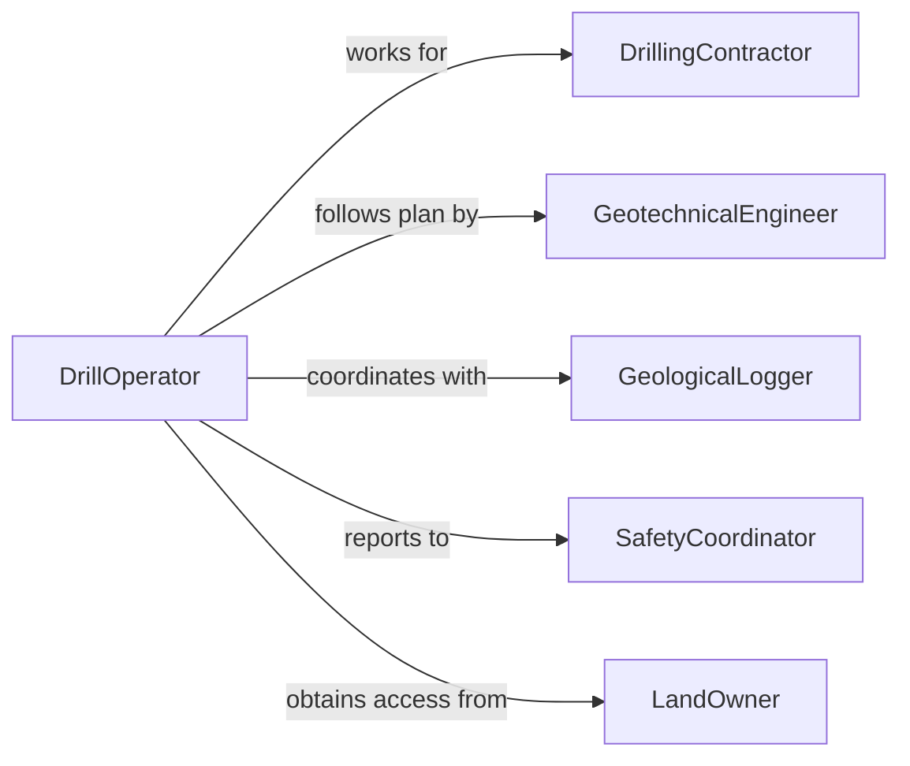

# Drill Holes Earth Rock

> Business-as-Code definition for drilling holes in earth or rock for exploration, construction, and resource extraction. Models the complete drilling workflow from site preparation through completion and logging.

## Overview

Drilling holes in earth or rock involves creating boreholes for geotechnical investigation, mineral exploration, water well installation, foundation anchors, and blasting operations. This definition exposes actions for drill site setup, drilling operations, sample collection, and borehole logging, with events for safety monitoring and geological documentation.

## Actors

| Actor | Description |
|-------|-------------|
| GeotechnicalEngineer | Designs drilling program and analyzes data |
| DrillingContractor | Provides drilling equipment and operators |
| EnvironmentalAgency | Issues permits and monitors compliance |
| LandOwner | Grants access to drilling locations |
| Laboratory | Analyzes soil and rock samples |
| ProjectEngineer | Coordinates drilling within project schedule |

## Roles

| Role | Description |
|------|-------------|
| DrillOperator | Executes drilling operations |
| GeologicalLogger | Documents subsurface conditions |
| SamplingTechnician | Collects and preserves drill samples |
| SafetyCoordinator | Monitors drilling safety procedures |

## Entities

| Entity | Description |
|--------|-------------|
| Borehole | Drilled opening in earth or rock |
| DrillingPlan | Specifications for depth, diameter, and location |
| DrillRig | Equipment used for drilling operations |
| CoreSample | Cylindrical rock or soil specimen |
| BoreholeLog | Documentation of subsurface conditions |
| DrillingFluid | Circulating medium for cuttings removal |

## Actions

| Action | Description |
|--------|-------------|
| setupDrillSite | Prepare location and position drilling equipment |
| mobilizeRig | Transport and assemble drilling rig |
| advanceBorehole | Drill deeper into earth or rock |
| collectCoreSample | Retrieve rock or soil specimen from borehole |
| circulateFluid | Pump drilling fluid to remove cuttings |
| logConditions | Document geological conditions encountered |
| completeBorehole | Finish drilling and prepare for abandonment or use |

## Events

| Event | Description |
|-------|-------------|
| drillSiteSetup | Location prepared and equipment positioned |
| rigMobilized | Drilling rig assembled and ready |
| boreholeAdvanced | Drilling progressed to new depth |
| coreSampleCollected | Rock or soil specimen retrieved |
| fluidCirculated | Drilling fluid pumped through system |
| conditionsLogged | Geological observations recorded |
| boreholeCompleted | Drilling finished and borehole prepared |

## Searches

| Search | Description |
|--------|-------------|
| findBoreholes | List boreholes by location, depth, or purpose |
| getSamples | Retrieve core samples and test results |
| getLogs | Find borehole logs and geological data |
| getProgress | Get drilling completion by site or project |


## Entity Relationships



## State Diagram


## Workflow



## Actor Relationships



## Usage

### Calling Actions

```typescript
import { drillHolesEarthRock } from '@headlessly/drill-holes-earth-rock'

const drilling = drillHolesEarthRock()

// Setup drill site for geotechnical investigation
const site = await drilling.setupDrillSite({
  projectId: 'bridge-foundation-2026',
  location: 'Pier 3 Location',
  coordinates: { lat: 40.7589, lon: -73.9851 },
  accessRoute: 'east-service-road',
  utilities: 'marked-clear'
})

// Mobilize drilling rig
const rig = await drilling.mobilizeRig({
  siteId: site.id,
  rigType: 'truck-mounted-rotary',
  rigCapacity: 200,
  capacityUnit: 'feet',
  setupDate: '2026-02-05'
})

// Advance borehole and collect samples
const borehole = await drilling.advanceBorehole({
  rigId: rig.id,
  targetDepth: 100,
  diameter: 6,
  units: 'feet',
  method: 'rotary-wash'
})

const sample = await drilling.collectCoreSample({
  boreholeId: borehole.id,
  depth: 25,
  coreLength: 5,
  recoveryPercent: 95,
  sampleNumber: 'BH-03-S01'
})

// Circulate drilling fluid and log conditions
await drilling.circulateFluid({
  boreholeId: borehole.id,
  fluidType: 'bentonite-mud',
  flowRate: 50,
  flowRateUnit: 'gallons-per-minute'
})

await drilling.logConditions({
  boreholeId: borehole.id,
  depth: 25,
  material: 'sandstone',
  color: 'gray',
  hardness: 'medium',
  fracturing: 'minimal',
  waterEncountered: false
})
```

### Event-Driven Automation

```typescript
// Alert when water is encountered during drilling
drilling.conditionsLogged(async ({ boreholeId, depth, waterEncountered, waterDepth }) => {
  if (waterEncountered) {
    await notify({
      to: 'geotechnical-engineer',
      priority: 'high',
      message: `Water encountered at ${waterDepth} feet in borehole ${boreholeId}`
    })

    // Modify drilling plan if groundwater is shallow
    if (waterDepth < 20) {
      await updateDrillingPlan({
        boreholeId,
        modification: 'install-casing',
        reason: 'shallow-groundwater'
      })
    }
  }
})

// Track core recovery and alert on poor recovery
drilling.coreSampleCollected(async ({ boreholeId, depth, recoveryPercent }) => {
  if (recoveryPercent < 75) {
    await notify({
      to: 'drilling-supervisor',
      message: `Low core recovery (${recoveryPercent}%) at ${depth} feet in borehole ${boreholeId}`,
      recommendation: 'Consider triple-tube core barrel'
    })
  }
})
```
