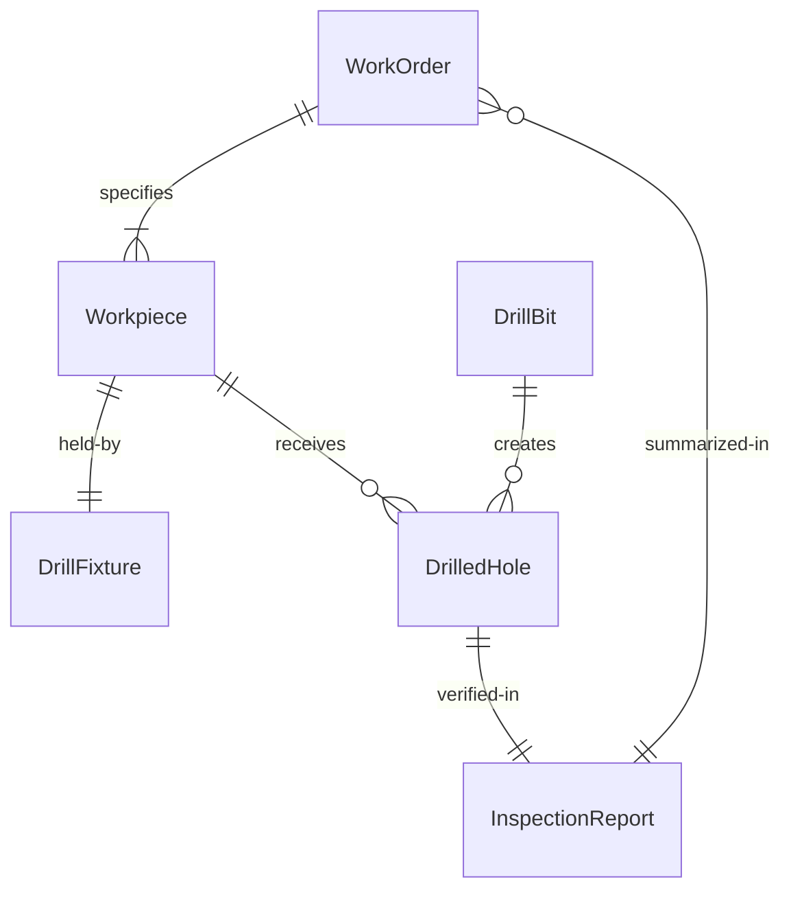
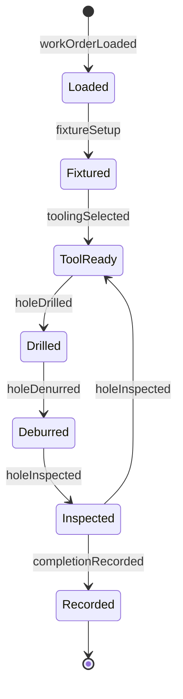
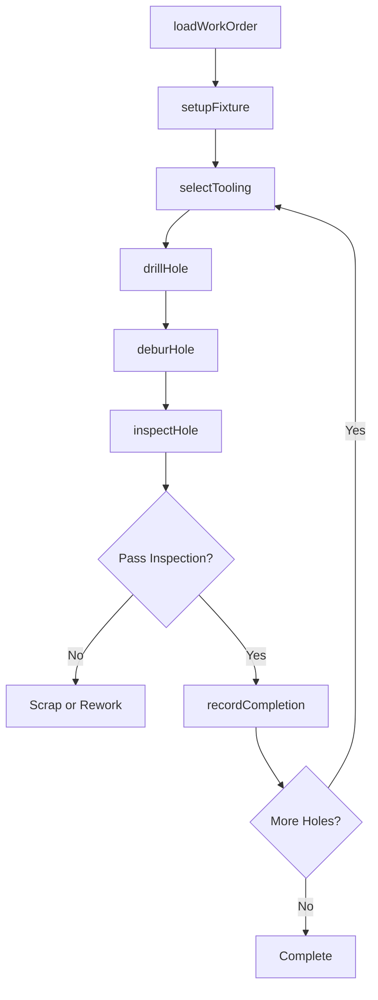
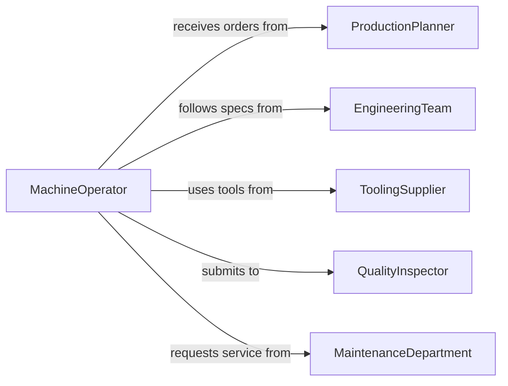

# Drill Holes Parts Equipment Materials

> Business-as-Code definition for drilling holes in parts, equipment, or materials during manufacturing and fabrication. Models the complete drilling workflow from work order processing through quality inspection.

## Overview

Drilling holes in parts, equipment, or materials involves creating precise openings in metal, plastic, composite, and other materials for assembly, fastening, and functionality. This definition exposes actions for setup, drilling operations, deburring, and inspection, with events for production tracking and quality control.

## Actors

| Actor | Description |
|-------|-------------|
| ProductionPlanner | Schedules drilling operations in manufacturing |
| EngineeringTeam | Specifies hole locations and tolerances |
| ToolingSupplier | Provides drill bits and cutting tools |
| QualityAssurance | Verifies drilling meets specifications |
| MaintenanceDepartment | Services and calibrates drilling equipment |
| Customer | Receives finished parts with drilled holes |

## Roles

| Role | Description |
|------|-------------|
| MachineOperator | Executes drilling operations on equipment |
| SetupTechnician | Prepares workpiece and tooling for drilling |
| QualityInspector | Verifies hole dimensions and position |
| Programmer | Creates CNC programs for automated drilling |

## Entities

| Entity | Description |
|--------|-------------|
| WorkOrder | Manufacturing instruction for drilling operation |
| Workpiece | Part or material to be drilled |
| DrillFixture | Device for holding workpiece during drilling |
| DrillBit | Cutting tool for creating holes |
| DrilledHole | Completed opening in workpiece |
| InspectionReport | Documentation of hole quality verification |

## Actions

| Action | Description |
|--------|-------------|
| loadWorkOrder | Import drilling specifications from planning system |
| setupFixture | Secure workpiece in drilling position |
| selectTooling | Choose appropriate drill bit and parameters |
| drillHole | Execute drilling operation |
| deburHole | Remove sharp edges from hole opening |
| inspectHole | Verify hole dimensions and position |
| recordCompletion | Document finished drilling operation |

## Events

| Event | Description |
|-------|-------------|
| workOrderLoaded | Drilling specifications imported |
| fixtureSetup | Workpiece secured in position |
| toolingSelected | Drill bit and parameters chosen |
| holeDrilled | Drilling operation completed |
| holeDenurred | Sharp edges removed from opening |
| holeInspected | Quality verification completed |
| completionRecorded | Drilling operation documented |

## Searches

| Search | Description |
|--------|-------------|
| findWorkOrders | List drilling orders by part, date, or status |
| getHoles | Retrieve hole specifications and actual dimensions |
| getInspections | Find inspection records and quality metrics |
| getProgress | Get production completion by work order |


## Entity Relationships



## State Diagram


## Workflow



## Actor Relationships



## Usage

### Calling Actions

```typescript
import { drillHolesPartsEquipmentMaterials } from '@headlessly/drill-holes-parts-equipment-materials'

const drilling = drillHolesPartsEquipmentMaterials()

// Load work order for drilling mounting plate
const workOrder = await drilling.loadWorkOrder({
  orderNumber: 'WO-2026-1234',
  partNumber: 'PLATE-A-100',
  quantity: 50,
  holes: [
    { id: 'H1', x: 25, y: 25, diameter: 0.25, depth: 'through', tolerance: 0.005 },
    { id: 'H2', x: 75, y: 25, diameter: 0.25, depth: 'through', tolerance: 0.005 },
    { id: 'H3', x: 25, y: 75, diameter: 0.25, depth: 'through', tolerance: 0.005 },
    { id: 'H4', x: 75, y: 75, diameter: 0.25, depth: 'through', tolerance: 0.005 }
  ],
  material: 'aluminum-6061',
  units: 'millimeters'
})

// Setup fixture and select tooling
await drilling.setupFixture({
  workOrderId: workOrder.id,
  fixtureType: 'grid-plate',
  clampingMethod: 'toe-clamps',
  workpiecePosition: 'centered'
})

const tooling = await drilling.selectTooling({
  material: 'aluminum-6061',
  holeDiameter: 0.25,
  depth: 10,
  bitType: 'HSS-twist-drill',
  speed: 3000,
  speedUnit: 'rpm',
  feed: 0.003,
  feedUnit: 'inches-per-revolution'
})

// Drill holes and inspect
const hole = await drilling.drillHole({
  workOrderId: workOrder.id,
  holeId: 'H1',
  toolingId: tooling.id
})

await drilling.deburHole({
  holeId: hole.id,
  method: 'chamfer-tool',
  edgeBreak: 0.010
})

const inspection = await drilling.inspectHole({
  holeId: hole.id,
  measuredDiameter: 0.2503,
  measuredPosition: { x: 25.002, y: 24.998 },
  concentricity: 0.002
})
```

### Event-Driven Automation

```typescript
// Alert when hole inspection fails
drilling.holeInspected(async ({ holeId, workOrderId, passed, measurements }) => {
  if (!passed) {
    await notify({
      to: 'production-supervisor',
      priority: 'high',
      message: `Hole ${holeId} failed inspection on work order ${workOrderId}`,
      deviations: measurements.filter(m => !m.withinTolerance)
    })

    // Increment scrap count
    await updateWorkOrder({
      workOrderId,
      scrapCount: 1,
      reason: 'out-of-tolerance-hole'
    })
  }
})

// Track tool life and recommend replacement
drilling.holeDrilled(async ({ toolingId, holeCount }) => {
  const toolLife = await getToolLife(toolingId)

  if (holeCount >= toolLife.maxHoles * 0.9) {
    await notify({
      to: 'machine-operator',
      message: `Drill bit ${toolingId} approaching end of life (${holeCount}/${toolLife.maxHoles} holes)`,
      recommendation: 'Prepare replacement tool'
    })
  }
})
```
