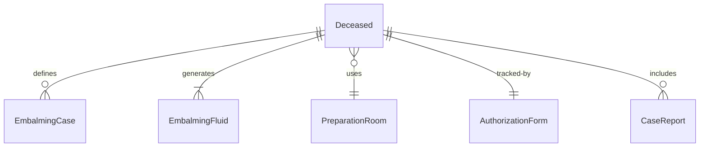
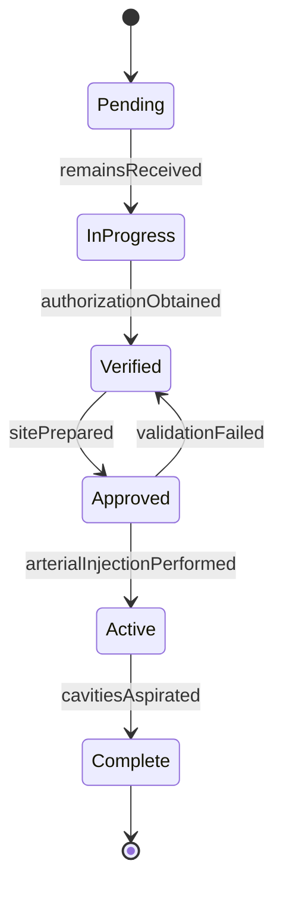
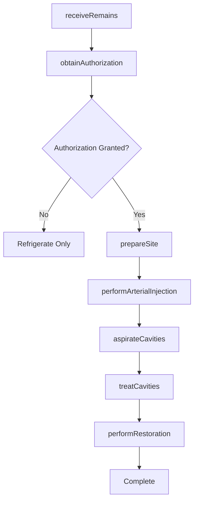
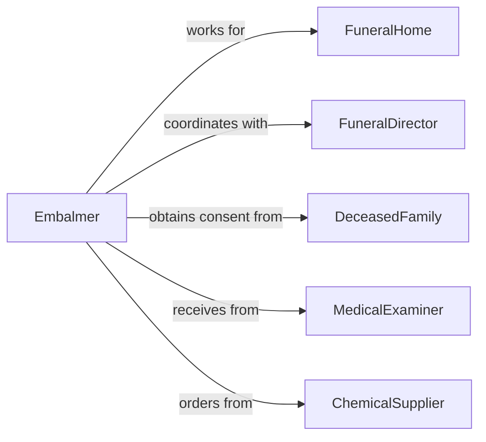

# Embalm Corpses

> Business-as-Code definition for embalming human remains in mortuary science. Models the complete embalming workflow from preparation through preservation and presentation.

## Overview

Embalming corpses involves chemically preserving human remains through arterial injection, cavity treatment, and cosmetic restoration for viewing and burial. This definition exposes actions for case preparation, embalming procedures, restoration work, and documentation, with events for regulatory compliance and family coordination.

## Actors

| Actor | Description |
|-------|-------------|
| FuneralHome | Provides mortuary services and facilities |
| DeceasedFamily | Requests services and makes arrangements |
| MedicalExaminer | Issues death certificate and releases remains |
| ChemicalSupplier | Provides embalming fluids and supplies |
| Cemetery | Receives prepared remains for burial |
| RegulatoryAuthority | Enforces health and safety standards |

## Roles

| Role | Description |
|------|-------------|
| Embalmer | Performs embalming procedures |
| FuneralDirector | Coordinates arrangements with family |
| MortuaryAssistant | Assists with preparation and documentation |
| Cosmetologist | Performs restorative and cosmetic work |

## Entities

| Entity | Description |
|--------|-------------|
| Deceased | Human remains under care of funeral home |
| EmbalmingCase | Record of embalming procedures performed |
| EmbalmingFluid | Chemical solution for preservation |
| PreparationRoom | Facility for embalming procedures |
| AuthorizationForm | Legal consent for embalming procedures |
| CaseReport | Documentation of procedures and observations |

## Actions

| Action | Description |
|--------|-------------|
| receiveRemains | Accept custody of deceased from medical facility |
| obtainAuthorization | Secure legal consent for embalming |
| prepareSite | Position remains and set features |
| performArterialInjection | Introduce preservative fluid via arterial system |
| aspirateCavities | Remove fluids and gases from body cavities |
| treatCavities | Inject cavity fluid for internal preservation |
| performRestoration | Apply cosmetics and restore natural appearance |

## Events

| Event | Description |
|-------|-------------|
| remainsReceived | Deceased accepted into funeral home care |
| authorizationObtained | Legal consent secured for procedures |
| sitePrepared | Remains positioned and features set |
| arterialInjectionPerformed | Preservative fluid circulated |
| cavitiesAspirated | Fluids and gases removed |
| cavitiesTreated | Internal preservation completed |
| restorationPerformed | Cosmetic work completed |

## Searches

| Search | Description |
|--------|-------------|
| findCases | List embalming cases by date or status |
| getAuthorizations | Retrieve consent forms and signatures |
| getReports | Find case documentation and observations |
| getSchedule | Get preparation room availability |


## Entity Relationships



## State Diagram


## Workflow



## Actor Relationships



## Usage

### Calling Actions

```typescript
import { embalmCorpses } from '@headlessly/embalm-corpses'

const embalming = embalmCorpses()

// Receive remains from hospital
const remains = await embalming.receiveRemains({
  deceasedName: 'Smith, John',
  dateOfDeath: '2026-02-03',
  timeOfDeath: '14:30',
  placeOfDeath: 'General Hospital',
  medicalExaminerCase: 'ME-2026-0234',
  receivedBy: 'embalmer-001',
  receivedDate: '2026-02-04'
})

// Obtain authorization from family
const authorization = await embalming.obtainAuthorization({
  caseId: remains.id,
  authorizedBy: 'Smith, Mary (Spouse)',
  relationship: 'spouse',
  procedures: ['arterial-embalming', 'cavity-treatment', 'cosmetology'],
  signedDate: '2026-02-04',
  witnessedBy: 'funeral-director-001'
})

// Prepare and perform embalming
await embalming.prepareSite({
  caseId: remains.id,
  roomAssignment: 'prep-room-1',
  tablePosition: 'supine',
  featuresSetting: {
    eyes: 'closed-eye-caps',
    mouth: 'closed-needle-injector',
    hands: 'positioned-naturally'
  }
})

await embalming.performArterialInjection({
  caseId: remains.id,
  injectionSite: 'right-common-carotid',
  drainageSite: 'right-jugular-vein',
  fluidType: 'high-index-arterial',
  fluidStrength: '25-index',
  volumeInjected: 3.5,
  volumeUnit: 'gallons',
  pressure: 12,
  pressureUnit: 'psi'
})

// Aspirate and treat cavities
await embalming.aspirateCavities({
  caseId: remains.id,
  aspirationSite: 'umbilical-region',
  volumeRemoved: 1200,
  volumeUnit: 'mL',
  contents: 'serous-fluid-gas'
})

await embalming.treatCavities({
  caseId: remains.id,
  cavityFluid: 'high-formaldehyde',
  volumeInjected: 32,
  volumeUnit: 'ounces'
})
```

### Event-Driven Automation

```typescript
// Alert funeral director when embalming is complete
embalming.restorationPerformed(async ({ caseId, deceasedName }) => {
  await notify({
    to: 'funeral-director',
    message: `Embalming complete for ${deceasedName}`,
    caseId,
    nextStep: 'Dressing and casketing'
  })

  await updateSchedule({
    caseId,
    status: 'ready-for-viewing',
    availableFrom: new Date().toISOString()
  })
})

// Track chemical inventory usage
embalming.arterialInjectionPerformed(async ({ fluidType, volumeInjected }) => {
  await updateInventory({
    product: fluidType,
    quantityUsed: volumeInjected,
    unit: 'gallons'
  })

  const currentStock = await checkInventory(fluidType)

  if (currentStock.quantity < currentStock.reorderPoint) {
    await notify({
      to: 'supply-coordinator',
      message: `Low inventory for ${fluidType}: ${currentStock.quantity} gallons remaining`,
      recommendation: 'Reorder supplies'
    })
  }
})
```
