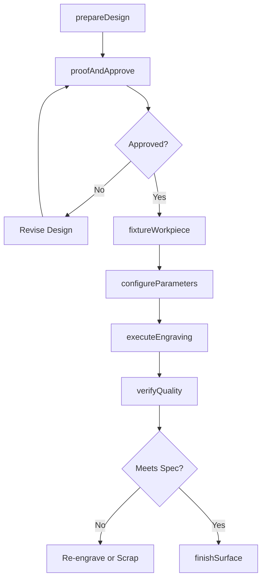
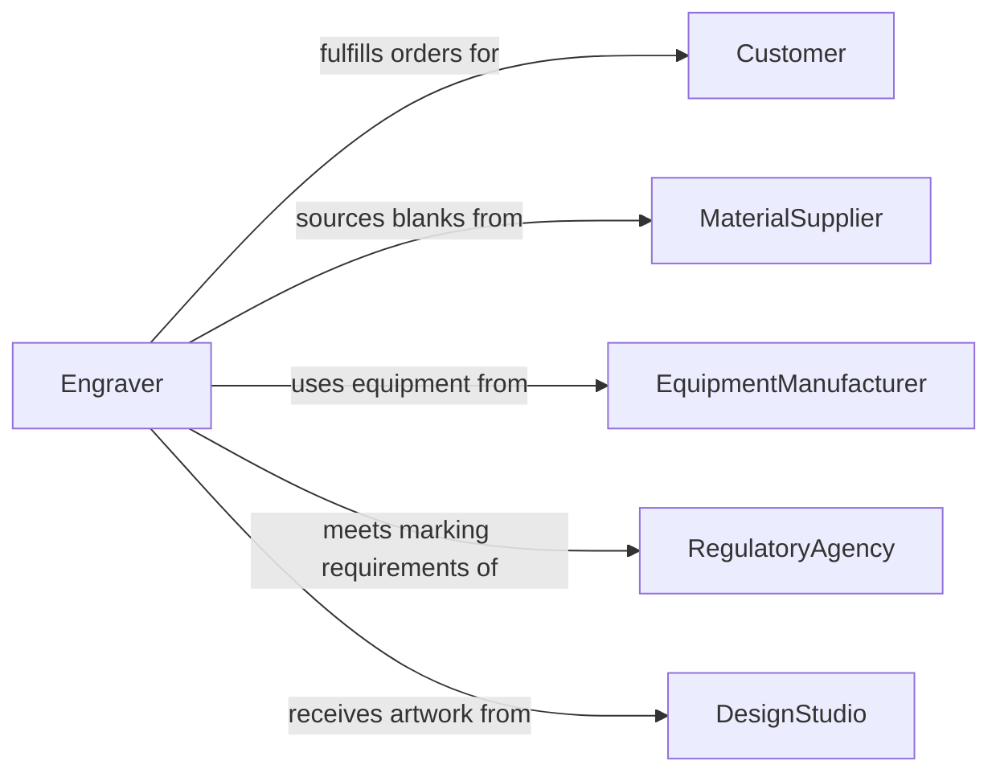

# Engrave Designs, Text, or Other Markings onto Materials

> Business-as-Code definition for engraving operations. Models the design preparation, material fixturing, tool or laser setup, engraving execution, depth verification, finishing, and quality inspection for text, graphics, serial numbers, and decorative patterns on metals, glass, wood, stone, plastics, and other materials.

## Overview

Engraving designs, text, or other markings onto materials involves preparing artwork or text files, fixturing the workpiece securely, selecting and setting up the engraving tool or laser, executing the engraving pass with controlled depth and speed, verifying mark quality and legibility, and finishing the engraved surface. This definition covers industrial part marking and serial number engraving, jewelry and trophy personalization, firearm serial number and regulatory marking, glass and crystal decorative engraving, and signage and memorial plaque production.

## Actors

| Actor | Description |
|-------|-------------|
| Customer | Commissions engraving work and approves design proofs |
| MaterialSupplier | Provides blanks, plates, and workpieces to be engraved |
| EquipmentManufacturer | Supplies engraving machines, laser systems, and cutting tools |
| RegulatoryAgency | Mandates marking requirements for traceability, safety, or compliance |
| DesignStudio | Creates artwork, fonts, and vector files for engraving |

## Roles

| Role | Description |
|------|-------------|
| Engraver | Operates engraving equipment and executes marking on workpieces |
| DesignPreparer | Converts artwork and text into machine-ready engraving files |
| QualityInspector | Verifies engraving depth, legibility, and dimensional accuracy |
| SetupTechnician | Configures machine parameters, fixtures workpieces, and selects tooling |

## Entities

| Entity | Description |
|--------|-------------|
| EngravingDesign | The artwork, text layout, or marking pattern to be engraved |
| Workpiece | The material or product receiving the engraving |
| EngravingTool | A rotary cutter, diamond drag point, or laser head used to create the marking |
| FixtureSetup | The clamping arrangement holding the workpiece in position during engraving |
| DepthSetting | The controlled penetration of the engraving into the material surface |
| ProofApproval | Customer sign-off on the design layout before engraving begins |
| QualityReport | Documentation confirming the engraving meets specifications for legibility and depth |

## Actions

| Action | Description |
|--------|-------------|
| prepareDesign | Create or import the text, graphics, or marking pattern into the engraving software |
| proofAndApprove | Generate a visual proof for customer review and obtain approval |
| fixtureWorkpiece | Secure the material in the engraving machine with proper alignment |
| configureParameters | Set engraving speed, depth, power, and tool selection for the material |
| executeEngraving | Run the engraving program to mark the workpiece |
| verifyQuality | Inspect the completed engraving for depth, clarity, and dimensional accuracy |
| finishSurface | Clean, deburr, or apply fill paint to the engraved area |

## Events

| Event | Description |
|-------|-------------|
| designPrepared | Engraving artwork or text has been finalized in the software |
| proofApproved | Customer has signed off on the design layout |
| workpieceFixtured | Material has been secured and aligned in the machine |
| parametersConfigured | Machine speed, depth, and tool settings have been dialed in |
| engravingCompleted | The marking program has finished executing on the workpiece |
| qualityVerified | Engraving has been inspected and confirmed to specification |
| surfaceFinished | Engraved area has been cleaned and finished for delivery |

## Searches

| Search | Description |
|--------|-------------|
| findEngravingJobs | Locate engraving orders by customer, material type, or status |
| getDesignTemplates | Retrieve reusable engraving templates by category or material |
| findMaterialSettings | Look up recommended machine parameters by material type and thickness |
| getJobHistory | Retrieve completed engraving records by customer or workpiece type |
| findPendingProofs | List designs awaiting customer approval before engraving |

## Workflow



## Actor Relationships



## Usage

### Calling Actions

```typescript
import { engraveDesignsTextMarkingsOnto } from '@headlessly/engrave-designs-text-markings-onto'

const engraving = engraveDesignsTextMarkingsOnto()

// Prepare and proof design
await engraving.prepareDesign({
  jobId: 'ENG-2024-04418',
  type: 'text-and-logo',
  text: 'Smith & Associates - Est. 2004',
  font: 'Garamond-Bold',
  logo: 'smith-associates-crest.svg',
  layout: 'centered-two-line',
  dimensions: { width: 150, height: 25, unit: 'mm' }
})

await engraving.configureParameters({
  jobId: 'ENG-2024-04418',
  material: 'brass-plate',
  method: 'rotary-engraving',
  tool: 'conical-60deg-carbide',
  depth: 0.3,
  depthUnit: 'mm',
  speed: 12000,
  feedRate: 800
})

// Execute and verify
const result = await engraving.executeEngraving({
  jobId: 'ENG-2024-04418',
  passes: 2,
  coolant: false
})
```

### Event-Driven Automation

```typescript
// Auto-notify customer when engraving is complete
engraving.qualityVerified(async ({ jobId, customerId, passed }) => {
  if (passed) {
    await notify({
      to: customerId,
      message: `Your engraving order ${jobId} is complete and ready for pickup or shipping.`
    })
  }
})

// Track tool wear for replacement scheduling
engraving.engravingCompleted(async ({ toolId, materialHardness, engravingMinutes }) => {
  await toolTracking.logUsage({
    toolId,
    materialHardness,
    minutes: engravingMinutes,
    date: new Date().toISOString()
  })
})
```
