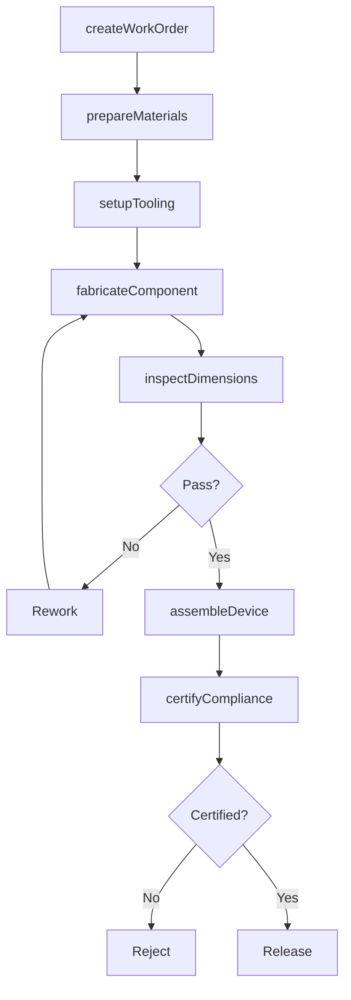
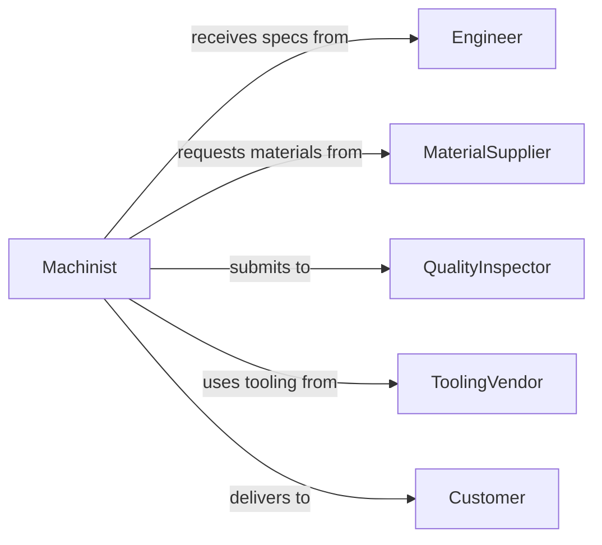

# Fabricate Devices Components

> Business-as-Code definition for device and component fabrication. Models the complete manufacturing process from design specification through quality verification.

## Overview

Device and component fabrication involves creating specialized equipment, assemblies, and parts through manufacturing processes. This definition exposes actions for each fabrication stage, events for production automation, and searches for inventory and quality tracking.

## Actors

| Actor | Description |
|-------|-------------|
| Engineer | Provides design specifications and technical drawings |
| MaterialSupplier | Supplies raw materials and stock for fabrication |
| QualityInspector | Verifies component specifications and tolerances |
| ToolingVendor | Provides specialized tooling and fixtures |
| Customer | Requests custom devices or component specifications |
| CertificationBody | Validates compliance with industry standards |

## Roles

| Role | Description |
|------|-------------|
| Machinist | Operates fabrication equipment and tools |
| ProductionManager | Oversees fabrication schedules and resources |
| QualityEngineer | Defines inspection criteria and tolerances |
| ToolDesigner | Creates jigs and fixtures for fabrication |

## Entities

| Entity | Description |
|--------|-------------|
| Device | A complete assembly or functional unit |
| Component | An individual fabricated part |
| Blueprint | Technical drawing with specifications |
| WorkOrder | Instructions for fabrication job |
| Tolerance | Acceptable dimensional variance |
| Batch | Group of components fabricated together |

## Actions

| Action | Description |
|--------|-------------|
| createWorkOrder | Initialize fabrication instructions from blueprint |
| prepareMaterials | Allocate raw materials for fabrication run |
| setupTooling | Configure machines and fixtures for production |
| fabricateComponent | Execute manufacturing process to create part |
| inspectDimensions | Verify component against tolerance specifications |
| assembleDevice | Combine components into functional device |
| certifyCompliance | Validate device meets regulatory requirements |

## Events

| Event | Description |
|-------|-------------|
| workOrderCreated | Fabrication job has been scheduled |
| materialsPrepared | Raw materials allocated to production |
| toolingSetup | Machines configured and ready for production |
| componentFabricated | Individual part has been manufactured |
| dimensionsInspected | Quality check completed on component |
| deviceAssembled | Components combined into functional unit |
| complianceCertified | Device validated against standards |

## Searches

| Search | Description |
|--------|-------------|
| findWorkOrders | List fabrication jobs by status or priority |
| getComponents | Retrieve fabricated parts by specification |
| getTolerances | Find dimensional specifications for component |
| getBatches | Retrieve fabrication runs by date or material |
| getDefects | List components failing quality inspection |

## Workflow



## Actor Relationships



## Usage

### Calling Actions

```typescript
import { fabricateDevicesComponents } from '@headlessly/fabricate-devices-components'

const fabrication = fabricateDevicesComponents()

// Create work order from customer blueprint
const workOrder = await fabrication.createWorkOrder({
  blueprintId: 'BP-2026-1847',
  quantity: 50,
  material: 'aluminum-6061',
  priority: 'high'
})

// Prepare materials and setup tooling
await fabrication.prepareMaterials({
  workOrderId: workOrder.id,
  materialSpecs: { stock: '2in-rod', length: 1000 }
})

await fabrication.setupTooling({
  workOrderId: workOrder.id,
  machines: ['cnc-mill-03', 'lathe-12']
})

// Fabricate and inspect components
for (let i = 0; i < workOrder.quantity; i++) {
  const component = await fabrication.fabricateComponent({
    workOrderId: workOrder.id,
    sequence: i + 1
  })

  const inspection = await fabrication.inspectDimensions({
    componentId: component.id,
    tolerances: workOrder.blueprint.tolerances
  })
}
```

### Event-Driven Automation

```typescript
// Auto-schedule quality inspection after fabrication
fabrication.componentFabricated(async ({ componentId, workOrderId }) => {
  await fabrication.inspectDimensions({
    componentId,
    tolerances: await getTolerances(workOrderId)
  })
})

// Alert production manager on inspection failures
fabrication.dimensionsInspected(async ({ componentId, passed, variance }) => {
  if (!passed) {
    await notify({
      to: 'production-manager',
      message: `Component ${componentId} failed inspection: ${variance.dimension} out of tolerance by ${variance.amount}mm`
    })
  }
})
```
