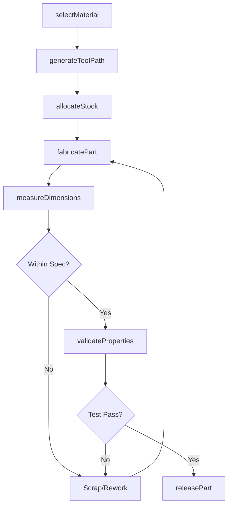
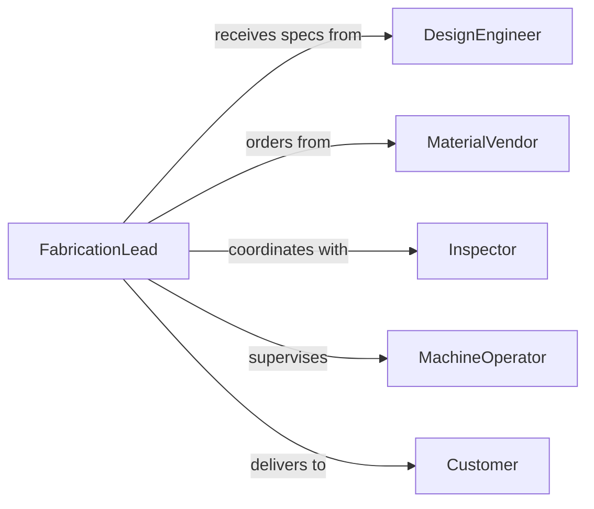

# Fabricate Parts Components

> Business-as-Code definition for parts and component fabrication. Models precision manufacturing operations from material selection through final inspection.

## Overview

Parts and component fabrication encompasses the production of individual manufactured elements used in assemblies, systems, and finished products. This definition exposes actions for material processing, machining operations, quality control, and inventory management across batch and custom production scenarios.

## Actors

| Actor | Description |
|-------|-------------|
| DesignEngineer | Provides CAD models and technical specifications |
| MaterialVendor | Supplies metals, plastics, and composites |
| Inspector | Performs dimensional and functional verification |
| MachineOperator | Executes fabrication on production equipment |
| Customer | Orders custom or replacement parts |
| TestingLab | Validates material properties and strength |

## Roles

| Role | Description |
|------|-------------|
| FabricationLead | Coordinates production schedules and resources |
| CNCProgrammer | Creates machine programs from CAD data |
| QualityTechnician | Executes inspection protocols |
| InventoryManager | Tracks raw materials and finished parts |

## Entities

| Entity | Description |
|--------|-------------|
| Part | Individual fabricated component with specific function |
| Material | Raw stock used in fabrication process |
| Specification | Technical requirements and tolerances |
| BatchRun | Collection of identical parts produced together |
| InspectionReport | Record of quality measurements |
| ToolPath | CNC machine program for fabrication |

## Actions

| Action | Description |
|--------|-------------|
| selectMaterial | Choose appropriate stock for part requirements |
| generateToolPath | Create CNC program from CAD model |
| allocateStock | Reserve material for production run |
| fabricatePart | Execute machining operations to create component |
| measureDimensions | Record actual dimensions against specifications |
| validateProperties | Test material strength and characteristics |
| releasePart | Approve component for assembly or shipment |

## Events

| Event | Description |
|-------|-------------|
| materialSelected | Stock type chosen for fabrication |
| toolPathGenerated | CNC program created and verified |
| stockAllocated | Material reserved for production |
| partFabricated | Component machining completed |
| dimensionsMeasured | Quality measurements recorded |
| propertiesValidated | Material testing completed |
| partReleased | Component approved for use |

## Searches

| Search | Description |
|--------|-------------|
| findParts | List components by specification or batch |
| getMaterials | Retrieve available stock by type or quantity |
| getSpecifications | Find technical requirements for part number |
| getBatchRuns | Retrieve production runs by date or material |
| getInspectionReports | List quality records by part or operator |

## Workflow



## Actor Relationships



## Usage

### Calling Actions

```typescript
import { fabricatePartsComponents } from '@headlessly/fabricate-parts-components'

const parts = fabricatePartsComponents()

// Create part from engineering specification
const material = await parts.selectMaterial({
  partNumber: 'PN-48291',
  specifications: {
    strength: 'high',
    corrosionResistance: true,
    machinability: 'excellent'
  }
})

// Generate toolpath and start production
const toolPath = await parts.generateToolPath({
  partNumber: 'PN-48291',
  cadModel: 'model-48291-rev3.step',
  machineType: 'cnc-mill'
})

await parts.allocateStock({
  material: material.type,
  quantity: 100,
  dimensions: { length: 500, width: 200, thickness: 25 }
})

// Fabricate batch and inspect
for (let i = 0; i < 100; i++) {
  const part = await parts.fabricatePart({
    toolPathId: toolPath.id,
    sequence: i + 1
  })

  const measurements = await parts.measureDimensions({
    partId: part.id,
    specifications: material.specifications
  })
}
```

### Event-Driven Automation

```typescript
// Auto-measure dimensions after fabrication
parts.partFabricated(async ({ partId, batchRunId }) => {
  const specs = await parts.getSpecifications({ batchRunId })
  await parts.measureDimensions({ partId, specifications: specs })
})

// Flag out-of-spec parts for review
parts.dimensionsMeasured(async ({ partId, measurements, withinSpec }) => {
  if (!withinSpec) {
    await notify({
      to: 'quality-technician',
      message: `Part ${partId} out of specification: review required`
    })
    await parts.validateProperties({ partId, priority: 'urgent' })
  }
})
```
